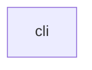

# Repository Map: ngram

*Generated: 2025-12-19 01:19*

## Statistics

- **Files:** 116
- **Directories:** 18
- **Total Size:** 826.6K
- **Doc Files:** 74
- **Code Files:** 38
- **Areas:** 3 (docs/ subfolders)
- **Modules:** 1 (subfolders in areas)
- **DOCS Links:** 36 (0.95 avg per code file)

### By Language

- markdown: 74
- python: 38

## Module Dependencies



### Module Details

| Module | Code | Docs | Lines | Files | Dependencies |
|--------|------|------|-------|-------|--------------|
| cli | `ngram/**` | `docs/cli/` | 10983 | 38 | - |

## File Tree

```
├── .gitignore (319)
├── .ngramignore (806)
├── README.md (4.4K)
├── docs/ (253.1K)
│   ├── cli/ (51.1K)
│   │   ├── ALGORITHM_CLI_Logic.md (7.0K)
│   │   ├── BEHAVIORS_CLI_Command_Effects.md (6.0K)
│   │   ├── IMPLEMENTATION_CLI_Code_Architecture.md (14.8K)
│   │   ├── PATTERNS_Why_CLI_Over_Copy.md (4.3K)
│   │   ├── SYNC_CLI_State.md (6.7K)
│   │   ├── SYNC_CLI_State_archive_2025-12.md (4.0K)
│   │   ├── TEST_CLI_Coverage.md (3.5K)
│   │   └── VALIDATION_CLI_Invariants.md (4.9K)
│   ├── map.md (53.4K)
│   ├── protocol/ (99.8K)
│   │   ├── ALGORITHM_Workflows_And_Procedures.md (6.6K)
│   │   ├── BEHAVIORS_Observable_Protocol_Effects.md (5.7K)
│   │   ├── IMPLEMENTATION_Protocol_Code_Architecture.md (14.2K)
│   │   ├── PATTERNS_Bidirectional_Documentation_Chain_For_AI_Agents.md (4.3K)
│   │   ├── SYNC_Protocol_Current_State.md (5.0K)
│   │   ├── SYNC_Protocol_Current_State_archive_2025-12.md (5.2K)
│   │   ├── TEST_Protocol_Test_Cases.md (3.7K)
│   │   ├── VALIDATION_Protocol_Invariants.md (5.5K)
│   │   └── features/ (49.5K)
│   │       ├── BEHAVIORS_Agent_Trace_Logging.md (3.7K)
│   │       ├── PATTERNS_Agent_Trace_Logging.md (3.6K)
│   │       ├── SYNC_Agent_Trace_Logging.md (2.0K)
│   │       └── doctor/ (40.1K)
│   │           ├── ALGORITHM_Project_Health_Doctor.md (14.2K)
│   │           ├── BEHAVIORS_Project_Health_Doctor.md (5.1K)
│   │           ├── PATTERNS_Project_Health_Doctor.md (4.1K)
│   │           ├── SYNC_Project_Health_Doctor.md (4.0K)
│   │           ├── TEST_Project_Health_Doctor.md (8.0K)
│   │           └── VALIDATION_Project_Health_Doctor.md (4.7K)
│   └── tui/ (48.7K)
│       ├── ALGORITHM_TUI_Flow.md (5.9K)
│       ├── BEHAVIORS_TUI_Interactions.md (6.6K)
│       ├── IMPLEMENTATION_TUI_Code_Architecture.md (11.7K)
│       ├── PATTERNS_TUI_Design.md (4.2K)
│       ├── SYNC_TUI_State.md (7.3K)
│       ├── SYNC_TUI_State_archive_2025-12.md (3.6K)
│       ├── TEST_TUI_Coverage.md (4.9K)
│       └── VALIDATION_TUI_Invariants.md (4.7K)
├── ngram/ (472.0K)
│   ├── __init__.py (532) →
│   ├── cli.py (12.5K) →
│   ├── context.py (18.2K) →
│   ├── doctor.py (7.8K) →
│   ├── doctor_checks.py (25.1K) →
│   ├── doctor_checks_content.py (16.8K) →
│   ├── doctor_checks_docs.py (11.2K) →
│   ├── doctor_checks_quality.py (7.4K) →
│   ├── doctor_checks_sync.py (9.0K) →
│   ├── doctor_files.py (15.5K) →
│   ├── doctor_report.py (20.1K)
│   ├── doctor_types.py (1.8K)
│   ├── github.py (8.0K) →
│   ├── init_cmd.py (8.1K) →
│   ├── project_map.py (11.3K) →
│   ├── project_map_html.py (9.6K) →
│   ├── prompt.py (2.9K) →
│   ├── repair.py (29.1K) →
│   ├── repair_core.py (18.8K) →
│   ├── repair_instructions.py (25.1K) →
│   ├── repair_instructions_docs.py (17.2K) →
│   ├── repair_interactive.py (11.4K) →
│   ├── repair_report.py (10.1K) →
│   ├── repo_overview.py (31.4K) →
│   ├── sync.py (10.8K) →
│   ├── tui/ (100.8K)
│   │   ├── __init__.py (284) →
│   │   ├── app.py (22.0K) →
│   │   ├── commands.py (33.0K) →
│   │   ├── manager.py (8.5K) →
│   │   ├── state.py (5.6K) →
│   │   ├── styles/ (4.6K)
│   │   │   └── theme.tcss (4.6K)
│   │   └── widgets/ (26.7K)
│   │       ├── __init__.py (496) →
│   │       ├── agent_container.py (3.4K) →
│   │       ├── agent_panel.py (3.7K) →
│   │       ├── input_bar.py (6.0K) →
│   │       ├── manager_panel.py (6.2K) →
│   │       └── status_bar.py (7.0K) →
│   ├── utils.py (3.2K) →
│   └── validate.py (28.2K) →
└── templates/ (96.1K)
    ├── CLAUDE_ADDITION.md (493)
    ├── ngram/ (94.8K)
    │   ├── PRINCIPLES.md (7.2K)
    │   ├── PROTOCOL.md (10.8K)
    │   ├── agents/ (2.6K)
    │   │   └── manager/ (2.6K)
    │   │       └── CLAUDE.md (2.6K)
    │   ├── state/ (2.1K)
    │   │   └── SYNC_Project_State.md (2.1K)
    │   ├── templates/ (23.8K)
    │   │   ├── ALGORITHM_TEMPLATE.md (2.3K)
    │   │   ├── BEHAVIORS_TEMPLATE.md (2.1K)
    │   │   ├── CONCEPT_TEMPLATE.md (1.1K)
    │   │   ├── IMPLEMENTATION_TEMPLATE.md (6.9K)
    │   │   ├── PATTERNS_TEMPLATE.md (2.1K)
    │   │   ├── SYNC_TEMPLATE.md (3.1K)
    │   │   ├── TEST_TEMPLATE.md (1.7K)
    │   │   ├── TOUCHES_TEMPLATE.md (1.6K)
    │   │   └── VALIDATION_TEMPLATE.md (2.9K)
    │   └── views/ (48.3K)
    │       ├── GLOBAL_LEARNINGS.md (439)
    │       ├── VIEW_Analyze_Structural_Analysis.md (4.1K)
    │       ├── VIEW_Analyze_Structural_Analysis_LEARNINGS.md (165)
    │       ├── VIEW_Collaborate_Pair_Program_With_Human.md (2.3K)
    │       ├── VIEW_Collaborate_Pair_Program_With_Human_LEARNINGS.md (152)
    │       ├── VIEW_Debug_Investigate_And_Fix_Issues.md (3.7K)
    │       ├── VIEW_Debug_Investigate_And_Fix_Issues_LEARNINGS.md (139)
    │       ├── VIEW_Document_Create_Module_Documentation.md (6.0K)
    │       ├── VIEW_Document_Create_Module_Documentation_LEARNINGS.md (146)
    │       ├── VIEW_Extend_Add_Features_To_Existing.md (4.9K)
    │       ├── VIEW_Extend_Add_Features_To_Existing_LEARNINGS.md (148)
    │       ├── VIEW_Implement_Write_Or_Modify_Code.md (4.6K)
    │       ├── VIEW_Implement_Write_Or_Modify_Code_LEARNINGS.md (148)
    │       ├── VIEW_Ingest_Process_Raw_Data_Sources.md (4.5K)
    │       ├── VIEW_Ingest_Process_Raw_Data_Sources_LEARNINGS.md (145)
    │       ├── VIEW_Onboard_Understand_Existing_Codebase.md (2.6K)
    │       ├── VIEW_Onboard_Understand_Existing_Codebase_LEARNINGS.md (156)
    │       ├── VIEW_Refactor_Improve_Code_Structure.md (5.1K)
    │       ├── VIEW_Refactor_Improve_Code_Structure_LEARNINGS.md (144)
    │       ├── VIEW_Review_Evaluate_Changes.md (2.5K)
    │       ├── VIEW_Review_Evaluate_Changes_LEARNINGS.md (142)
    │       ├── VIEW_Specify_Design_Vision_And_Architecture.md (2.3K)
    │       ├── VIEW_Specify_Design_Vision_And_Architecture_LEARNINGS.md (151)
    │       ├── VIEW_Test_Write_Tests_And_Verify.md (3.5K)
    │       └── VIEW_Test_Write_Tests_And_Verify_LEARNINGS.md (136)
    └── ngramignore (806)
```

## File Details

### `README.md`

**Sections:**
- # ngram
- ## The Problem
- ## The Solution
- ## Quick Start
- # Install
- # Initialize in your project
- # Check protocol health
- # Check project health (monoliths, stale docs, etc.)
- # Auto-fix issues with agents
- # Get documentation context for a file
- # Generate bootstrap prompt for LLM
- ## CLI Commands
- ## How It Works
- # ngram
- # VIEW: Implement
- ## LOAD FIRST
- ## AFTER CHANGES
- ## Documentation Chain
- ## Key Concepts
- ## Design Principles
- ## License
- ## Contributing

### `docs/cli/ALGORITHM_CLI_Logic.md`

**Sections:**
- # ADD Framework CLI — Algorithm: Command Processing Logic
- ## CHAIN
- ## OVERVIEW
- ## DATA STRUCTURES
- ## ALGORITHM: Validate Command
- ## ALGORITHM: Doctor Command
- ## ALGORITHM: Repair Command
- ## KEY DECISIONS
- # Safe fixes that only touch references
- # Also create/update documentation content
- # Also make code changes
- ## DATA FLOW
- ## COMPLEXITY
- ## HELPER FUNCTIONS
- ## INTERACTIONS
- ## GAPS / IDEAS / QUESTIONS

### `docs/cli/BEHAVIORS_CLI_Command_Effects.md`

**Sections:**
- # ADD Framework CLI — Behaviors: Command Effects and Observable Outcomes
- ## CHAIN
- ## BEHAVIORS
- ## INPUTS / OUTPUTS
- ## EDGE CASES
- ## ANTI-BEHAVIORS
- ## GAPS / IDEAS / QUESTIONS

### `docs/cli/IMPLEMENTATION_CLI_Code_Architecture.md`

**Code refs:**
- `ngram/cli.py`
- `ngram/context.py`
- `ngram/doctor.py`
- `ngram/doctor_checks.py`
- `ngram/doctor_checks_content.py`
- `ngram/doctor_files.py`
- `ngram/doctor_report.py`
- `ngram/doctor_types.py`
- `ngram/github.py`
- `ngram/init_cmd.py`
- `ngram/project_map.py`
- `ngram/project_map_html.py`
- `ngram/prompt.py`
- `ngram/repair.py`
- `ngram/repair_instructions.py`
- `ngram/repair_instructions_docs.py`
- `ngram/repair_report.py`
- `ngram/sync.py`
- `ngram/utils.py`
- `ngram/validate.py`

**Doc refs:**
- `docs/cli/ALGORITHM_CLI_Logic.md`

**Sections:**
- # ADD Framework CLI — Implementation: Code Architecture and Structure
- ## CHAIN
- ## CODE STRUCTURE
- ## DESIGN PATTERNS
- ## SCHEMA
- ## ENTRY POINTS
- ## DATA FLOW
- ## MODULE DEPENDENCIES
- ## STATE MANAGEMENT
- ## RUNTIME BEHAVIOR
- ## CONCURRENCY MODEL
- ## CONFIGURATION
- ## BIDIRECTIONAL LINKS
- ## GAPS / IDEAS / QUESTIONS

### `docs/cli/PATTERNS_Why_CLI_Over_Copy.md`

**Code refs:**
- `context.py`
- `doctor.py`
- `github.py`
- `init_cmd.py`
- `project_map.py`
- `prompt.py`
- `repair.py`
- `sync.py`
- `validate.py`

**Sections:**
- # ADD Framework CLI — Patterns: Why CLI Over Copy
- ## CHAIN
- ## THE PROBLEM
- ## THE PATTERN
- ## PRINCIPLES
- ## DEPENDENCIES
- ## INSPIRATIONS
- ## WHAT THIS DOES NOT SOLVE
- ## GAPS / IDEAS / QUESTIONS

### `docs/cli/SYNC_CLI_State.md`

**Code refs:**
- `cli.py`
- `doctor.py`
- `doctor_checks.py`
- `ngram/cli.py`
- `ngram/context.py`
- `ngram/doctor.py`
- `ngram/doctor_checks.py`
- `ngram/init_cmd.py`
- `ngram/repair.py`
- `ngram/validate.py`
- `repair.py`
- `repair_instructions.py`
- `utils.py`

**Doc refs:**
- `docs/cli/ALGORITHM_CLI_Logic.md`
- `docs/cli/IMPLEMENTATION_CLI_Code_Architecture.md`
- `docs/cli/PATTERNS_Why_CLI_Over_Copy.md`

**Sections:**
- # ADD Framework CLI — Sync: Current State
- ## CHAIN
- ## CURRENT STATE
- ## IN PROGRESS
- ## RECENT CHANGES
- ## KNOWN ISSUES
- ## HANDOFF: FOR AGENTS
- ## HANDOFF: FOR HUMAN
- ## POINTERS
- ## ARCHIVE

### `docs/cli/SYNC_CLI_State_archive_2025-12.md`

**Code refs:**
- `cli.py`
- `doctor.py`
- `github.py`
- `repair.py`

**Doc refs:**
- `docs/cli/ALGORITHM_CLI_Logic.md`
- `docs/cli/BEHAVIORS_CLI_Command_Effects.md`
- `docs/cli/IMPLEMENTATION_CLI_Code_Architecture.md`
- `docs/cli/PATTERNS_Why_CLI_Over_Copy.md`
- `docs/cli/SYNC_CLI_State.md`
- `docs/cli/TEST_CLI_Coverage.md`
- `docs/cli/VALIDATION_CLI_Invariants.md`

**Sections:**
- # Archived: SYNC_CLI_State.md
- ## MATURITY
- ## RECENT CHANGES
- ## TODO

### `docs/cli/TEST_CLI_Coverage.md`

**Sections:**
- # ADD Framework CLI — Test: Test Cases and Coverage
- ## CHAIN
- ## TEST STRATEGY
- ## UNIT TESTS (0% coverage)
- ## INTEGRATION TESTS (0% coverage)
- ## EDGE CASES (manual only)
- ## TEST COVERAGE
- ## HOW TO RUN
- # Currently no automated tests exist
- # Manual testing commands:
- # Test init
- # Test doctor
- # Test repair (dry run)
- # Test context
- ## KNOWN TEST GAPS
- ## PROPOSED TEST STRUCTURE
- ## FLAKY TESTS
- ## GAPS / IDEAS / QUESTIONS

### `docs/cli/VALIDATION_CLI_Invariants.md`

**Sections:**
- # ADD Framework CLI — Validation: Invariants and Correctness Checks
- ## CHAIN
- ## INVARIANTS
- ## PROPERTIES
- ## ERROR CONDITIONS
- ## TEST COVERAGE
- ## VERIFICATION PROCEDURE
- # Run CLI commands manually for now
- # No automated test suite yet
- # TODO: Add pytest tests
- ## CHECK REFERENCES
- ## GAPS / IDEAS / QUESTIONS

### `docs/map.md`

**Code refs:**
- `app.py`
- `cli.py`
- `commands.py`
- `context.py`
- `doctor.py`
- `doctor_checks.py`
- `github.py`
- `init_cmd.py`
- `project_map.py`
- `prompt.py`
- `repair.py`
- `repair_core.py`
- `repair_instructions.py`
- `scripts/check_chain_links.py`
- `scripts/check_doc_completeness.py`
- `scripts/check_doc_refs.py`
- `scripts/check_orphans.py`
- `src/ngram/__init__.py`
- `src/ngram/cli.py`
- `src/ngram/context.py`
- `src/ngram/doctor.py`
- `src/ngram/doctor_checks.py`
- `src/ngram/doctor_checks_content.py`
- `src/ngram/doctor_checks_docs.py`
- `src/ngram/doctor_checks_quality.py`
- `src/ngram/doctor_checks_sync.py`
- `src/ngram/doctor_files.py`
- `src/ngram/doctor_report.py`
- `src/ngram/doctor_types.py`
- `src/ngram/github.py`
- `src/ngram/init_cmd.py`
- `src/ngram/project_map.py`
- `src/ngram/project_map_html.py`
- `src/ngram/prompt.py`
- `src/ngram/repair.py`
- `src/ngram/repair_core.py`
- `src/ngram/repair_instructions.py`
- `src/ngram/repair_instructions_docs.py`
- `src/ngram/repair_interactive.py`
- `src/ngram/repair_report.py`
- `src/ngram/repo_overview.py`
- `src/ngram/sync.py`
- `src/ngram/tui/__init__.py`
- `src/ngram/tui/app.py`
- `src/ngram/tui/commands.py`
- `src/ngram/tui/manager.py`
- `src/ngram/tui/state.py`
- `src/ngram/tui/widgets/__init__.py`
- `src/ngram/tui/widgets/agent_container.py`
- `src/ngram/tui/widgets/agent_panel.py`
- `src/ngram/tui/widgets/input_bar.py`
- `src/ngram/tui/widgets/manager_panel.py`
- `src/ngram/tui/widgets/status_bar.py`
- `src/ngram/utils.py`
- `src/ngram/validate.py`
- `state.py`
- `sync.py`
- `utils.py`
- `validate.py`

**Doc refs:**
- `docs/cli/ALGORITHM_CLI_Logic.md`
- `docs/cli/BEHAVIORS_CLI_Command_Effects.md`
- `docs/cli/IMPLEMENTATION_CLI_Code_Architecture.md`
- `docs/cli/PATTERNS_Why_CLI_Over_Copy.md`
- `docs/cli/SYNC_CLI_State.md`
- `docs/cli/SYNC_CLI_State_archive_2025-12.md`
- `docs/cli/TEST_CLI_Coverage.md`
- `docs/cli/VALIDATION_CLI_Invariants.md`
- `docs/protocol/ALGORITHM_Workflows_And_Procedures.md`
- `docs/protocol/BEHAVIORS_Observable_Protocol_Effects.md`
- `docs/protocol/IMPLEMENTATION_Protocol_Code_Architecture.md`
- `docs/protocol/PATTERNS_Bidirectional_Documentation_Chain_For_AI_Agents.md`
- `docs/protocol/SYNC_Protocol_Current_State.md`
- `docs/protocol/SYNC_Protocol_Current_State_archive_2025-12.md`
- `docs/protocol/TEST_Protocol_Test_Cases.md`
- `docs/protocol/VALIDATION_Protocol_Invariants.md`
- `docs/protocol/features/BEHAVIORS_Agent_Trace_Logging.md`
- `docs/protocol/features/PATTERNS_Agent_Trace_Logging.md`
- `docs/protocol/features/SYNC_Agent_Trace_Logging.md`
- `docs/protocol/features/doctor/ALGORITHM_Project_Health_Doctor.md`
- `docs/protocol/features/doctor/BEHAVIORS_Project_Health_Doctor.md`
- `docs/protocol/features/doctor/PATTERNS_Project_Health_Doctor.md`
- `docs/protocol/features/doctor/SYNC_Project_Health_Doctor.md`
- `docs/protocol/features/doctor/TEST_Project_Health_Doctor.md`
- `docs/protocol/features/doctor/VALIDATION_Project_Health_Doctor.md`
- `docs/tui/ALGORITHM_TUI_Flow.md`
- `docs/tui/BEHAVIORS_TUI_Interactions.md`
- `docs/tui/IMPLEMENTATION_TUI_Code_Architecture.md`
- `docs/tui/PATTERNS_TUI_Design.md`
- `docs/tui/SYNC_TUI_State.md`
- `docs/tui/SYNC_TUI_State_archive_2025-12.md`
- `docs/tui/TEST_TUI_Coverage.md`
- `docs/tui/VALIDATION_TUI_Invariants.md`
- `templates/CLAUDE_ADDITION.md`
- `templates/ngram/PRINCIPLES.md`
- `templates/ngram/PROTOCOL.md`
- `templates/ngram/agents/manager/CLAUDE.md`
- `templates/ngram/state/SYNC_Project_State.md`
- `templates/ngram/templates/ALGORITHM_TEMPLATE.md`
- `templates/ngram/templates/BEHAVIORS_TEMPLATE.md`
- `templates/ngram/templates/CONCEPT_TEMPLATE.md`
- `templates/ngram/templates/IMPLEMENTATION_TEMPLATE.md`
- `templates/ngram/templates/PATTERNS_TEMPLATE.md`
- `templates/ngram/templates/SYNC_TEMPLATE.md`
- `templates/ngram/templates/TEST_TEMPLATE.md`
- `templates/ngram/templates/TOUCHES_TEMPLATE.md`
- `templates/ngram/templates/VALIDATION_TEMPLATE.md`
- `templates/ngram/views/GLOBAL_LEARNINGS.md`
- `templates/ngram/views/VIEW_Analyze_Structural_Analysis.md`
- `templates/ngram/views/VIEW_Analyze_Structural_Analysis_LEARNINGS.md`
- `templates/ngram/views/VIEW_Collaborate_Pair_Program_With_Human.md`
- `templates/ngram/views/VIEW_Collaborate_Pair_Program_With_Human_LEARNINGS.md`
- `templates/ngram/views/VIEW_Debug_Investigate_And_Fix_Issues.md`
- `templates/ngram/views/VIEW_Debug_Investigate_And_Fix_Issues_LEARNINGS.md`
- `templates/ngram/views/VIEW_Document_Create_Module_Documentation.md`
- `templates/ngram/views/VIEW_Document_Create_Module_Documentation_LEARNINGS.md`
- `templates/ngram/views/VIEW_Extend_Add_Features_To_Existing.md`
- `templates/ngram/views/VIEW_Extend_Add_Features_To_Existing_LEARNINGS.md`
- `templates/ngram/views/VIEW_Implement_Write_Or_Modify_Code.md`
- `templates/ngram/views/VIEW_Implement_Write_Or_Modify_Code_LEARNINGS.md`
- `templates/ngram/views/VIEW_Ingest_Process_Raw_Data_Sources.md`
- `templates/ngram/views/VIEW_Ingest_Process_Raw_Data_Sources_LEARNINGS.md`
- `templates/ngram/views/VIEW_Onboard_Understand_Existing_Codebase.md`
- `templates/ngram/views/VIEW_Onboard_Understand_Existing_Codebase_LEARNINGS.md`
- `templates/ngram/views/VIEW_Refactor_Improve_Code_Structure.md`
- `templates/ngram/views/VIEW_Refactor_Improve_Code_Structure_LEARNINGS.md`
- `templates/ngram/views/VIEW_Review_Evaluate_Changes.md`
- `templates/ngram/views/VIEW_Review_Evaluate_Changes_LEARNINGS.md`
- `templates/ngram/views/VIEW_Specify_Design_Vision_And_Architecture.md`
- `templates/ngram/views/VIEW_Specify_Design_Vision_And_Architecture_LEARNINGS.md`
- `templates/ngram/views/VIEW_Test_Write_Tests_And_Verify.md`
- `templates/ngram/views/VIEW_Test_Write_Tests_And_Verify_LEARNINGS.md`
- `views/VIEW_Analyze_Structural_Analysis.md`
- `views/VIEW_Collaborate_Pair_Program_With_Human.md`
- `views/VIEW_Debug_Investigate_And_Fix_Issues.md`
- `views/VIEW_Document_Create_Module_Documentation.md`
- `views/VIEW_Extend_Add_Features_To_Existing.md`
- `views/VIEW_Implement_Write_Or_Modify_Code.md`
- `views/VIEW_Ingest_Process_Raw_Data_Sources.md`
- `views/VIEW_Onboard_Understand_Existing_Codebase.md`
- `views/VIEW_Refactor_Improve_Code_Structure.md`
- `views/VIEW_Review_Evaluate_Changes.md`
- `views/VIEW_Specify_Design_Vision_And_Architecture.md`
- `views/VIEW_Test_Write_Tests_And_Verify.md`

**Sections:**
- # Repository Map: ngram
- ## Statistics
- ## Module Dependencies
- ## File Tree
- ## File Details

### `docs/protocol/ALGORITHM_Workflows_And_Procedures.md`

**Doc refs:**
- `templates/CLAUDE_ADDITION.md`

**Sections:**
- # ADD Framework — Algorithm: Workflows and Procedures
- ## CHAIN
- ## OVERVIEW
- ## ALGORITHM: Install Protocol in Project
- ## ALGORITHM: Agent Starts Task
- ## ALGORITHM: Create New Module
- ## ALGORITHM: Modify Existing Module
- ## ALGORITHM: Document Cross-Cutting Concept
- ## DATA FLOW
- ## COMPLEXITY
- ## GAPS / IDEAS / QUESTIONS

### `docs/protocol/BEHAVIORS_Observable_Protocol_Effects.md`

**Sections:**
- # ADD Framework — Behaviors: Observable Protocol Effects
- ## CHAIN
- ## BEHAVIORS
- ## INPUTS / OUTPUTS
- ## EDGE CASES
- ## ANTI-BEHAVIORS
- ## GAPS / IDEAS / QUESTIONS

### `docs/protocol/IMPLEMENTATION_Protocol_Code_Architecture.md`

**Doc refs:**
- `templates/ngram/PRINCIPLES.md`
- `templates/ngram/PROTOCOL.md`
- `templates/ngram/state/SYNC_Project_State.md`
- `templates/ngram/templates/ALGORITHM_TEMPLATE.md`
- `templates/ngram/templates/BEHAVIORS_TEMPLATE.md`
- `templates/ngram/templates/CONCEPT_TEMPLATE.md`
- `templates/ngram/templates/IMPLEMENTATION_TEMPLATE.md`
- `templates/ngram/templates/PATTERNS_TEMPLATE.md`
- `templates/ngram/templates/SYNC_TEMPLATE.md`
- `templates/ngram/templates/TEST_TEMPLATE.md`
- `templates/ngram/templates/TOUCHES_TEMPLATE.md`
- `templates/ngram/templates/VALIDATION_TEMPLATE.md`
- `templates/ngram/views/VIEW_Collaborate_Pair_Program_With_Human.md`
- `templates/ngram/views/VIEW_Debug_Investigate_And_Fix_Issues.md`
- `templates/ngram/views/VIEW_Document_Create_Module_Documentation.md`
- `templates/ngram/views/VIEW_Extend_Add_Features_To_Existing.md`
- `templates/ngram/views/VIEW_Implement_Write_Or_Modify_Code.md`
- `templates/ngram/views/VIEW_Ingest_Process_Raw_Data_Sources.md`
- `templates/ngram/views/VIEW_Onboard_Understand_Existing_Codebase.md`
- `templates/ngram/views/VIEW_Refactor_Improve_Code_Structure.md`
- `templates/ngram/views/VIEW_Review_Evaluate_Changes.md`
- `templates/ngram/views/VIEW_Specify_Design_Vision_And_Architecture.md`
- `templates/ngram/views/VIEW_Test_Write_Tests_And_Verify.md`

**Sections:**
- # ADD Framework — Implementation: File Structure and Architecture
- ## CHAIN
- ## OVERVIEW
- ## FILE STRUCTURE
- ## FILE RESPONSIBILITIES
- ## SCHEMA
- ## ENTRY POINTS
- ## DATA FLOW
- ## LOGIC CHAINS
- ## MODULE DEPENDENCIES
- ## STATE MANAGEMENT
- ## BIDIRECTIONAL LINKS
- # DOCS: docs/backend/auth/PATTERNS_Why_JWT_With_Refresh_Tokens.md
- ## CONFIGURATION
- ## GAPS / IDEAS / QUESTIONS

### `docs/protocol/PATTERNS_Bidirectional_Documentation_Chain_For_AI_Agents.md`

**Sections:**
- # ADD Framework — Patterns: Bidirectional Documentation Chain for AI Agent Workflows
- ## CHAIN
- ## THE PROBLEM
- ## THE PATTERN
- ## PRINCIPLES
- # Descriptive names
- # Not
- ## DEPENDENCIES
- ## INSPIRATIONS
- ## WHAT THIS DOES NOT SOLVE
- ## GAPS / IDEAS / QUESTIONS

### `docs/protocol/SYNC_Protocol_Current_State.md`

**Code refs:**
- `ngram/cli.py`

**Doc refs:**
- `templates/CLAUDE_ADDITION.md`
- `templates/ngram/PRINCIPLES.md`
- `templates/ngram/PROTOCOL.md`

**Sections:**
- # ADD Framework — Sync: Current State
- ## MATURITY
- ## CURRENT STATE
- ## HANDOFF: FOR AGENTS
- ## HANDOFF: FOR HUMAN
- ## CONSCIOUSNESS TRACE
- ## STRUCTURE
- ## POINTERS
- ## ARCHIVE

### `docs/protocol/SYNC_Protocol_Current_State_archive_2025-12.md`

**Sections:**
- # Archived: SYNC_Protocol_Current_State.md
- ## RECENT CHANGES
- # Returns all linked docs for that file's module
- # Copy output to LLM to bootstrap it into using the protocol
- ## TODO

### `docs/protocol/TEST_Protocol_Test_Cases.md`

**Sections:**
- # ADD Framework — Test: Test Cases and Coverage
- ## CHAIN
- ## TEST STRATEGY
- ## CLI TESTS
- ## INTEGRATION TESTS
- ## EDGE CASES
- ## TEST COVERAGE
- ## HOW TO RUN
- # Manual testing via CLI
- # Dogfood test
- ## KNOWN TEST GAPS
- ## GAPS / IDEAS / QUESTIONS

### `docs/protocol/VALIDATION_Protocol_Invariants.md`

**Code refs:**
- `scripts/check_chain_links.py`
- `scripts/check_doc_completeness.py`
- `scripts/check_doc_refs.py`
- `scripts/check_orphans.py`

**Sections:**
- # ADD Framework — Validation: Protocol Invariants
- ## CHAIN
- ## INVARIANTS
- ## PROPERTIES
- ## ERROR CONDITIONS
- ## TEST COVERAGE
- ## VERIFICATION PROCEDURE
- # Check all invariants
- # Check specific invariant
- # Check specific module
- ## SYNC STATUS
- ## GAPS / IDEAS / QUESTIONS

### `docs/protocol/features/BEHAVIORS_Agent_Trace_Logging.md`

**Sections:**
- # Agent Trace Logging — Behaviors: Observable Effects
- ## CHAIN
- ## COMMANDS
- ## AUTOMATIC TRACING
- ## TRACE FILE FORMAT
- ## INTEGRATION POINTS
- ## Usage (auto-generated)
- ## WHAT GETS TRACED
- ## WHAT DOESN'T GET TRACED

### `docs/protocol/features/PATTERNS_Agent_Trace_Logging.md`

**Sections:**
- # Agent Trace Logging — Patterns: Why This Design
- ## CHAIN
- ## THE PROBLEM
- ## THE INSIGHT
- ## DESIGN DECISIONS
- ## WHAT THIS ENABLES
- ## TRADEOFFS
- ## ALTERNATIVES CONSIDERED
- ## OPEN QUESTIONS

### `docs/protocol/features/SYNC_Agent_Trace_Logging.md`

**Code refs:**
- `ngram/cli.py`

**Sections:**
- # Agent Trace Logging — Sync: Current State
- ## MATURITY
- ## CURRENT STATE
- ## IMPLEMENTATION PLAN
- ## HANDOFF: FOR AGENTS
- ## TODO
- ## OPEN QUESTIONS

### `docs/protocol/features/doctor/ALGORITHM_Project_Health_Doctor.md`

**Sections:**
- # ALGORITHM: Project Health Doctor
- ## MAIN FLOW
- ## 1. LOAD CONFIGURATION
- ## 2. DISCOVER PROJECT STRUCTURE
- # Also find subdirectories
- ## 3. RUN CHECKS
- # Check if mapped in modules.yaml
- # Check for template placeholders
- # Look for DOCS: comment
- # Find most recent SYNC update across all SYNC files
- # Skip if no docs at all (that's UNDOCUMENTED, not ABANDONED)
- # Check if only has PATTERNS or SYNC (started but not continued)
- # Started (has 1-2 docs) but incomplete (missing 3+ docs)
- # Check if stale
- # Check directories
- # Check files
- ## 4. AGGREGATE RESULTS
- # Apply severity overrides
- # Group by severity
- ## 5. CALCULATE SCORE
- ## 6. GENERATE OUTPUT
- ## 7. EXIT CODE
- ## CHAIN

### `docs/protocol/features/doctor/BEHAVIORS_Project_Health_Doctor.md`

**Sections:**
- # BEHAVIORS: Project Health Doctor
- ## COMMAND INTERFACE
- # Basic health check
- # With specific directory
- # Output formats
- # Filter by severity
- # Specific checks
- ## OUTPUT BEHAVIOR
- ## Critical (2 issues)
- ## Warnings (3 issues)
- ## Info (3 issues)
- ## Suggested Actions
- ## GUIDED REMEDIATION
- ## Current State
- ## Recommended Steps
- # DOCS: docs/api/PATTERNS_Api_Design.md
- ## Template Commands
- # Generate PATTERNS from template
- ## Reference
- ## EXIT CODES
- ## CONFIGURATION
- # Thresholds
- # Ignore patterns
- # Disable specific checks
- # Custom severity overrides
- ## CHAIN

### `docs/protocol/features/doctor/PATTERNS_Project_Health_Doctor.md`

**Sections:**
- # PATTERNS: Project Health Doctor
- ## THE PROBLEM
- ## THE INSIGHT
- ## DESIGN DECISIONS
- ## WHAT WE CHECK
- ## WHAT WE DON'T CHECK
- ## ALTERNATIVES CONSIDERED
- ## CHAIN

### `docs/protocol/features/doctor/SYNC_Project_Health_Doctor.md`

**Code refs:**
- `doctor.py`

**Sections:**
- # SYNC: Project Health Doctor
- ## MATURITY
- ## CURRENT STATE
- ## IMPLEMENTATION ORDER
- ## HANDOFF: FOR AGENTS
- ## HANDOFF: FOR HUMAN
- ## TODO
- ## CHAIN

### `docs/protocol/features/doctor/TEST_Project_Health_Doctor.md`

**Sections:**
- # TEST: Project Health Doctor
- ## TEST STRUCTURE
- ## UNIT TESTS
- # Note: docs/api/ not created
- ## INTEGRATION TESTS
- ## FIXTURE PROJECTS
- ## COVERAGE TARGETS
- ## RUNNING TESTS
- # All doctor tests
- # With coverage
- # Specific check
- # Integration only
- ## CHAIN

### `docs/protocol/features/doctor/VALIDATION_Project_Health_Doctor.md`

**Sections:**
- # VALIDATION: Project Health Doctor
- ## INVARIANTS
- ## CHECK CORRECTNESS
- ## OUTPUT FORMAT CORRECTNESS
- ## EDGE CASES
- ## PERFORMANCE BOUNDS
- ## VERIFICATION COMMANDS
- # Verify determinism
- # Verify exit codes
- # Verify JSON validity
- # Verify ignore patterns
- ## CHAIN

### `docs/tui/ALGORITHM_TUI_Flow.md`

**Code refs:**
- `doctor.py`
- `repair_core.py`

**Sections:**
- # ngram TUI — Algorithm: Application Flow and Event Handling
- ## CHAIN
- ## OVERVIEW
- ## DATA STRUCTURES
- ## ALGORITHM: Main Event Loop
- ## KEY DECISIONS
- ## DATA FLOW
- ## COMPLEXITY
- ## HELPER FUNCTIONS
- ## INTERACTIONS
- ## GAPS / IDEAS / QUESTIONS

### `docs/tui/BEHAVIORS_TUI_Interactions.md`

**Sections:**
- # ngram TUI — Behaviors: User Interactions and Observable Effects
- ## CHAIN
- ## BEHAVIORS
- ## INPUTS / OUTPUTS
- ## EDGE CASES
- ## ANTI-BEHAVIORS
- ## GAPS / IDEAS / QUESTIONS

### `docs/tui/IMPLEMENTATION_TUI_Code_Architecture.md`

**Code refs:**
- `ngram/cli.py`
- `ngram/doctor.py`
- `ngram/repair_core.py`
- `ngram/tui/app.py`
- `ngram/tui/commands.py`
- `ngram/tui/manager.py`
- `ngram/tui/state.py`
- `ngram/tui/widgets/agent_container.py`
- `ngram/tui/widgets/agent_panel.py`
- `ngram/tui/widgets/input_bar.py`
- `ngram/tui/widgets/manager_panel.py`
- `ngram/tui/widgets/status_bar.py`

**Sections:**
- # ngram TUI — Implementation: Code Architecture
- ## CHAIN
- ## CODE STRUCTURE
- ## DESIGN PATTERNS
- ## SCHEMA
- ## ENTRY POINTS
- ## DATA FLOW
- ## MODULE DEPENDENCIES
- ## STATE MANAGEMENT
- ## RUNTIME BEHAVIOR
- ## CONCURRENCY MODEL
- ## CONFIGURATION
- ## BIDIRECTIONAL LINKS
- ## REMAINING WORK
- ## DECISIONS MADE

### `docs/tui/PATTERNS_TUI_Design.md`

**Code refs:**
- `repair_core.py`

**Sections:**
- # ngram TUI — Patterns: Claude Code-Style Interface
- ## CHAIN
- ## THE PROBLEM
- ## THE PATTERN
- ## PRINCIPLES
- ## DEPENDENCIES
- ## INSPIRATIONS
- ## WHAT THIS DOES NOT SOLVE
- ## GAPS / IDEAS / QUESTIONS

### `docs/tui/SYNC_TUI_State.md`

**Code refs:**
- `app.py`
- `commands.py`
- `ngram/cli.py`
- `ngram/repair_core.py`
- `repair_core.py`

**Doc refs:**
- `docs/tui/PATTERNS_TUI_Design.md`

**Sections:**
- # ngram TUI — Sync: Current State
- ## CHAIN
- ## CURRENT STATE
- ## KNOWN ISSUES
- ## HANDOFF: FOR AGENTS
- ## HANDOFF: FOR HUMAN
- ## POINTERS
- ## ARCHIVE

### `docs/tui/SYNC_TUI_State_archive_2025-12.md`

**Code refs:**
- `repair.py`
- `repair_core.py`

**Sections:**
- # Archived: SYNC_TUI_State.md
- ## DESIGN DECISIONS
- ## FILE STRUCTURE (Planned)

### `docs/tui/TEST_TUI_Coverage.md`

**Code refs:**
- `app.py`
- `commands.py`
- `state.py`

**Sections:**
- # ngram TUI — Test: Test Strategy and Coverage
- ## CHAIN
- ## TEST STRATEGY
- ## UNIT TESTS
- ## INTEGRATION TESTS
- ## EDGE CASES
- ## TEST COVERAGE
- ## HOW TO RUN
- # Once tests exist:
- # Run specific test file
- # Run with coverage
- # Run only unit tests (fast)
- # Run integration tests
- ## KNOWN TEST GAPS
- ## FLAKY TESTS
- ## TEST INFRASTRUCTURE NEEDED
- # Mock for agent subprocess
- ## GAPS / IDEAS / QUESTIONS

### `docs/tui/VALIDATION_TUI_Invariants.md`

**Sections:**
- # ngram TUI — Validation: Invariants and Verification
- ## CHAIN
- ## INVARIANTS
- ## PROPERTIES
- ## ERROR CONDITIONS
- ## TEST COVERAGE
- ## VERIFICATION PROCEDURE
- # Once tests exist:
- # With coverage:
- ## SYNC STATUS
- ## GAPS / IDEAS / QUESTIONS

### `ngram/__init__.py`

**Docs:** `../docs/protocol/`

### `ngram/cli.py`

**Docs:** `docs/cli/PATTERNS_Why_CLI_Over_Copy.md`

**Definitions:**
- `def main()`

### `ngram/context.py`

**Docs:** `docs/cli/PATTERNS_Why_CLI_Over_Copy.md`

**Definitions:**
- `def get_traces_dir()`
- `def log_trace()`
- `def read_traces()`
- `def analyze_traces()`
- `def print_trace_summary()`
- `def clear_traces()`
- `def parse_imports()`
- `def find_file_from_import()`
- `def find_module_docs()`
- `def get_module_context()`
- `def build_dependency_map()`
- `def add_node()`
- `def print_module_context()`

### `ngram/doctor.py`

**Docs:** `docs/cli/IMPLEMENTATION_CLI_Code_Architecture.md`

**Definitions:**
- `def calculate_health_score()`
- `def run_doctor()`
- `def doctor_command()`

### `ngram/doctor_checks.py`

**Docs:** `docs/cli/IMPLEMENTATION_CLI_Code_Architecture.md`

**Definitions:**
- `def doctor_check_monolith()`
- `def doctor_check_undocumented()`
- `def doctor_check_stale_sync()`
- `def doctor_check_no_docs_ref()`
- `def extract_impl_file_refs()`
- `def doctor_check_broken_impl_links()`
- `def detect_stub_patterns()`
- `def doctor_check_stub_impl()`
- `def find_empty_functions()`
- `def doctor_check_incomplete_impl()`
- `def doctor_check_undoc_impl()`
- `def doctor_check_yaml_drift()`
- `def doctor_check_missing_tests()`

### `ngram/doctor_checks_content.py`

**Docs:** `docs/cli/IMPLEMENTATION_CLI_Code_Architecture.md`

**Definitions:**
- `def doctor_check_new_undoc_code()`
- `def doctor_check_doc_duplication()`
- `def doctor_check_long_strings()`

### `ngram/doctor_checks_docs.py`

**Docs:** `docs/cli/IMPLEMENTATION_CLI_Code_Architecture.md`

**Definitions:**
- `def doctor_check_placeholder_docs()`
- `def doctor_check_orphan_docs()`
- `def doctor_check_stale_impl()`
- `def doctor_check_large_doc_module()`
- `def doctor_check_incomplete_chain()`

### `ngram/doctor_checks_quality.py`

**Docs:** `docs/cli/IMPLEMENTATION_CLI_Code_Architecture.md`

**Definitions:**
- `def doctor_check_magic_values()`
- `def doctor_check_hardcoded_secrets()`

### `ngram/doctor_checks_sync.py`

**Docs:** `docs/cli/IMPLEMENTATION_CLI_Code_Architecture.md`

**Definitions:**
- `def doctor_check_conflicts()`
- `def doctor_check_doc_gaps()`
- `def doctor_check_suggestions()`

### `ngram/doctor_files.py`

**Docs:** `docs/cli/PATTERNS_Why_CLI_Over_Copy.md`

**Definitions:**
- `def parse_gitignore()`
- `def load_doctor_config()`
- `def load_doctor_ignore()`
- `def is_issue_ignored()`
- `def filter_ignored_issues()`
- `def add_doctor_ignore()`
- `def should_ignore_path()`
- `def is_binary_file()`
- `def find_code_directories()`
- `def has_direct_code_files()`
- `def find_leaf_code_dirs()`
- `def find_source_files()`
- `def count_lines()`
- `def find_long_sections()`

### `ngram/doctor_report.py`

**Definitions:**
- `def get_issue_guidance()`
- `def get_issue_explanation()`
- `def generate_health_markdown()`
- `def print_doctor_report()`
- `def check_sync_status()`

### `ngram/doctor_types.py`

**Definitions:**
- `class DoctorIssue`
- `class DoctorConfig`
- `class IgnoreEntry`

### `ngram/github.py`

**Docs:** `docs/cli/PATTERNS_Why_CLI_Over_Copy.md`

**Definitions:**
- `class GitHubIssue`
- `def is_gh_available()`
- `def is_git_repo()`
- `def get_repo_info()`
- `def create_issue_title()`
- `def create_issue_body()`
- `def create_github_issue()`
- `def create_issues_for_findings()`
- `def close_github_issue()`
- `def commit_with_issue_ref()`
- `def find_existing_issues()`
- `def generate_issues_mapping()`

### `ngram/init_cmd.py`

**Docs:** `docs/cli/PATTERNS_Why_CLI_Over_Copy.md`

**Definitions:**
- `def _build_claude_addition()`
- `def init_protocol()`

### `ngram/project_map.py`

**Docs:** `docs/cli/PATTERNS_Why_CLI_Over_Copy.md`

**Definitions:**
- `class ModuleInfo`
- `def load_modules_yaml()`
- `def count_file_lines()`
- `def glob_to_regex()`
- `def find_code_files()`
- `def check_doc_coverage()`
- `def analyze_modules()`
- `def format_doc_coverage()`
- `def format_doc_coverage_short()`
- `def draw_box()`
- `def topological_layers()`
- `def generate_project_map()`
- `def draw_layer()`

### `ngram/project_map_html.py`

**Docs:** `docs/ngram-cli/project-map/`

**Definitions:**
- `def generate_html_map()`
- `def print_project_map()`

### `ngram/prompt.py`

**Docs:** `docs/cli/PATTERNS_Why_CLI_Over_Copy.md`

**Definitions:**
- `def generate_bootstrap_prompt()`
- `def print_bootstrap_prompt()`

### `ngram/repair.py`

**Docs:** `docs/cli/PATTERNS_Why_CLI_Over_Copy.md`

**Definitions:**
- `def get_severity_color()`
- `def get_agent_color()`
- `def get_agent_symbol()`
- `def load_github_issue_mapping()`
- `def save_github_issue_mapping()`
- `def spawn_repair_agent()`
- `def repair_command()`
- `def run_repair()`

### `ngram/repair_core.py`

**Docs:** `docs/cli/PATTERNS_Why_CLI_Over_Copy.md`

**Definitions:**
- `class RepairResult`
- `class ArbitrageDecision`
- `def get_learnings_content()`
- `def get_issue_symbol()`
- `def get_issue_action_parts()`
- `def get_issue_action()`
- `def get_depth_types()`
- `def build_agent_prompt()`
- `def parse_decisions_from_output()`
- `def parse_stream_json_line()`
- `async def spawn_repair_agent_async()`

### `ngram/repair_instructions.py`

**Docs:** `docs/cli/PATTERNS_Why_CLI_Over_Copy.md`

**Definitions:**
- `def get_issue_instructions()`

### `ngram/repair_instructions_docs.py`

**Docs:** `docs/cli/PATTERNS_Why_CLI_Over_Copy.md`

**Definitions:**
- `def get_doc_instructions()`

### `ngram/repair_interactive.py`

**Docs:** `docs/cli/PATTERNS_Why_CLI_Over_Copy.md`

**Definitions:**
- `class Colors`
- `def color()`
- `def print_progress_bar()`
- `def input_listener_thread()`
- `def spawn_manager_agent()`
- `def check_for_manager_input()`
- `def resolve_arbitrage_interactive()`
- `def reset_manager_state()`
- `def stop_manager_listener()`

### `ngram/repair_report.py`

**Docs:** `docs/cli/PATTERNS_Why_CLI_Over_Copy.md`

**Definitions:**
- `def generate_llm_report()`
- `def generate_final_report()`

### `ngram/repo_overview.py`

**Docs:** `docs/cli/PATTERNS_Why_CLI_Over_Copy.md`

**Definitions:**
- `class FileInfo`
- `class DependencyInfo`
- `class RepoOverview`
- `def get_language()`
- `def extract_docs_ref()`
- `def extract_markdown_sections()`
- `def extract_markdown_code_refs()`
- `def extract_markdown_doc_refs()`
- `def extract_code_definitions()`
- `def count_chars()`
- `def _filter_local_imports()`
- `def build_file_tree()`
- `def get_dependency_info()`
- `def count_tree_stats()`
- `def traverse()`
- `def count_docs_structure()`
- `def generate_repo_overview()`
- `def file_info_to_dict()`
- `def overview_to_dict()`
- `def _format_size()`
- `def format_markdown()`
- `def render_tree()`
- `def render_details()`
- `def format_yaml()`
- `def format_json()`
- `def generate_and_save()`

### `ngram/sync.py`

**Docs:** `docs/cli/PATTERNS_Why_CLI_Over_Copy.md`

**Definitions:**
- `class SyncFileInfo`
- `def parse_sync_header()`
- `def parse_date()`
- `def find_all_sync_files()`
- `def archive_sync_file()`
- `def archive_all_syncs()`
- `def print_sync_status()`
- `def sync_command()`

### `ngram/tui/__init__.py`

**Docs:** `docs/tui/PATTERNS_TUI_Design.md`

### `ngram/tui/app.py`

**Docs:** `docs/tui/PATTERNS_TUI_Design.md`

**Definitions:**
- `def check_textual()`
- `class NgramApp`
- `def __init__()`
- `def compose()`
- `async def on_mount()`
- `async def _startup_sequence()`
- `async def _start_claude_pty()`
- `async def on_claude_output()`
- `async def _start_manager_with_overview()`
- `def _build_manager_overview_prompt()`
- `async def _show_static_overview()`
- `async def _animate_loading()`
- `def on_click()`
- `async def on_input_bar_command_submitted()`
- `async def _run_doctor()`
- `async def _run_doctor_with_display()`
- `async def _run_doctor_async()`
- `async def _handle_drift_warning()`
- `async def handle_command()`
- `def log_error()`
- `def on_exception()`
- `async def action_quit()`
- `async def action_doctor()`
- `async def action_repair()`
- `def main()`

### `ngram/tui/commands.py`

**Docs:** `docs/tui/BEHAVIORS_TUI_Interactions.md`

**Definitions:**
- `def _truncate_thinking()`
- `def _detect_commands()`
- `async def handle_command()`
- `async def handle_message()`
- `async def _animate_loading()`
- `async def _run_claude_message()`
- `async def run_claude()`
- `def throttled_update()`
- `async def drain_stderr()`
- `async def handle_help()`
- `async def handle_run()`
- `async def _run_shell_command()`
- `async def handle_repair()`
- `async def _spawn_agent()`
- `async def on_output()`
- `async def _run_agent()`
- `async def _spawn_next_from_queue()`
- `async def handle_doctor()`
- `async def handle_quit()`
- `async def handle_clear()`
- `async def handle_issues()`
- `async def handle_logs()`
- `async def _refresh_map()`

### `ngram/tui/manager.py`

**Docs:** `docs/tui/PATTERNS_TUI_Design.md`

**Definitions:**
- `class DriftWarning`
- `class ClaudePTY`
- `def __init__()`
- `async def start()`
- `async def _read_output()`
- `def _clean_output()`
- `async def send()`
- `async def stop()`
- `def is_running()`
- `class ManagerSupervisor`
- `def __init__()`
- `def extract_changed_files()`
- `def extract_doc_updates()`
- `async def check_agent_output()`
- `async def monitor_agent()`
- `async def on_agent_complete()`
- `def write_guidance()`
- `def clear_guidance()`

### `ngram/tui/state.py`

**Docs:** `docs/tui/IMPLEMENTATION_TUI_Code_Architecture.md`

**Definitions:**
- `class ConversationMessage`
- `def to_dict()`
- `def from_dict()`
- `class ConversationHistory`
- `def __init__()`
- `def _load()`
- `def _save()`
- `def add_message()`
- `def get_recent()`
- `def clear()`
- `def start_new_session()`
- `class AgentHandle`
- `def duration()`
- `def is_active()`
- `def append_output()`
- `def get_output()`
- `class SessionState`
- `def add_agent()`
- `def remove_agent()`
- `def get_agent()`
- `def add_manager_message()`
- `def active_count()`
- `def clear_completed()`

### `ngram/tui/widgets/__init__.py`

**Docs:** `docs/tui/IMPLEMENTATION_TUI_Code_Architecture.md`

### `ngram/tui/widgets/agent_container.py`

**Docs:** `docs/tui/IMPLEMENTATION_TUI_Code_Architecture.md`

**Definitions:**
- `class AgentContainer`
- `def __init__()`
- `def on_mount()`
- `def add_agent()`
- `def update_agent()`
- `def remove_agent()`
- `def set_agent_status()`
- `def _convert_to_tabs()`

### `ngram/tui/widgets/agent_panel.py`

**Docs:** `docs/tui/IMPLEMENTATION_TUI_Code_Architecture.md`

**Definitions:**
- `class AgentPanel`
- `def __init__()`
- `def on_mount()`
- `def append_output()`
- `def set_status()`

### `ngram/tui/widgets/input_bar.py`

**Docs:** `docs/tui/IMPLEMENTATION_TUI_Code_Architecture.md`

**Definitions:**
- `class InputBar`
- `class CommandSubmitted`
- `def __init__()`
- `def __init__()`
- `def on_mount()`
- `def _update_height()`
- `def watch_text()`
- `def value()`
- `def value()`
- `def _submit()`
- `def on_key()`

### `ngram/tui/widgets/manager_panel.py`

**Docs:** `docs/tui/IMPLEMENTATION_TUI_Code_Architecture.md`

**Definitions:**
- `class ManagerPanel`
- `def __init__()`
- `def on_mount()`
- `def _is_at_bottom()`
- `def _auto_scroll()`
- `def add_message()`
- `def add_thinking()`
- `def add_tool_call()`
- `def clear()`

### `ngram/tui/widgets/status_bar.py`

**Docs:** `docs/tui/IMPLEMENTATION_TUI_Code_Architecture.md`

**Definitions:**
- `class StatusBar`
- `def __init__()`
- `def set_folder()`
- `def update_health()`
- `def set_repair_progress()`
- `def clear_repair_progress()`
- `def _start_animation()`
- `def _stop_animation()`
- `def _animate()`
- `def _format_progress_bar()`
- `def _format_bar()`
- `def _refresh_display()`
- `def _get_health_color()`
- `def on_resize()`

### `ngram/utils.py`

**Docs:** `docs/cli/PATTERNS_Why_CLI_Over_Copy.md`

**Definitions:**
- `def get_templates_path()`
- `def find_module_directories()`

### `ngram/validate.py`

**Docs:** `docs/cli/PATTERNS_Why_CLI_Over_Copy.md`

**Definitions:**
- `class ValidationResult`
- `def check_protocol_installed()`
- `def check_project_sync_exists()`
- `def check_module_docs_minimum()`
- `def check_full_chain()`
- `def check_chain_links()`
- `def check_naming_conventions()`
- `def check_views_exist()`
- `def check_module_manifest()`
- `def generate_fix_prompt()`
- `def validate_protocol()`

### `templates/CLAUDE_ADDITION.md`

**Code refs:**
- `init_cmd.py`

**Sections:**
- # ngram CLAUDE.md Template

### `templates/ngram/PRINCIPLES.md`

**Sections:**
- # Working Principles
- ## Architecture: One Solution Per Problem
- ## Verification: Test Before Claiming Built
- ## Communication: Depth Over Brevity
- ## Quality: Never Degrade
- ## Experience: User Before Infrastructure
- ## How These Principles Integrate

### `templates/ngram/PROTOCOL.md`

**Doc refs:**
- `views/VIEW_Analyze_Structural_Analysis.md`
- `views/VIEW_Collaborate_Pair_Program_With_Human.md`
- `views/VIEW_Debug_Investigate_And_Fix_Issues.md`
- `views/VIEW_Document_Create_Module_Documentation.md`
- `views/VIEW_Extend_Add_Features_To_Existing.md`
- `views/VIEW_Implement_Write_Or_Modify_Code.md`
- `views/VIEW_Ingest_Process_Raw_Data_Sources.md`
- `views/VIEW_Onboard_Understand_Existing_Codebase.md`
- `views/VIEW_Refactor_Improve_Code_Structure.md`
- `views/VIEW_Review_Evaluate_Changes.md`
- `views/VIEW_Specify_Design_Vision_And_Architecture.md`
- `views/VIEW_Test_Write_Tests_And_Verify.md`

**Sections:**
- # ADD Framework
- ## WHY THIS PROTOCOL EXISTS
- ## COMPANION: PRINCIPLES.md
- ## THE CORE INSIGHT
- ## HOW TO USE THIS
- ## FILE TYPES AND THEIR PURPOSE
- ## KEY PRINCIPLES (from PRINCIPLES.md)
- ## STRUCTURING YOUR DOCS
- ## WHEN DOCS DON'T EXIST
- ## THE DOCUMENTATION PROCESS
- ## Maturity
- ## THE PROTOCOL IS A TOOL

### `templates/ngram/agents/manager/CLAUDE.md`

**Sections:**
- # ngram Manager
- ## Your Role
- ## Context You Have
- ## What You Can Do
- ## What You Output
- ## Guidelines
- ## Files to Check
- ## Updating LEARNINGS Files
- ## After Your Response

### `templates/ngram/state/SYNC_Project_State.md`

**Sections:**
- # Project — Sync: Current State
- ## CURRENT STATE
- ## ACTIVE WORK
- ## RECENT CHANGES
- ## KNOWN ISSUES
- ## HANDOFF: FOR AGENTS
- ## HANDOFF: FOR HUMAN
- ## TODO
- ## CONSCIOUSNESS TRACE
- ## AREAS
- ## MODULE COVERAGE

### `templates/ngram/templates/ALGORITHM_TEMPLATE.md`

**Code refs:**
- `{path/to/main/source/file.py`

**Sections:**
- # {Module Name} — Algorithm: {Brief Description of Procedures and Logic}
- ## CHAIN
- ## OVERVIEW
- ## DATA STRUCTURES
- ## ALGORITHM: {Primary Function Name}
- ## KEY DECISIONS
- ## DATA FLOW
- ## COMPLEXITY
- ## HELPER FUNCTIONS
- ## INTERACTIONS
- ## GAPS / IDEAS / QUESTIONS

### `templates/ngram/templates/BEHAVIORS_TEMPLATE.md`

**Code refs:**
- `{path/to/main/source/file.py`

**Sections:**
- # {Module Name} — Behaviors: {Brief Description of Observable Effects}
- ## CHAIN
- ## BEHAVIORS
- ## INPUTS / OUTPUTS
- ## EDGE CASES
- ## ANTI-BEHAVIORS
- ## GAPS / IDEAS / QUESTIONS

### `templates/ngram/templates/CONCEPT_TEMPLATE.md`

**Sections:**
- # CONCEPT: {Concept Name} — {What This Concept Is}
- ## WHAT IT IS
- ## WHY IT EXISTS
- ## KEY PROPERTIES
- ## RELATIONSHIPS TO OTHER CONCEPTS
- ## THE CORE INSIGHT
- ## COMMON MISUNDERSTANDINGS
- ## SEE ALSO

### `templates/ngram/templates/IMPLEMENTATION_TEMPLATE.md`

**Code refs:**
- `{path/to/main/source/file.py`

**Sections:**
- # {Module} — Implementation: Code Architecture and Structure
- ## CHAIN
- ## CODE STRUCTURE
- ## DESIGN PATTERNS
- ## SCHEMA
- ## ENTRY POINTS
- ## DATA FLOW
- ## LOGIC CHAINS
- ## MODULE DEPENDENCIES
- ## STATE MANAGEMENT
- ## RUNTIME BEHAVIOR
- ## CONCURRENCY MODEL
- ## CONFIGURATION
- ## BIDIRECTIONAL LINKS
- ## GAPS / IDEAS / QUESTIONS

### `templates/ngram/templates/PATTERNS_TEMPLATE.md`

**Code refs:**
- `{path/to/main/source/file.py`

**Sections:**
- # {Module Name} — Patterns: {Brief Design Philosophy Description}
- ## CHAIN
- ## THE PROBLEM
- ## THE PATTERN
- ## PRINCIPLES
- ## DEPENDENCIES
- ## INSPIRATIONS
- ## WHAT THIS DOES NOT SOLVE
- ## GAPS / IDEAS / QUESTIONS

### `templates/ngram/templates/SYNC_TEMPLATE.md`

**Sections:**
- # {Module/Area/Project} — Sync: Current State
- ## MATURITY
- ## CURRENT STATE
- ## IN PROGRESS
- ## RECENT CHANGES
- ## KNOWN ISSUES
- ## HANDOFF: FOR AGENTS
- ## HANDOFF: FOR HUMAN
- ## TODO
- ## CONSCIOUSNESS TRACE
- ## POINTERS

### `templates/ngram/templates/TEST_TEMPLATE.md`

**Code refs:**
- `{path/to/test/file.py`

**Sections:**
- # {Module} — Test: Test Cases and Coverage
- ## CHAIN
- ## TEST STRATEGY
- ## UNIT TESTS
- ## INTEGRATION TESTS
- ## EDGE CASES
- ## TEST COVERAGE
- ## HOW TO RUN
- # Run all tests for this module
- # Run specific test
- ## KNOWN TEST GAPS
- ## FLAKY TESTS
- ## GAPS / IDEAS / QUESTIONS

### `templates/ngram/templates/TOUCHES_TEMPLATE.md`

**Sections:**
- # TOUCHES: Where {Concept Name} Appears in the System
- ## MODULES THAT IMPLEMENT
- ## INTERFACES
- ## DEPENDENCIES
- ## INVARIANTS ACROSS MODULES
- ## CONFLICTS / TENSIONS
- ## SYNC
- ## WHEN TO UPDATE THIS FILE

### `templates/ngram/templates/VALIDATION_TEMPLATE.md`

**Code refs:**
- `{path/to/main/source/file.py`

**Sections:**
- # {Module Name} — Validation: {Brief Description of Invariants and Tests}
- ## CHAIN
- ## INVARIANTS
- ## PROPERTIES
- ## ERROR CONDITIONS
- ## TEST COVERAGE
- ## VERIFICATION PROCEDURE
- # Run tests
- # Run with coverage
- ## SYNC STATUS
- ## GAPS / IDEAS / QUESTIONS

### `templates/ngram/views/GLOBAL_LEARNINGS.md`

**Sections:**
- # Global Learnings
- ## Learnings

### `templates/ngram/views/VIEW_Analyze_Structural_Analysis.md`

**Sections:**
- # VIEW: Analyze — Structural Analysis and Recommendations
- ## WHY THIS VIEW EXISTS
- ## CONTEXT TO LOAD
- ## ANALYSIS CHECKLIST
- ## OUTPUT FORMAT
- ## Current Structure
- ## Recommendations
- ## Proposed Structure
- ## AFTER ANALYSIS
- ## Structural Analysis — [DATE]
- ## HANDOFF
- ## VERIFICATION

### `templates/ngram/views/VIEW_Analyze_Structural_Analysis_LEARNINGS.md`

**Sections:**
- # Learnings: Structural Analysis
- ## Learnings

### `templates/ngram/views/VIEW_Collaborate_Pair_Program_With_Human.md`

**Sections:**
- # VIEW: Collaborate
- ## WHY THIS VIEW EXISTS
- ## CONTEXT TO LOAD
- ## COLLABORATION PRINCIPLES
- ## WHEN TO SLOW DOWN
- ## HANDOFFS
- ## VERIFICATION

### `templates/ngram/views/VIEW_Collaborate_Pair_Program_With_Human_LEARNINGS.md`

**Sections:**
- # Collaborate View Learnings
- ## Learnings

### `templates/ngram/views/VIEW_Debug_Investigate_And_Fix_Issues.md`

**Sections:**
- # VIEW: Debug
- ## WHY THIS VIEW EXISTS
- ## CONTEXT TO LOAD
- ## THE WORK
- ## WHEN YOU FIND IT
- ## HANDOFFS
- ## OBSERVATIONS (Living Documentation)
- ## Agent Observations
- ## VERIFICATION

### `templates/ngram/views/VIEW_Debug_Investigate_And_Fix_Issues_LEARNINGS.md`

**Sections:**
- # Debug View Learnings
- ## Learnings

### `templates/ngram/views/VIEW_Document_Create_Module_Documentation.md`

**Sections:**
- # VIEW: Document New Module
- ## WHY THIS VIEW EXISTS
- ## CONTEXT TO LOAD
- ## THE WORK
- ## CHAIN
- # DOCS: docs/backend/auth/PATTERNS_Why_JWT_With_Refresh_Tokens.md
- ## MINIMUM VIABLE DOCUMENTATION
- ## AFTER DOCUMENTATION
- ## VERIFICATION

### `templates/ngram/views/VIEW_Document_Create_Module_Documentation_LEARNINGS.md`

**Sections:**
- # Document View Learnings
- ## Learnings

### `templates/ngram/views/VIEW_Extend_Add_Features_To_Existing.md`

**Sections:**
- # VIEW: Extend
- ## WHY THIS VIEW EXISTS
- ## CONTEXT TO LOAD
- ## PLANNING
- ## THE WORK
- ## BEFORE TESTING: DOC VERIFICATION
- ## AFTER EXTENDING
- # modules.yaml (project root)
- ## HANDOFFS
- ## OBSERVATIONS (Living Documentation)
- ## Agent Observations
- ## VERIFICATION

### `templates/ngram/views/VIEW_Extend_Add_Features_To_Existing_LEARNINGS.md`

**Sections:**
- # Extend View Learnings
- ## Learnings

### `templates/ngram/views/VIEW_Implement_Write_Or_Modify_Code.md`

**Sections:**
- # VIEW: Implement
- ## WHY THIS VIEW EXISTS
- ## CONTEXT TO LOAD
- ## THE WORK
- ## BEFORE TESTING: DOC VERIFICATION
- ## AFTER IMPLEMENTATION
- # modules.yaml (project root)
- # ... other fields as relevant
- ## OBSERVATIONS (Living Documentation)
- ## Agent Observations
- ## VERIFICATION

### `templates/ngram/views/VIEW_Implement_Write_Or_Modify_Code_LEARNINGS.md`

**Sections:**
- # Implement View Learnings
- ## Learnings

### `templates/ngram/views/VIEW_Ingest_Process_Raw_Data_Sources.md`

**Sections:**
- # VIEW: Ingest — Process Raw Data Sources
- ## WHY THIS VIEW EXISTS
- ## CONTEXT TO LOAD
- ## THE WORK
- ## OUTPUT
- ## HANDOFF
- ## VERIFICATION
- ## TIPS

### `templates/ngram/views/VIEW_Ingest_Process_Raw_Data_Sources_LEARNINGS.md`

**Sections:**
- # Ingest View Learnings
- ## Learnings

### `templates/ngram/views/VIEW_Onboard_Understand_Existing_Codebase.md`

**Sections:**
- # VIEW: Onboard — Understand Existing Codebase
- ## WHY THIS VIEW EXISTS
- ## CONTEXT TO LOAD
- ## WHAT TO BUILD
- ## QUESTIONS TO ANSWER
- ## OUTPUT
- ## HANDOFF

### `templates/ngram/views/VIEW_Onboard_Understand_Existing_Codebase_LEARNINGS.md`

**Sections:**
- # Onboard View Learnings
- ## Learnings

### `templates/ngram/views/VIEW_Refactor_Improve_Code_Structure.md`

**Sections:**
- # VIEW: Refactor — Improve Code Structure Without Changing Behavior
- ## WHY THIS VIEW EXISTS
- ## CONTEXT TO LOAD
- ## BEFORE REFACTORING
- ## WHILE REFACTORING
- ## AFTER REFACTORING
- ## OBSERVATIONS (Living Documentation)
- ## Agent Observations
- ## HANDOFF
- ## VERIFICATION

### `templates/ngram/views/VIEW_Refactor_Improve_Code_Structure_LEARNINGS.md`

**Sections:**
- # Refactor View Learnings
- ## Learnings

### `templates/ngram/views/VIEW_Review_Evaluate_Changes.md`

**Sections:**
- # VIEW: Review
- ## WHY THIS VIEW EXISTS
- ## CONTEXT TO LOAD
- ## WHAT TO CHECK
- ## HANDOFFS
- ## OBSERVATIONS (Living Documentation)
- ## Review Observations
- ## VERIFICATION

### `templates/ngram/views/VIEW_Review_Evaluate_Changes_LEARNINGS.md`

**Sections:**
- # Review View Learnings
- ## Learnings

### `templates/ngram/views/VIEW_Specify_Design_Vision_And_Architecture.md`

**Sections:**
- # VIEW: Specify
- ## WHY THIS VIEW EXISTS
- ## CONTEXT TO LOAD
- ## WHAT TO SPECIFY
- ## OUTPUT
- ## HANDOFFS
- ## VERIFICATION

### `templates/ngram/views/VIEW_Specify_Design_Vision_And_Architecture_LEARNINGS.md`

**Sections:**
- # Specify View Learnings
- ## Learnings

### `templates/ngram/views/VIEW_Test_Write_Tests_And_Verify.md`

**Sections:**
- # VIEW: Test — Write Tests and Verify Correctness
- ## WHY THIS VIEW EXISTS
- ## CONTEXT TO LOAD
- ## WHAT TO TEST
- ## WRITING GOOD TESTS
- ## AFTER TESTING
- ## OBSERVATIONS (Living Documentation)
- ## Agent Observations
- ## HANDOFF
- ## VERIFICATION

### `templates/ngram/views/VIEW_Test_Write_Tests_And_Verify_LEARNINGS.md`

**Sections:**
- # Test View Learnings
- ## Learnings
