# Repository Map: ngram/docs

*Generated: 2025-12-20 18:51*

- **Files:** 259
- **Directories:** 52
- **Total Size:** 1.5M
- **Doc Files:** 259
- **Code Files:** 0
- **Areas:** 13 (docs/ subfolders)
- **Modules:** 33 (subfolders in areas)
- **DOCS Links:** 0 (0 avg per code file)

- markdown: 259

```mermaid
graph TD
    cli_core[cli_core]
    cli_prompt[cli_prompt]
    core_utils[core_utils]
    protocol_doctor[protocol_doctor]
    llm_agents[llm_agents]
    tui[tui]
    engine_models[engine_models]
    engine_moments[engine_moments]
    engine_moment_graph[engine_moment_graph]
    engine_physics[engine_physics]
    engine_physics_graph[engine_physics_graph]
    engine_api[engine_api]
    engine_scene_memory[engine_scene_memory]
    engine_root[engine_root]
    tools[tools]
```



| Module | Code | Docs | Lines | Files | Dependencies |
|--------|------|------|-------|-------|--------------|
| cli_core | `ngram/**` | `docs/cli/core/` | 15195 | 54 | - |
| cli_prompt | `ngram/prompt.py` | `docs/cli/prompt/` | 72 | 1 | - |
| core_utils | `ngram/core_utils.py` | `docs/core_utils/` | 89 | 1 | - |
| protocol_doctor | `ngram/doctor.py` | `docs/protocol/doctor/` | 227 | 1 | - |
| llm_agents | `ngram/llms/**` | `docs/llm_agents/` | 216 | 1 | - |
| tui | `ngram/tui/**` | `docs/tui/` | 3405 | 15 | - |
| engine_models | `engine/models/**` | `docs/engine/models/` | 849 | 4 | - |
| engine_moments | `engine/moments/**` | `docs/engine/moments/` | 25 | 1 | - |
| engine_moment_graph | `engine/moment_graph/**` | `docs/engine/moment-graph-engine/` | 804 | 4 | - |
| engine_physics | `engine/physics/**` | `docs/physics/` | 4980 | 15 | - |
| engine_physics_graph | `engine/physics/graph/**` | `docs/physics/graph/` | 4424 | 12 | - |
| engine_api | `engine/api/**` | `docs/infrastructure/api/` | 0 | 0 | - |
| engine_scene_memory | `engine/infrastructure/memory/**` | `docs/infrastructure/scene-memory/` | 512 | 2 | - |
| engine_root | `engine/**` | `docs/engine/` | 14579 | 51 | - |
| tools | `tools/**` | `docs/tools/` | 409 | 2 | - |

```
├── agents/ (119.2K)
│   ├── narrator/ (61.1K)
│   │   ├── archive/ (14.8K)
│   │   │   └── SYNC_archive_2024-12.md (14.8K)
│   │   ├── ALGORITHM_Scene_Generation.md (5.9K)
│   │   ├── BEHAVIORS_Narrator.md (4.2K)
│   │   ├── HEALTH_Narrator.md (3.4K)
│   │   ├── IMPLEMENTATION_Narrator.md (5.8K)
│   │   ├── PATTERNS_Narrator.md (4.6K)
│   │   ├── SYNC_Narrator.md (1.7K)
│   │   ├── SYNC_Narrator_archive_2025-12.md (8.4K)
│   │   ├── TEMPLATE_Player_Notes.md (1.8K)
│   │   ├── TOOL_REFERENCE.md (3.2K)
│   │   ├── VALIDATION_Narrator.md (3.6K)
│   │   └── (..3 more files)
│   └── world-runner/ (58.2K)
│       ├── archive/ (19.2K)
│       │   └── SYNC_archive_2024-12.md (19.2K)
│       ├── ALGORITHM_World_Runner.md (6.5K)
│       ├── BEHAVIORS_World_Runner.md (6.1K)
│       ├── HEALTH_World_Runner.md (597)
│       ├── IMPLEMENTATION_World_Runner_Service_Architecture.md (4.9K)
│       ├── INPUT_REFERENCE.md (1.8K)
│       ├── PATTERNS_World_Runner.md (5.4K)
│       ├── SYNC_World_Runner.md (1.8K)
│       ├── TEST_World_Runner_Coverage.md (3.5K)
│       ├── TOOL_REFERENCE.md (4.3K)
│       └── VALIDATION_World_Runner_Invariants.md (3.8K)
├── architecture/ (55.0K)
│   └── cybernetic_studio_architecture/ (55.0K)
│       ├── ALGORITHM_Cybernetic_Studio_Process_Flow.md (4.4K)
│       ├── BEHAVIORS_Cybernetic_Studio_System_Behaviors.md (7.4K)
│       ├── HEALTH_Cybernetic_Studio_Health_Checks.md (7.5K)
│       ├── IMPLEMENTATION_Cybernetic_Studio_Code_Structure.md (8.4K)
│       ├── PATTERNS_Cybernetic_Studio_Architecture.md (16.1K)
│       ├── SYNC_Cybernetic_Studio_Architecture_State.md (6.2K)
│       └── VALIDATION_Cybernetic_Studio_Architectural_Invariants.md (5.0K)
├── cli/ (140.8K)
│   ├── archive/ (6.3K)
│   │   ├── SYNC_CLI_Development_State_archive_2025-12.md (2.1K)
│   │   ├── SYNC_CLI_State_Archive_2025-12.md (2.8K)
│   │   └── SYNC_archive_2024-12.md (1.3K)
│   ├── core/ (72.0K)
│   │   ├── ALGORITHM_CLI_Command_Execution_Logic/ (13.3K)
│   │   │   ├── ALGORITHM_Overview.md (docs-fix section) (934)
│   │   │   ├── ALGORITHM_Overview.md (doctor & work section) (4.0K)
│   │   │   ├── ALGORITHM_Overview.md (init & validate section) (1.5K)
│   │   │   ├── ALGORITHM_Overview.md (marker scans section) (1.6K)
│   │   │   ├── ALGORITHM_Overview.md (1.7K)
│   │   │   └── ALGORITHM_Overview.md (refactor section) (3.6K)
│   │   ├── IMPLEMENTATION_CLI_Code_Architecture/ (24.8K)
│   │   │   ├── IMPLEMENTATION_Code_Structure.md (8.1K)
│   │   │   ├── IMPLEMENTATION_Overview.md (6.4K)
│   │   │   ├── IMPLEMENTATION_Runtime_And_Dependencies.md (5.8K)
│   │   │   └── IMPLEMENTATION_Schema.md (4.6K)
│   │   ├── BEHAVIORS_CLI_Command_Effects.md (7.6K)
│   │   ├── HEALTH_CLI_Command_Test_Coverage.md (6.7K)
│   │   ├── PATTERNS_Why_CLI_Over_Copy.md (5.8K)
│   │   ├── SYNC_CLI_Development_State.md (8.3K)
│   │   └── VALIDATION_CLI_Instruction_Invariants.md (5.6K)
│   ├── prompt/ (39.5K)
│   │   ├── ALGORITHM_Prompt_Bootstrap_Prompt_Construction.md (4.4K)
│   │   ├── BEHAVIORS_Prompt_Command_Output_and_Flow.md (3.5K)
│   │   ├── HEALTH_Prompt_Runtime_Verification.md (6.8K)
│   │   ├── IMPLEMENTATION_Prompt_Code_Architecture.md (7.7K)
│   │   ├── PATTERNS_Prompt_Command_Workflow_Design.md (4.7K)
│   │   ├── SYNC_Prompt_Command_State.md (7.7K)
│   │   └── VALIDATION_Prompt_Bootstrap_Invariants.md (4.7K)
│   ├── ALGORITHM_CLI_Command_Execution_Logic.md (4.6K)
│   ├── BEHAVIORS_CLI_Module_Command_Surface_Effects.md (770)
│   ├── HEALTH_CLI_Module_Verification.md (602)
│   ├── IMPLEMENTATION_CLI_Code_Architecture.md (13.2K)
│   ├── PATTERNS_CLI_Module_Overview_And_Scope.md (1.0K)
│   ├── VALIDATION_CLI_Module_Invariants.md (732)
│   ├── modules.md (1.7K)
│   └── (..1 more files)
├── connectome/ (88.8K)
│   ├── edge_kit/ (9.3K)
│   │   ├── ALGORITHM_Connectome_Edge_Kit_Edge_Rendering_Pulse_Shine_And_Label_Placement_Rules.md (1.3K)
│   │   ├── BEHAVIORS_Connectome_Edge_Kit_Readable_Directional_And_Truthful_Link_Effects.md (877)
│   │   ├── HEALTH_Connectome_Edge_Kit_Runtime_Verification_Of_Link_Visibility_And_Semantic_Styling.md (3.0K)
│   │   ├── IMPLEMENTATION_Connectome_Edge_Kit_Component_Map_And_Render_Tokens.md (1.1K)
│   │   ├── PATTERNS_Connectome_Edge_Kit_Color_Coded_Trigger_Typed_Directional_Link_Styling_Patterns.md (865)
│   │   ├── SYNC_Connectome_Edge_Kit_Sync_Current_State.md (1.2K)
│   │   └── VALIDATION_Connectome_Edge_Kit_Invariants_For_Color_Dash_And_Pulse_Truth.md (889)
│   ├── event_model/ (11.7K)
│   │   ├── ALGORITHM_Connectome_Event_Normalization_And_Rendering_Event_Synthesis.md (1.3K)
│   │   ├── BEHAVIORS_Connectome_Event_Model_Observable_Event_Stream_Effects.md (985)
│   │   ├── HEALTH_Connectome_Event_Model_Runtime_Verification_And_Signal_Coverage.md (5.2K)
│   │   ├── IMPLEMENTATION_Connectome_Event_Model_Code_Architecture_And_Schema.md (1.1K)
│   │   ├── PATTERNS_Connectome_Event_Model_Contract_And_Normalization_Patterns.md (801)
│   │   ├── SYNC_Connectome_Event_Model_Sync_Current_State.md (1.3K)
│   │   └── VALIDATION_Connectome_Event_Model_Invariants_And_Error_Conditions.md (1.0K)
│   ├── flow_canvas/ (9.3K)
│   │   ├── ALGORITHM_Connectome_Flow_Canvas_Layout_Zones_And_Edge_Label_Decluttering.md (1.1K)
│   │   ├── BEHAVIORS_Connectome_Flow_Canvas_Readable_Stable_Interaction_Effects.md (879)
│   │   ├── HEALTH_Connectome_Flow_Canvas_Runtime_Verification_Of_Render_Stability_And_Perf_Budgets.md (3.5K)
│   │   ├── IMPLEMENTATION_Connectome_Flow_Canvas_Code_Structure_With_React_Flow_And_Zones.md (1.1K)
│   │   ├── PATTERNS_Connectome_Flow_Canvas_Pannable_Zoomable_Zoned_System_Map_Rendering_Patterns.md (869)
│   │   ├── SYNC_Connectome_Flow_Canvas_Sync_Current_State.md (981)
│   │   └── VALIDATION_Connectome_Flow_Canvas_Invariants_For_Readability_And_Stability.md (882)
│   ├── log_panel/ (10.0K)
│   │   ├── ALGORITHM_Connectome_Log_Panel_Log_Rendering_Duration_Coloring_And_Export.md (2.1K)
│   │   ├── BEHAVIORS_Connectome_Log_Panel_Step_Clarity_And_Copyable_Audit_Trail_Effects.md (882)
│   │   ├── HEALTH_Connectome_Log_Panel_Runtime_Verification_Of_Log_Truth_And_Export_Integrity.md (2.9K)
│   │   ├── IMPLEMENTATION_Connectome_Log_Panel_Component_Structure_And_Serializer_Integration.md (1.1K)
│   │   ├── PATTERNS_Connectome_Log_Panel_Unified_Explain_And_Copyable_Event_Ledger_View_Patterns.md (869)
│   │   ├── SYNC_Connectome_Log_Panel_Sync_Current_State.md (1.2K)
│   │   └── VALIDATION_Connectome_Log_Panel_Invariants_For_Truthful_Durations_And_Stable_Export.md (898)
│   ├── node_kit/ (9.6K)
│   │   ├── ALGORITHM_Connectome_Node_Kit_Node_Rendering_Spec_And_Energy_Glow_Mapping.md (1.2K)
│   │   ├── BEHAVIORS_Connectome_Node_Kit_Visible_Clarity_And_Trust_Effects.md (852)
│   │   ├── HEALTH_Connectome_Node_Kit_Runtime_Verification_Of_Node_State_And_Visual_Signal_Truth.md (3.4K)
│   │   ├── IMPLEMENTATION_Connectome_Node_Kit_Component_Map_And_Styling_Tokens.md (1.0K)
│   │   ├── PATTERNS_Connectome_Node_Kit_Typed_Language_Coded_Energy_Aware_Node_Rendering_Patterns.md (849)
│   │   ├── SYNC_Connectome_Node_Kit_Sync_Current_State.md (1.3K)
│   │   └── VALIDATION_Connectome_Node_Kit_Invariants_For_Node_Readability_And_State_Reflection.md (876)
│   ├── page_shell/ (7.1K)
│   │   ├── ALGORITHM_Connectome_Page_Shell_Control_Dispatch_And_Layout_Composition.md (1.0K)
│   │   ├── BEHAVIORS_Connectome_Page_Shell_Stable_Workflow_And_Mode_Control_Effects.md (1.1K)
│   │   ├── HEALTH_Connectome_Page_Shell_Runtime_Verification_Of_Control_Semantics_And_Mode_Gating.md (1.1K)
│   │   ├── IMPLEMENTATION_Connectome_Page_Shell_Nextjs_Route_And_Component_Wiring.md (1.0K)
│   │   ├── PATTERNS_Connectome_Page_Shell_Route_Composition_And_User_Control_Surface_Patterns.md (849)
│   │   ├── SYNC_Connectome_Page_Shell_Sync_Current_State.md (992)
│   │   └── VALIDATION_Connectome_Page_Shell_Invariants_For_Control_Correctness_And_No_Drift.md (1.1K)
│   ├── runtime_engine/ (10.4K)
│   │   ├── ALGORITHM_Connectome_Runtime_Engine_Step_Release_And_Realtime_Scheduling.md (1.2K)
│   │   ├── BEHAVIORS_Connectome_Runtime_Engine_User_Controlled_Traversal_Effects.md (863)
│   │   ├── HEALTH_Connectome_Runtime_Engine_Runtime_Verification_Of_Pacing_And_Order.md (4.7K)
│   │   ├── IMPLEMENTATION_Connectome_Runtime_Engine_Code_Structure_And_Control_Surface.md (1.0K)
│   │   ├── PATTERNS_Connectome_Runtime_Engine_Stepper_And_Realtime_Traversal_Control_Patterns.md (850)
│   │   ├── SYNC_Connectome_Runtime_Engine_Sync_Current_State.md (917)
│   │   └── VALIDATION_Connectome_Runtime_Engine_Invariants_For_Stepper_And_Realtime.md (870)
│   ├── state_store/ (9.8K)
│   │   ├── ALGORITHM_Connectome_State_Store_Atomic_Commits_For_Step_Releases_And_Realtime.md (1.2K)
│   │   ├── BEHAVIORS_Connectome_State_Store_Observable_State_Consistency_Effects.md (871)
│   │   ├── HEALTH_Connectome_State_Store_Runtime_Verification_Of_Ledger_And_Timer_Correctness.md (4.1K)
│   │   ├── IMPLEMENTATION_Connectome_State_Store_Code_Structure_And_Zustand_Actions.md (1.0K)
│   │   ├── PATTERNS_Connectome_State_Store_Single_Source_Of_Truth_For_Events_Focus_And_Timers.md (857)
│   │   ├── SYNC_Connectome_State_Store_Sync_Current_State.md (918)
│   │   └── VALIDATION_Connectome_State_Store_Invariants_For_Ledger_Ordering_And_Focus.md (867)
│   └── telemetry_adapter/ (11.5K)
│       ├── ALGORITHM_Connectome_Telemetry_Adapter_Sse_Subscription_Event_Parsing_And_Raw_Event_Emission.md (961)
│       ├── BEHAVIORS_Connectome_Telemetry_Adapter_Realtime_Ingestion_Buffering_And_Backpressure_Effects.md (974)
│       ├── HEALTH_Connectome_Telemetry_Adapter_Runtime_Verification_Of_Stream_Integrity_And_Buffer_Bounds.md (3.8K)
│       ├── IMPLEMENTATION_Connectome_Telemetry_Adapter_Code_Structure_For_Sse_And_Snapshot_Docking.md (1.5K)
│       ├── PATTERNS_Connectome_Telemetry_Adapter_Sse_To_FlowEvent_Normalization_Docking_Patterns.md (2.1K)
│       ├── SYNC_Connectome_Telemetry_Adapter_Sync_Current_State.md (1.2K)
│       └── VALIDATION_Connectome_Telemetry_Adapter_Invariants_For_No_Dropped_Events_And_Stable_Order.md (983)
├── core_utils/ (33.2K)
│   ├── ALGORITHM_Template_Path_Resolution_And_Doc_Discovery.md (3.9K)
│   ├── BEHAVIORS_Core_Utils_Helper_Effects.md (3.6K)
│   ├── HEALTH_Core_Utils_Verification.md (7.4K)
│   ├── IMPLEMENTATION_Core_Utils_Code_Architecture.md (8.3K)
│   ├── PATTERNS_Core_Utils_Functions.md (2.2K)
│   ├── SYNC_Core_Utils_State.md (4.3K)
│   └── VALIDATION_Core_Utils_Invariants.md (3.6K)
├── engine/ (80.7K)
│   ├── models/ (42.0K)
│   │   ├── ALGORITHM_Models.md (6.0K)
│   │   ├── BEHAVIORS_Models.md (4.0K)
│   │   ├── HEALTH_Models.md (4.4K)
│   │   ├── IMPLEMENTATION_Models.md (10.8K)
│   │   ├── PATTERNS_Models.md (6.7K)
│   │   ├── SYNC_Models.md (5.1K)
│   │   └── VALIDATION_Models.md (5.1K)
│   ├── moment-graph-engine/ (21.5K)
│   │   ├── ALGORITHM_Click_Wait_Surfacing.md (3.1K)
│   │   ├── BEHAVIORS_Traversal_And_Surfacing.md (2.4K)
│   │   ├── IMPLEMENTATION_Moment_Graph_Runtime_Layout.md (2.4K)
│   │   ├── PATTERNS_Instant_Traversal_Moment_Graph.md (3.7K)
│   │   ├── SYNC_Moment_Graph_Engine.md (6.0K)
│   │   ├── TEST_Moment_Graph_Runtime_Coverage.md (1.8K)
│   │   └── VALIDATION_Moment_Traversal_Invariants.md (2.2K)
│   ├── moments/ (11.8K)
│   │   ├── ALGORITHM_Moment_Graph_Operations.md (1.3K)
│   │   ├── BEHAVIORS_Moment_Lifecycle.md (1.4K)
│   │   ├── IMPLEMENTATION_Moment_Graph_Stub.md (868)
│   │   ├── PATTERNS_Moments.md (3.7K)
│   │   ├── SYNC_Moments.md (2.1K)
│   │   ├── TEST_Moment_Graph_Coverage.md (1.3K)
│   │   └── VALIDATION_Moment_Graph_Invariants.md (1.1K)
│   ├── ALGORITHM_Engine.md (687)
│   ├── BEHAVIORS_Engine.md (865)
│   ├── HEALTH_Engine.md (515)
│   ├── IMPLEMENTATION_Engine.md (848)
│   ├── PATTERNS_Engine.md (1.1K)
│   ├── SYNC_Engine.md (622)
│   └── VALIDATION_Engine.md (666)
├── infrastructure/ (117.5K)
│   ├── api/ (61.2K)
│   │   ├── ALGORITHM_Api.md (19.8K)
│   │   ├── ALGORITHM_Playthrough_Creation.md (5.8K)
│   │   ├── BEHAVIORS_Api.md (2.1K)
│   │   ├── HEALTH_Api.md (3.7K)
│   │   ├── IMPLEMENTATION_Api.md (7.8K)
│   │   ├── PATTERNS_Api.md (2.8K)
│   │   ├── SYNC_Api.md (3.0K)
│   │   ├── SYNC_Api_archive_2025-12.md (13.9K)
│   │   └── VALIDATION_Api.md (2.3K)
│   └── scene-memory/ (56.3K)
│       ├── archive/ (2.5K)
│       │   └── SYNC_archive_2024-12.md (2.5K)
│       ├── ALGORITHM_Scene_Memory.md (8.5K)
│       ├── BEHAVIORS_Scene_Memory.md (5.0K)
│       ├── HEALTH_Scene_Memory.md (518)
│       ├── IMPLEMENTATION_Scene_Memory.md (5.5K)
│       ├── PATTERNS_Scene_Memory.md (4.7K)
│       ├── SYNC_Scene_Memory.md (6.0K)
│       ├── SYNC_Scene_Memory_archive_2025-12.md (15.2K)
│       ├── TEST_Scene_Memory.md (3.3K)
│       └── VALIDATION_Scene_Memory.md (5.2K)
├── llm_agents/ (33.2K)
│   ├── ALGORITHM_Gemini_Stream_Flow.md (4.1K)
│   ├── BEHAVIORS_Gemini_Agent_Output.md (4.1K)
│   ├── HEALTH_LLM_Agent_Coverage.md (5.2K)
│   ├── IMPLEMENTATION_LLM_Agent_Code_Architecture.md (1.9K)
│   ├── PATTERNS_Provider_Specific_LLM_Subprocesses.md (4.4K)
│   ├── SYNC_LLM_Agents_State.md (4.6K)
│   ├── SYNC_LLM_Agents_State_archive_2025-12.md (5.0K)
│   └── VALIDATION_Gemini_Agent_Invariants.md (3.8K)
├── physics/ (341.1K)
│   ├── graph/ (113.9K)
│   │   ├── archive/ (18.2K)
│   │   │   └── ALGORITHM_Energy_Flow_archived_2025-12-20.md (18.2K)
│   │   ├── BEHAVIORS_Graph.md (8.8K)
│   │   ├── PATTERNS_Graph.md (5.1K)
│   │   ├── SYNC_Graph.md (6.9K)
│   │   ├── SYNC_Graph_archive_2025-12.md (30.8K)
│   │   └── VALIDATION_Living_Graph.md (44.1K)
│   ├── ALGORITHM_Physics.md (141.5K)
│   ├── API_Physics.md (6.9K)
│   ├── BEHAVIORS_Physics.md (13.4K)
│   ├── HEALTH_Physics.md (4.7K)
│   ├── IMPLEMENTATION_Physics.md (10.3K)
│   ├── PATTERNS_Physics.md (9.3K)
│   ├── SYNC_Physics.md (4.9K)
│   ├── SYNC_Physics_archive_2025-12.md (17.8K)
│   └── VALIDATION_Physics.md (18.5K)
├── protocol/ (104.4K)
│   ├── ALGORITHM/ (2.5K)
│   │   └── ALGORITHM_Protocol_Process_Flow.md (2.5K)
│   ├── IMPLEMENTATION/ (5.5K)
│   │   └── IMPLEMENTATION_Protocol_File_Structure.md (5.5K)
│   ├── archive/ (839)
│   │   └── SYNC_Archive_2024-12.md (839)
│   ├── doctor/ (54.0K)
│   │   ├── ALGORITHM_Project_Health_Doctor.md (17.3K)
│   │   ├── BEHAVIORS_Project_Health_Doctor.md (9.3K)
│   │   ├── HEALTH_Project_Health_Doctor.md (5.0K)
│   │   ├── IMPLEMENTATION_Project_Health_Doctor.md (5.6K)
│   │   ├── PATTERNS_Project_Health_Doctor.md (4.0K)
│   │   ├── SYNC_Project_Health_Doctor.md (7.7K)
│   │   └── VALIDATION_Project_Health_Doctor.md (5.2K)
│   ├── features/ (9.4K)
│   │   ├── BEHAVIORS_Agent_Trace_Logging.md (3.7K)
│   │   ├── PATTERNS_Agent_Trace_Logging.md (3.6K)
│   │   └── SYNC_Agent_Trace_Logging.md (2.0K)
│   ├── ALGORITHM_Protocol_Core_Mechanics.md (569)
│   ├── BEHAVIORS_Observable_Protocol_Effects.md (6.7K)
│   ├── HEALTH_Protocol_Verification.md (5.6K)
│   ├── IMPLEMENTATION_Protocol_System_Architecture.md (697)
│   ├── PATTERNS_Bidirectional_Documentation_Chain_For_AI_Agents.md (5.0K)
│   ├── SYNC_Protocol_Current_State.md (7.9K)
│   └── VALIDATION_Protocol_Invariants.md (5.7K)
├── schema/ (63.6K)
│   ├── SCHEMA/ (6.6K)
│   │   ├── SCHEMA_Links.md (1.6K)
│   │   ├── SCHEMA_Nodes.md (2.9K)
│   │   ├── SCHEMA_Overview.md (1.0K)
│   │   └── SCHEMA_Tensions.md (1.1K)
│   ├── SCHEMA_Moments/ (3.3K)
│   │   ├── SCHEMA_Moments_Links.md (1.2K)
│   │   ├── SCHEMA_Moments_Node.md (893)
│   │   ├── SCHEMA_Moments_Overview.md (784)
│   │   └── (..1 more files)
│   ├── graph-health/ (11.6K)
│   │   ├── PATTERNS_Graph_Health_Validation.md (3.7K)
│   │   ├── SYNC_Graph_Health.md (3.9K)
│   │   └── SYNC_Graph_Health_archive_2025-12.md (4.0K)
│   ├── models/ (30.3K)
│   │   ├── PATTERNS_Pydantic_Schema_Models.md (3.2K)
│   │   ├── SYNC_Schema_Models.md (2.7K)
│   │   └── SYNC_Schema_Models_archive_2025-12.md (24.4K)
│   ├── ALGORITHM_Schema_Module_Doc_Routing.md (678)
│   ├── BEHAVIORS_Schema_Module_Observable_Schema_Effects.md (689)
│   ├── HEALTH_Schema_Module_Verification.md (605)
│   ├── IMPLEMENTATION_Schema_Module_Doc_Structure.md (639)
│   ├── PATTERNS_Schema_Module_Overview_And_Ownership.md (681)
│   ├── SCHEMA_Code.md (4.5K)
│   ├── VALIDATION_Graph.md (3.1K)
│   └── (..3 more files)
├── tools/ (4.1K)
│   ├── ALGORITHM_Tools.md (534)
│   ├── BEHAVIORS_Tools.md (717)
│   ├── HEALTH_Tools.md (539)
│   ├── PATTERNS_Tools.md (710)
│   ├── SYNC_Tools.md (572)
│   └── (..2 more files)
├── tui/ (57.7K)
│   ├── IMPLEMENTATION_TUI_Code_Architecture/ (9.9K)
│   │   └── IMPLEMENTATION_TUI_Code_Architecture_Structure.md (9.9K)
│   ├── archive/ (8.0K)
│   │   ├── IMPLEMENTATION_Archive_2024-12.md (2.5K)
│   │   ├── SYNC_TUI_State_Archive_2025-12.md (5.2K)
│   │   └── (..1 more files)
│   ├── ALGORITHM_TUI_Widget_Interaction_Flow.md (6.2K)
│   ├── BEHAVIORS_TUI_Interactions.md (6.9K)
│   ├── HEALTH_TUI_Component_Test_Coverage.md (6.1K)
│   ├── IMPLEMENTATION_TUI_Code_Architecture.md (3.8K)
│   ├── PATTERNS_TUI_Modular_Interface_Design.md (5.1K)
│   ├── SYNC_TUI_Development_Current_State.md (6.9K)
│   └── VALIDATION_TUI_User_Interface_Invariants.md (4.8K)
├── SYNC_Project_Repository_Map.md (5.5K)
├── SYNC_Project_Repository_Map_archive_2025-12.md (50.4K)
└── map.md (210.9K)
```

**Doc refs:**
- `agents/narrator/CLAUDE.md`
- `docs/agents/narrator/HANDOFF_Rolling_Window_Architecture.md`

**Sections:**
- # Narrator Archive - 2024-12
- ## Archived Sections (2025-12-19)
- ## HANDOFF_Rolling_Window_Architecture (Full Detail)
- # Handoff - Rolling Window Architecture
- ## The Problem
- ## The Solution: Rolling Window
- ## Why SSE (Not WebSocket)
- ## API Design
- ## Frontend Responsibilities
- ## Backend Responsibilities
- ## Generation Queue
- # 1. Return cached response immediately
- # 2. Queue generation for new clickables
- # 1. Call narrator
- # 2. Cache it
- # 3. Push to frontend
- ## Edge Cases
- ## Narrator Prompt Implications
- ## Open Questions
- ## Files Changed
- ## Next Steps
- ## TOOL_REFERENCE: Complete Example + JSON Schema (Archived)
- ## INPUT_REFERENCE: Complete Example Input (Archived)

**Sections:**
- # Narrator — Algorithm: Scene Generation
- ## CHAIN
- ## Purpose
- ## Overview
- ## High-Level Flow
- ## Inputs and Outputs
- ## Two Modes
- ## Data Structures
- ## Core Steps (Algorithm)
- ## Algorithm: generate_scene_output
- ## Rolling Window (Summary)
- ## Thread Continuity (Summary)
- ## Key Decisions
- ## Data Flow
- ## Complexity
- ## Helper Functions
- ## Interactions
- ## Quality Checks (Minimum)
- ## Gaps / Ideas / Questions

**Doc refs:**
- `docs/agents/narrator/INPUT_REFERENCE.md`
- `docs/agents/narrator/TOOL_REFERENCE.md`

**Sections:**
- # Narrator — Behaviors: What the Narrator Produces
- ## CHAIN
- ## Two Response Modes
- ## Dialogue Chunks
- ## Graph Mutations
- ## SceneTree (Significant Actions)
- ## time_elapsed Rules
- ## BEHAVIORS
- ## INPUTS / OUTPUTS
- ## EDGE CASES
- ## ANTI-BEHAVIORS
- ## GAPS / IDEAS / QUESTIONS
- ## World Injection Handling
- ## Quality Indicators

**Sections:**
- # Narrator — Health: Verification Mechanics and Coverage
- ## PURPOSE OF THIS FILE
- ## CHAIN
- ## FLOWS ANALYSIS (TRIGGERS + FREQUENCY)
- ## HEALTH INDICATORS SELECTED
- ## STATUS (RESULT INDICATOR)
- ## DOCK TYPES (COMPLETE LIST)
- ## CHECKER INDEX
- ## INDICATOR: author_coherence
- ## HOW TO RUN
- # Run narrator integration checks
- ## KNOWN GAPS

**Code refs:**
- `engine/infrastructure/orchestration/agent_cli.py`
- `engine/infrastructure/orchestration/narrator.py`
- `tools/stream_dialogue.py`

**Doc refs:**
- `agents/narrator/CLAUDE.md`

**Sections:**
- # Narrator — Implementation: Code Architecture and Structure
- ## CHAIN
- ## CODE STRUCTURE
- ## DESIGN PATTERNS
- ## SCHEMA
- ## ENTRY POINTS
- ## DATA FLOW AND DOCKING (FLOW-BY-FLOW)
- ## LOGIC CHAINS
- ## MODULE DEPENDENCIES
- ## STATE MANAGEMENT
- ## CONCURRENCY MODEL
- ## CONFIGURATION

**Code refs:**
- `engine/infrastructure/orchestration/narrator.py`
- `engine/physics/graph/graph_ops.py`
- `engine/physics/graph/graph_queries.py`

**Doc refs:**
- `agents/narrator/CLAUDE.md`
- `docs/agents/narrator/HANDOFF_Rolling_Window_Architecture.md`

**Sections:**
- # Narrator — Patterns: Why This Design
- ## Core Insight
- ## The Problem
- ## The Pattern
- ## Design Principles
- ## Principles
- ## Pre-Generation Model
- ## What the Narrator Controls
- ## Free Input (Exception)
- ## Workflow (High Level)
- ## Dependencies
- ## Inspirations
- ## Scope
- ## Gaps / Ideas / Questions
- ## CHAIN

**Doc refs:**
- `agents/narrator/CLAUDE.md`
- `docs/agents/narrator/IMPLEMENTATION_Narrator.md`
- `docs/agents/narrator/PATTERNS_Narrator.md`
- `docs/schema/SCHEMA.md`

**Sections:**
- # Narrator — Sync: Current State
- ## MATURITY
- ## CURRENT STATE
- ## RECENT CHANGES
- ## HANDOFF: FOR AGENTS
- ## TODO
- ## POINTERS
- ## CHAIN

**Code refs:**
- `engine/infrastructure/orchestration/agent_cli.py`
- `engine/infrastructure/orchestration/narrator.py`

**Doc refs:**
- `agents/narrator/CLAUDE_old.md`
- `docs/agents/narrator/ALGORITHM_Scene_Generation.md`
- `docs/agents/narrator/BEHAVIORS_Narrator.md`
- `docs/agents/narrator/HANDOFF_Rolling_Window_Architecture.md`
- `docs/agents/narrator/IMPLEMENTATION_Narrator.md`
- `docs/agents/narrator/INPUT_REFERENCE.md`
- `docs/agents/narrator/PATTERNS_Narrator.md`
- `docs/agents/narrator/PATTERNS_World_Building.md`
- `docs/agents/narrator/SYNC_Narrator.md`
- `docs/agents/narrator/TEST_Narrator.md`
- `docs/agents/narrator/TOOL_REFERENCE.md`
- `docs/agents/narrator/VALIDATION_Narrator.md`
- `docs/agents/narrator/archive/SYNC_archive_2024-12.md`

**Sections:**
- # Archived: SYNC_Narrator.md
- ## RECENT CHANGES

**Sections:**
- # Player Notes — {playthrough_id}
- ## Player Setup
- ## Current Understanding
- ## Session Observations
- ## Emerging Patterns
- ## Narrator Adjustments
- ## Open Questions

**Doc refs:**
- `docs/schema/SCHEMA.md`

**Sections:**
- # Narrator Tool Reference
- ## How To Use
- # First call (starts session)
- # Subsequent calls (continues session)
- ## Output Schema (NarratorOutput)
- ## SceneTree (Significant Actions)
- ## Dialogue Chunks (Conversational Actions)
- ## Graph Mutations
- ## Time Elapsed
- ## Validation Rules (Minimum)

**Sections:**
- # Narrator — Validation: Behavioral Invariants and Output Verification
- ## CHAIN
- ## INVARIANTS (Must Always Hold)
- ## VERIFICATION PROCEDURE
- ## TEST COVERAGE (Snapshot)
- ## SYNC STATUS
- ## GAPS / IDEAS / QUESTIONS

**Sections:**
- # World Runner — Archive (2024-12)
- ## Purpose
- ## Archived From TOOL_REFERENCE.md
- ## Complete Example
- ## Validation Rules
- ## Processing Order
- ## JSON Schema (for programmatic validation)
- ## Archived From BEHAVIORS_World_Runner.md
- ## Injection as Markdown (Narrator Input)
- # WORLD INJECTION
- ## Status: INTERRUPTED
- ## EVENT: Ambush on the Road
- ## CLUSTER: Relevant Nodes
- ## WORLD CHANGES (Background)
- ## NEWS AVAILABLE
- ## Injection: Completed
- # WORLD INJECTION
- ## Status: COMPLETED
- ## WORLD CHANGES (While You Traveled)
- ## NEWS AVAILABLE
- ## ARRIVAL: York
- ## Archived From INPUT_REFERENCE.md
- ## Complete Example Input
- ## Processing Guidance
- ## CHAIN

**Sections:**
- # World Runner — Algorithm: How It Works
- ## OVERVIEW
- ## DATA STRUCTURES
- ## Core Principle: Runner Owns the Tick Loop
- ## ALGORITHM: run_world
- ## Player Intersection (`affects_player`)
- ## Algorithm Steps (Condensed)
- ## KEY DECISIONS
- ## DATA FLOW
- ## COMPLEXITY
- ## HELPER FUNCTIONS
- ## INTERACTIONS
- ## Stateless Between Calls
- ## Cluster Context for Flips
- ## GAPS / IDEAS / QUESTIONS
- ## CHAIN

**Sections:**
- # World Runner — Behaviors: What It Produces
- ## Injection Interface
- ## BEHAVIORS
- ## INPUTS / OUTPUTS
- ## OUTPUTS
- ## BEHAVIORS
- ## INPUTS / OUTPUTS
- ## Interrupted Injection
- ## Completed Injection
- ## Injection Queue (In-Scene Events)
- ## Event / WorldChange / News
- ## EDGE CASES
- ## ANTI-BEHAVIORS
- ## GAPS / IDEAS / QUESTIONS
- ## Resume Pattern (Narrator)
- ## EDGE CASES
- ## ANTI-BEHAVIORS
- ## GAPS / IDEAS / QUESTIONS
- ## CHAIN

**Sections:**
- # World Runner — Health: Verification Checklist
- ## CHAIN
- ## CHECKS

**Code refs:**
- `engine/infrastructure/orchestration/world_runner.py`

**Doc refs:**
- `agents/world_runner/CLAUDE.md`

**Sections:**
- # World Runner — Implementation: Service Architecture and Boundaries
- ## CHAIN
- ## CODE STRUCTURE
- ## DESIGN PATTERNS
- ## SCHEMA
- ## ENTRY POINTS
- ## DATA FLOW AND DOCKING (FLOW-BY-FLOW)
- ## MODULE DEPENDENCIES
- ## STATE MANAGEMENT
- ## CONCURRENCY MODEL

**Sections:**
- # World Runner Input Reference
- ## Script Location
- ## Prompt Structure
- ## Flip Context
- ## Graph Context
- ## Player Context
- ## Processing Guidance (Short)
- ## CHAIN

**Code refs:**
- `engine/infrastructure/orchestration/world_runner.py`
- `engine/physics/graph/graph_ops.py`
- `engine/physics/graph/graph_queries.py`

**Doc refs:**
- `agents/world_runner/CLAUDE.md`

**Sections:**
- # World Runner — Patterns: Why This Shape
- ## The Core Insight
- ## The Problem
- ## The Pattern
- ## Design Principles
- ## Principles
- ## Interrupt/Resume Pattern
- ## Stateless Runner
- ## What the Runner Is Not
- ## Player Impact Threshold
- ## Why Separation Matters
- ## Dependencies
- ## Inspirations
- ## Scope
- ## Gaps / Ideas / Questions
- ## CHAIN

**Sections:**
- # World Runner — Sync: Current State
- ## MATURITY
- ## CURRENT STATE
- ## RECENT CHANGES
- ## HANDOFF: FOR AGENTS
- ## TODO
- ## POINTERS
- ## CHAIN

**Code refs:**
- `engine/infrastructure/orchestration/world_runner.py`

**Sections:**
- # World Runner — Health: Verification Mechanics and Coverage
- ## PURPOSE OF THIS FILE
- ## CHAIN
- ## FLOWS ANALYSIS (TRIGGERS + FREQUENCY)
- ## HEALTH INDICATORS SELECTED
- ## STATUS (RESULT INDICATOR)
- ## CHECKER INDEX
- ## INDICATOR: adapter_resilience
- ## KNOWN GAPS

**Sections:**
- # World Runner Tool Reference
- ## WorldRunnerOutput
- ## Graph Mutations
- ## World Injection
- ## Validation Rules (Summary)
- ## Processing Order
- ## Archive Note
- ## CHAIN

**Code refs:**
- `engine/infrastructure/orchestration/world_runner.py`

**Sections:**
- # World Runner — Validation: Service Invariants and Failure Behavior
- ## CHAIN
- ## INVARIANTS
- ## PROPERTIES
- ## ERROR CONDITIONS
- ## TEST COVERAGE
- ## VERIFICATION PROCEDURE
- # No automated tests for World Runner service yet.
- ## SYNC STATUS
- ## GAPS / IDEAS / QUESTIONS

**Sections:**
- # ARCHITECTURE — Cybernetic Studio — Algorithm: Stimulus-to-Surface Flow
- ## CHAIN
- ## OVERVIEW
- ## DATA STRUCTURES
- ## ALGORITHM: Stimulus-to-Surface Flow
- ## KEY DECISIONS
- ## DATA FLOW
- ## COMPLEXITY
- ## INTERACTIONS
- ## GAPS / IDEAS / QUESTIONS

**Sections:**
- # ARCHITECTURE — Cybernetic Studio — Behaviors: System Observable Effects
- ## CHAIN
- ## BEHAVIORS
- ## INPUTS / OUTPUTS
- ## EDGE CASES
- ## ANTI-BEHAVIORS
- ## GAPS / IDEAS / QUESTIONS

**Sections:**
- # ARCHITECTURE — Cybernetic Studio — Health: Verification Mechanics and Coverage
- ## PURPOSE OF THIS FILE
- ## WHY THIS PATTERN
- ## CHAIN
- ## FLOWS ANALYSIS (TRIGGERS + FREQUENCY)
- ## HEALTH INDICATORS SELECTED
- ## STATUS (RESULT INDICATOR)
- ## CHECKER INDEX
- ## INDICATOR: evidence_ref_only_storage
- ## INDICATOR: graph_ownership_boundary
- ## HOW TO RUN
- # Pending: add health runner once graph hooks exist.
- ## KNOWN GAPS
- ## GAPS / IDEAS / QUESTIONS

**Sections:**
- # ARCHITECTURE — Cybernetic Studio — Implementation: Code Structure
- ## CHAIN
- ## CODE STRUCTURE
- ## DESIGN PATTERNS
- ## BOUNDARIES
- ## ENTRY POINTS
- ## DATA FLOW AND DOCKING (FLOW-BY-FLOW)
- ## MODULE DEPENDENCIES
- ## BIDIRECTIONAL LINKS
- ## GAPS / IDEAS / QUESTIONS

**Code refs:**
- `ngram/doctor_checks.py`

**Sections:**
- # ARCHITECTURE — Cybernetic Studio (Game + Dev Framework + Graph Layer)
- ## CHAIN
- ## 0) One-Sentence Summary
- ## 1) Validated Axioms (Non-Negotiable)
- ## 2) Repo Topology (How Many Repos, What Owns What)
- ## 3) Linking Between Repos (Three Kinds of Links)
- ## 4) Unified Ontology (Minimal Node/Link Set)
- ## 5) Evidence References (How the Graph Touches the Repo Without Duplicating It)
- ## 6) Stimulus → Energy Injection (Granular, Bottom-Up, No Overmind)
- ## 7) Physics Loop (What Runs Every Tick)
- ## 8) Places (Rooms, Views, and SYNC as Living Surfaces)
- ## 9) Agents and Identity (Story Characters vs Dev Agents)
- ## 10) Homeostasis and Safety (Prevent Runaway Refactors)
- ## 11) Concrete Deliverables (What Gets Built Where)
- ## 12) Acceptance Criteria (V1)
- ## 13) Open Questions (Explicitly Remaining)
- ## Appendix A — Minimal YAML Examples (V1)

**Doc refs:**
- `data/ARCHITECTURE — Cybernetic Studio.md`
- `docs/architecture/cybernetic_studio_architecture/ALGORITHM_Cybernetic_Studio_Process_Flow.md`
- `docs/architecture/cybernetic_studio_architecture/BEHAVIORS_Cybernetic_Studio_System_Behaviors.md`
- `docs/architecture/cybernetic_studio_architecture/HEALTH_Cybernetic_Studio_Health_Checks.md`
- `docs/architecture/cybernetic_studio_architecture/IMPLEMENTATION_Cybernetic_Studio_Code_Structure.md`
- `docs/architecture/cybernetic_studio_architecture/PATTERNS_Cybernetic_Studio_Architecture.md`
- `docs/architecture/cybernetic_studio_architecture/SYNC_Cybernetic_Studio_Architecture_State.md`
- `docs/architecture/cybernetic_studio_architecture/VALIDATION_Cybernetic_Studio_Architectural_Invariants.md`

**Sections:**
- # Cybernetic Studio Architecture — Sync: Current State
- ## CHAIN
- ## MATURITY
- ## CURRENT STATE
- ## IN PROGRESS
- ## RECENT CHANGES
- ## KNOWN ISSUES
- ## HANDOFF: FOR AGENTS
- ## HANDOFF: FOR HUMAN
- ## TODO
- # Pending: integration checks once graph service wiring exists.
- ## CONSCIOUSNESS TRACE
- ## POINTERS

**Sections:**
- # ARCHITECTURE — Cybernetic Studio — Validation: Architectural Invariants
- ## CHAIN
- ## INVARIANTS
- ## PROPERTIES
- ## ERROR CONDITIONS
- ## HEALTH COVERAGE
- ## VERIFICATION PROCEDURE
- # Pending: add integration checks once graph service wiring exists.
- ## SYNC STATUS
- ## GAPS / IDEAS / QUESTIONS

**Code refs:**
- `ngram/work_core.py`

**Doc refs:**
- `docs/cli/archive/SYNC_CLI_State_Archive_2025-12.md`
- `docs/cli/core/SYNC_CLI_Development_State.md`

**Sections:**
- # Archived: SYNC_CLI_Development_State.md
- ## MATURITY
- ## CURRENT STATE
- ## IN PROGRESS
- ## RECENT CHANGES (ARCHIVED)
- ## KNOWN ISSUES
- ## HANDOFF: FOR AGENTS
- ## HANDOFF: FOR HUMAN
- ## TODO
- ## CONSCIOUSNESS TRACE
- ## POINTERS
- ## AGENT OBSERVATIONS (CONDENSED)

**Code refs:**
- `ngram/doctor_checks.py`

**Doc refs:**
- `docs/cli/core/SYNC_CLI_Development_State.md`
- `docs/protocol/archive/SYNC_Archive_2024-12.md`

**Sections:**
- # Archived: SYNC_CLI_State.md
- ## MATURITY
- ## RECENT CHANGES (ARCHIVED)
- ## NOTES
- ## RELATED ARCHIVES
- ## CHAIN
- ## CURRENT STATE
- ## IN PROGRESS
- ## KNOWN ISSUES
- ## HANDOFF: FOR AGENTS
- ## HANDOFF: FOR HUMAN
- ## TODO
- ## CONSCIOUSNESS TRACE
- ## POINTERS

**Doc refs:**
- `docs/cli/archive/SYNC_CLI_State_Archive_2025-12.md`
- `docs/cli/core/SYNC_CLI_Development_State.md`

**Sections:**
- # CLI Archive: Pre-2025 Summary
- ## MATURITY
- ## CURRENT STATE
- ## IN PROGRESS
- ## RECENT CHANGES (ARCHIVED)
- ## KNOWN ISSUES
- ## HANDOFF: FOR AGENTS
- ## HANDOFF: FOR HUMAN
- ## TODO
- ## CONSCIOUSNESS TRACE
- ## POINTERS

**Sections:**
- # ngram Framework CLI — Algorithm: Docs Fix Command
- ## CHAIN
- ## OVERVIEW
- ## ALGORITHM: `docs_fix_command()`

**Sections:**
- # ngram Framework CLI — Algorithm: Doctor and Repair
- ## CONTEXT
- ## ALGORITHM: Doctor Command
- ## ALGORITHM: Repair Command
- # AGENTS.md = .ngram/CLAUDE.md + templates/CODEX_SYSTEM_PROMPT_ADDITION.md
- ## KEY DECISIONS
- # Safe fixes that only touch references
- # Also create/update documentation content
- # Also make code changes

**Sections:**
- # ngram Framework CLI — Algorithm: Init and Validate
- ## CONTEXT
- ## ALGORITHM: Init Command
- ## ALGORITHM: Validate Command

**Sections:**
- # ngram Framework CLI — Algorithm: Marker Scans and Support Utilities
- ## CONTEXT
- ## ALGORITHM: Solve Markers Command
- ## HELPER FUNCTIONS
- ## INTERACTIONS (HIGH-LEVEL)

**Sections:**
- # ngram Framework CLI — Algorithm: Command Processing Logic (Overview)
- ## CHAIN
- ## OVERVIEW
- ## DATA STRUCTURES
- ## DATA FLOW (SUMMARY)
- ## PERFORMANCE NOTES

**Sections:**
- # ngram Framework CLI — Algorithm: Refactor Command
- ## CHAIN
- ## PURPOSE
- ## STEPS
- ## DOCS INTEGRATION
- ## GAPS / IDEAS

**Code refs:**
- `ngram/agent_cli.py`
- `ngram/cli.py`
- `ngram/context.py`
- `ngram/core_utils.py`
- `ngram/doctor.py`
- `ngram/doctor_checks.py`
- `ngram/doctor_checks_content.py`
- `ngram/doctor_checks_core.py`
- `ngram/doctor_checks_docs.py`
- `ngram/doctor_checks_metadata.py`
- `ngram/doctor_checks_prompt_integrity.py`
- `ngram/doctor_checks_quality.py`
- `ngram/doctor_checks_reference.py`
- `ngram/doctor_checks_stub.py`
- `ngram/doctor_checks_sync.py`
- `ngram/doctor_files.py`
- `ngram/doctor_report.py`
- `ngram/doctor_types.py`
- `ngram/github.py`
- `ngram/init_cmd.py`
- `ngram/project_map.py`
- `ngram/project_map_html.py`
- `ngram/prompt.py`
- `ngram/work.py`
- `ngram/work_core.py`
- `ngram/work_escalation_interactive.py`
- `ngram/work_instructions.py`
- `ngram/work_instructions_docs.py`
- `ngram/work_report.py`
- `ngram/repo_overview.py`
- `ngram/repo_overview_formatters.py`
- `ngram/solve_escalations.py`
- `ngram/sync.py`
- `ngram/validate.py`

**Doc refs:**
- `docs/cli/core/IMPLEMENTATION_CLI_Code_Architecture/overview/IMPLEMENTATION_Overview.md`
- `docs/cli/core/IMPLEMENTATION_CLI_Code_Architecture/runtime/IMPLEMENTATION_Runtime_And_Dependencies.md`
- `docs/cli/core/IMPLEMENTATION_CLI_Code_Architecture/schema/IMPLEMENTATION_Schema.md`

**Sections:**
- # ngram Framework CLI — Implementation: Code Structure
- ## CHAIN
- ## CONTEXT
- ## CODE STRUCTURE
- ## DESIGN PATTERNS
- ## SCHEMA
- ## ENTRY POINTS
- ## DATA FLOW AND DOCKING (FLOW-BY-FLOW)
- ## LOGIC CHAINS
- ## MODULE DEPENDENCIES
- ## STATE MANAGEMENT
- ## RUNTIME BEHAVIOR
- ## CONCURRENCY MODEL
- ## CONFIGURATION
- ## BIDIRECTIONAL LINKS
- ## FILE RESPONSIBILITIES

**Code refs:**
- `ngram/cli.py`
- `ngram/core_utils.py`
- `ngram/doctor.py`
- `ngram/doctor_checks.py`
- `ngram/doctor_checks_content.py`
- `ngram/doctor_checks_docs.py`
- `ngram/doctor_checks_naming.py`
- `ngram/doctor_checks_quality.py`
- `ngram/doctor_checks_sync.py`
- `ngram/doctor_files.py`
- `ngram/refactor.py`
- `ngram/work.py`
- `ngram/work_core.py`
- `ngram/work_escalation_interactive.py`
- `ngram/work_instructions.py`
- `ngram/work_instructions_docs.py`
- `ngram/work_report.py`
- `ngram/repo_overview.py`
- `ngram/repo_overview_formatters.py`
- `ngram/solve_escalations.py`
- `ngram/validate.py`

**Doc refs:**
- `docs/cli/archive/SYNC_archive_2024-12.md`
- `docs/cli/core/IMPLEMENTATION_CLI_Code_Architecture/structure/IMPLEMENTATION_Code_Structure.md`
- `docs/cli/core/IMPLEMENTATION_CLI_Code_Architecture/runtime/IMPLEMENTATION_Runtime_And_Dependencies.md`
- `docs/cli/core/IMPLEMENTATION_CLI_Code_Architecture/schema/IMPLEMENTATION_Schema.md`
- `docs/cli/core/PATTERNS_Why_CLI_Over_Copy.md`

**Sections:**
- # ngram Framework CLI — Implementation: Code Architecture and Structure (Overview)
- ## CHAIN
- ## OVERVIEW
- ## DESIGN PATTERNS
- ## SUBSYSTEM IMPLEMENTATIONS
- ## BIDIRECTIONAL LINKS (ENTRY)
- ## CODE STRUCTURE
- ## SCHEMA
- ## ENTRY POINTS
- ## DATA FLOW AND DOCKING (FLOW-BY-FLOW)
- ## LOGIC CHAINS
- ## MODULE DEPENDENCIES
- ## STATE MANAGEMENT
- ## RUNTIME BEHAVIOR
- ## CONCURRENCY MODEL
- ## CONFIGURATION
- ## BIDIRECTIONAL LINKS
- ## GAPS / IDEAS / QUESTIONS
- ## GAPS (ACTIVE)
- ## ARCHIVE POINTER

**Code refs:**
- `ngram/agent_cli.py`
- `ngram/cli.py`
- `ngram/doctor.py`
- `ngram/doctor_report.py`
- `ngram/init_cmd.py`
- `ngram/work.py`
- `ngram/work_report.py`

**Doc refs:**
- `docs/cli/core/IMPLEMENTATION_CLI_Code_Architecture/structure/IMPLEMENTATION_Code_Structure.md`
- `docs/cli/core/IMPLEMENTATION_CLI_Code_Architecture/overview/IMPLEMENTATION_Overview.md`
- `docs/cli/core/IMPLEMENTATION_CLI_Code_Architecture/schema/IMPLEMENTATION_Schema.md`

**Sections:**
- # ngram Framework CLI — Implementation: Runtime and Dependencies
- ## CHAIN
- ## CONTEXT
- ## CODE STRUCTURE
- ## DESIGN PATTERNS
- ## SCHEMA
- ## ENTRY POINTS
- ## DATA FLOW AND DOCKING (FLOW-BY-FLOW)
- ## LOGIC CHAINS
- ## MODULE DEPENDENCIES
- ## STATE MANAGEMENT
- ## RUNTIME BEHAVIOR
- ## CONCURRENCY MODEL
- ## CONFIGURATION
- ## BIDIRECTIONAL LINKS
- ## GAPS / IDEAS / QUESTIONS

**Code refs:**
- `ngram/cli.py`
- `ngram/doctor.py`
- `ngram/doctor_report.py`
- `ngram/work.py`
- `ngram/work_report.py`
- `ngram/validate.py`

**Doc refs:**
- `docs/cli/core/IMPLEMENTATION_CLI_Code_Architecture/structure/IMPLEMENTATION_Code_Structure.md`

**Sections:**
- # ngram Framework CLI — Implementation: Schema Definitions for CLI Flows
- ## CHAIN
- ## CONTEXT
- ## CODE STRUCTURE
- ## DESIGN PATTERNS
- ## SCHEMA
- ## ENTRY POINTS
- ## DATA FLOW AND DOCKING (FLOW-BY-FLOW)
- ## LOGIC CHAINS
- ## MODULE DEPENDENCIES
- ## STATE MANAGEMENT
- ## RUNTIME BEHAVIOR
- ## CONCURRENCY MODEL
- ## CONFIGURATION
- ## BIDIRECTIONAL LINKS
- ## GAPS / IDEAS / QUESTIONS

**Doc refs:**
- `docs/cli/core/ALGORITHM_CLI_Command_Execution_Logic/ALGORITHM_Overview.md`
- `docs/cli/core/HEALTH_CLI_Command_Test_Coverage.md`
- `docs/cli/core/VALIDATION_CLI_Instruction_Invariants.md`

**Sections:**
- # ngram Framework CLI — Behaviors: Command Effects and Observable Outcomes
- ## CHAIN
- ## BEHAVIORS
- ## NOTES
- ## INPUTS / OUTPUTS
- ## EDGE CASES
- ## ANTI-BEHAVIORS
- ## GAPS / IDEAS / QUESTIONS

**Doc refs:**
- `docs/llm_agents/HEALTH_LLM_Agent_Coverage.md`
- `docs/tui/HEALTH_TUI_Coverage.md`

**Sections:**
- # ngram Framework CLI — Health: Verification Mechanics and Coverage
- ## PURPOSE OF THIS FILE
- ## WHY THIS PATTERN
- ## HOW TO USE THIS TEMPLATE
- ## CHAIN
- ## FLOWS ANALYSIS (TRIGGERS + FREQUENCY)
- ## HEALTH INDICATORS SELECTED
- ## STATUS (RESULT INDICATOR)
- ## DOCK TYPES (COMPLETE LIST)
- ## INDICATOR: CLI Command Health
- ## CHECKER INDEX
- ## INDICATOR: Init Integrity
- ## HOW TO RUN
- # Run all health checks via validate
- # Run project health via doctor
- ## KNOWN GAPS
- ## GAPS / IDEAS / QUESTIONS

**Code refs:**
- `agent_cli.py`
- `ngram/core_utils.py`
- `ngram/doctor_files.py`
- `ngram/work_core.py`
- `ngram/work_escalation_interactive.py`
- `ngram/work_instructions.py`
- `ngram/work_instructions_docs.py`
- `ngram/work_report.py`
- `ngram/repo_overview.py`
- `ngram/solve_escalations.py`

**Sections:**
- # ngram Framework CLI — Patterns: Why CLI Over Copy
- ## CHAIN
- ## THE PROBLEM
- ## THE PATTERN
- ## PRINCIPLES
- ## DEPENDENCIES
- ## INSPIRATIONS
- ## DATA
- ## SCOPE
- ## WHAT THIS DOES NOT SOLVE
- ## CLI SUBSYSTEM REFERENCES
- ## GAPS / IDEAS / QUESTIONS

**Code refs:**
- `ngram/doctor_checks_content.py`
- `ngram/doctor_checks_docs.py`
- `ngram/doctor_checks_stub.py`
- `ngram/doctor_files.py`
- `ngram/init_cmd.py`
- `ngram/prompt.py`
- `ngram/refactor.py`
- `ngram/work_core.py`
- `ngram/repo_overview.py`
- `ngram/solve_escalations.py`

**Doc refs:**
- `archive/SYNC_CLI_Development_State_archive_2025-12.md`
- `docs/cli/ALGORITHM_CLI_Command_Execution_Logic.md`
- `docs/cli/core/IMPLEMENTATION_CLI_Code_Architecture/overview/IMPLEMENTATION_Overview.md`
- `docs/cli/archive/SYNC_CLI_Development_State_archive_2025-12.md`
- `docs/cli/archive/SYNC_CLI_State_Archive_2025-12.md`
- `docs/cli/core/ALGORITHM_CLI_Command_Execution_Logic/ALGORITHM_Overview.md (marker scans section)`
- `docs/cli/core/ALGORITHM_CLI_Command_Execution_Logic/ALGORITHM_Overview.md`
- `docs/cli/core/ALGORITHM_CLI_Command_Execution_Logic/ALGORITHM_Overview.md (refactor section)`
- `docs/cli/core/BEHAVIORS_CLI_Command_Effects.md`
- `docs/cli/core/IMPLEMENTATION_CLI_Code_Architecture/overview/IMPLEMENTATION_Overview.md`
- `docs/cli/core/IMPLEMENTATION_CLI_Code_Architecture/runtime/IMPLEMENTATION_Runtime_And_Dependencies.md`
- `docs/cli/core/SYNC_CLI_Development_State.md`
- `docs/cli/core/VALIDATION_CLI_Instruction_Invariants.md`
- `docs/protocol/doctor/SYNC_Project_Health_Doctor.md`

**Sections:**
- # ngram Framework CLI — Sync: Current State
- ## CHAIN
- ## MATURITY
- ## CURRENT STATE
- ## IN PROGRESS
- ## KNOWN ISSUES
- ## CONFLICTS
- ## HANDOFF: FOR AGENTS
- ## HANDOFF: FOR HUMAN
- ## RECENT CHANGES
- ## GAPS
- ## Agent Observations
- ## TODO
- ## CONSCIOUSNESS TRACE
- ## POINTERS
- ## ARCHIVE

**Doc refs:**
- `docs/cli/core/ALGORITHM_CLI_Command_Execution_Logic/ALGORITHM_Overview.md`
- `docs/cli/core/SYNC_CLI_Development_State.md`

**Sections:**
- # ngram Framework CLI — Validation: Invariants and Correctness Checks
- ## CHAIN
- ## INVARIANTS
- ## PROPERTIES
- ## ERROR CONDITIONS
- ## HEALTH COVERAGE
- ## SYNC STATUS
- ## VERIFICATION PROCEDURE
- # Run CLI commands manually for now
- # No automated test suite yet
- # TODO: Add pytest tests
- ## CHECK REFERENCES
- ## GAPS / IDEAS / QUESTIONS

**Code refs:**
- `ngram/cli.py`
- `ngram/prompt.py`

**Doc refs:**
- `state/SYNC_Project_State.md`

**Sections:**
- # CLI Prompt — Algorithm: Assemble the bootstrap prompt
- ## CHAIN
- ## OVERVIEW
- ## DATA STRUCTURES
- ## ALGORITHM: `generate_bootstrap_prompt()`
- ## KEY DECISIONS
- ## DATA FLOW
- ## COMPLEXITY
- ## HELPER FUNCTIONS
- ## INTERACTIONS
- ## GAPS / IDEAS / QUESTIONS

**Code refs:**
- `ngram/prompt.py`

**Doc refs:**
- `data/NGRAM Documentation Chain Pattern (Draft “Marco”).md`

**Sections:**
- # CLI Prompt — Behaviors: What the bootstrap command surfaces to agents
- ## CHAIN
- ## BEHAVIORS
- ## INPUTS / OUTPUTS
- ## EDGE CASES
- ## ANTI-BEHAVIORS
- ## GAPS / IDEAS / QUESTIONS

**Code refs:**
- `ngram/prompt.py`

**Sections:**
- # CLI Prompt — Health: Runtime verification of bootstrap guidance
- ## PURPOSE OF THIS FILE
- ## WHY THIS PATTERN
- ## HOW TO USE THIS TEMPLATE
- ## CHAIN
- ## FLOWS ANALYSIS (TRIGGERS + FREQUENCY)
- ## HEALTH INDICATORS SELECTED
- ## STATUS (RESULT INDICATOR)
- ## DOCK TYPES (COMPLETE LIST)
- ## CHECKER INDEX
- ## HEALTH SIGNAL MAPPING
- ## VERIFICATION RESULTS
- ## INDICATOR: Prompt Doc Reference Health
- ## INDICATOR: Prompt Checklist Presence
- ## HOW TO RUN
- ## KNOWN GAPS
- ## GAPS / IDEAS / QUESTIONS

**Code refs:**
- `ngram/cli.py`
- `ngram/prompt.py`

**Doc refs:**
- `docs/cli/prompt/ALGORITHM_Prompt_Bootstrap_Prompt_Construction.md`

**Sections:**
- # CLI Prompt — Implementation: Code architecture and docking
- ## CHAIN
- ## CODE STRUCTURE
- ## DESIGN PATTERNS
- ## SCHEMA
- ## ENTRY POINTS
- ## DATA FLOW AND DOCKING
- ## LOGIC CHAINS
- ## MODULE DEPENDENCIES
- ## STATE MANAGEMENT
- ## RUNTIME BEHAVIOR
- ## CONCURRENCY MODEL
- ## CONFIGURATION
- ## BIDIRECTIONAL LINKS
- ## GAPS / IDEAS / QUESTIONS

**Code refs:**
- `agent_cli.py`
- `ngram/prompt.py`

**Doc refs:**
- `docs/cli/prompt/HEALTH_Prompt_Runtime_Verification.md`

**Sections:**
- # CLI Prompt — Patterns: Workflow that surfacing protocol context
- ## CHAIN
- ## THE PROBLEM
- ## THE PATTERN
- ## PRINCIPLES
- ## DATA
- ## DEPENDENCIES
- ## INSPIRATIONS
- ## SCOPE
- ## GAPS / IDEAS / QUESTIONS

**Code refs:**
- `ngram/prompt.py`

**Doc refs:**
- `docs/cli/core/SYNC_CLI_Development_State.md`
- `docs/cli/prompt/HEALTH_Prompt_Runtime_Verification.md`
- `docs/protocol/HEALTH_Protocol_Verification.md`

**Sections:**
- # CLI Prompt Module — Sync: Current State
- ## MATURITY
- ## CURRENT STATE
- ## IN PROGRESS
- ## RECENT CHANGES
- ## KNOWN ISSUES
- ## HANDOFF: FOR AGENTS
- ## HANDOFF: FOR HUMAN
- ## TODO
- ## CONSCIOUSNESS TRACE
- ## POINTERS

**Code refs:**
- `ngram/prompt.py`

**Doc refs:**
- `docs/cli/prompt/HEALTH_Prompt_Runtime_Verification.md`
- `docs/cli/prompt/SYNC_Prompt_Command_State.md`
- `docs/protocol/HEALTH_Protocol_Verification.md`

**Sections:**
- # CLI Prompt — Validation: Bootstrap prompt invariants
- ## CHAIN
- ## INVARIANTS
- ## PROPERTIES
- ## ERROR CONDITIONS
- ## HEALTH COVERAGE
- ## VERIFICATION PROCEDURE
- ## SYNC STATUS
- ## GAPS / IDEAS / QUESTIONS

**Code refs:**
- `cli.py`
- `doctor.py`
- `ngram/cli.py`
- `ngram/doctor.py`
- `ngram/work.py`

**Sections:**
- # ngram Framework CLI — Algorithm: Command Execution Logic
- ## CHAIN
- ## OVERVIEW
- ## DATA STRUCTURES
- ## ALGORITHM: `dispatch_command()`
- ## KEY DECISIONS
- ## DATA FLOW
- ## COMPLEXITY
- ## HELPER FUNCTIONS
- ## INTERACTIONS
- ## GAPS / IDEAS / QUESTIONS

**Sections:**
- # ngram Framework CLI — Behaviors: Command Surface Effects
- ## CHAIN
- ## BEHAVIORS

**Sections:**
- # ngram Framework CLI — Health: Verification Checklist
- ## CHAIN
- ## CHECKS

**Code refs:**
- `ngram/cli.py`
- `ngram/context.py`
- `ngram/core_utils.py`
- `ngram/doctor.py`
- `ngram/doctor_checks_core.py`
- `ngram/doctor_checks_metadata.py`
- `ngram/doctor_files.py`
- `ngram/init_cmd.py`
- `ngram/prompt.py`
- `ngram/work.py`
- `ngram/work_core.py`

**Doc refs:**
- `docs/cli/core/IMPLEMENTATION_CLI_Code_Architecture/structure/IMPLEMENTATION_Code_Structure.md`
- `docs/cli/core/IMPLEMENTATION_CLI_Code_Architecture/overview/IMPLEMENTATION_Overview.md`
- `docs/cli/core/PATTERNS_Why_CLI_Over_Copy.md`

**Sections:**
- # ngram Framework CLI — Implementation: Code Architecture and Structure
- ## CHAIN
- ## CODE STRUCTURE
- ## DESIGN PATTERNS
- ## SCHEMA
- ## ENTRY POINTS
- ## DATA FLOW AND DOCKING (FLOW-BY-FLOW)
- ## LOGIC CHAINS
- ## MODULE DEPENDENCIES
- ## STATE MANAGEMENT
- ## RUNTIME BEHAVIOR
- ## CONCURRENCY MODEL
- ## CONFIGURATION
- ## BIDIRECTIONAL LINKS
- ## GAPS / IDEAS / QUESTIONS

**Sections:**
- # ngram Framework CLI — Patterns: Command Surface Overview and Scope
- ## CHAIN
- ## PURPOSE
- ## SCOPE

**Sections:**
- # ngram Framework CLI — Validation: Command Invariants
- ## CHAIN
- ## INVARIANTS

**Doc refs:**
- `docs/cli/core/ALGORITHM_CLI_Command_Execution_Logic/ALGORITHM_Overview.md`
- `docs/cli/core/ALGORITHM_CLI_Command_Execution_Logic/ALGORITHM_Overview.md (refactor section)`
- `docs/cli/core/BEHAVIORS_CLI_Command_Effects.md`
- `docs/cli/core/HEALTH_CLI_Command_Test_Coverage.md`
- `docs/cli/core/IMPLEMENTATION_CLI_Code_Architecture/overview/IMPLEMENTATION_Overview.md`
- `docs/cli/core/PATTERNS_Why_CLI_Over_Copy.md`
- `docs/cli/core/SYNC_CLI_Development_State.md`
- `docs/cli/core/VALIDATION_CLI_Instruction_Invariants.md`
- `docs/cli/prompt/PATTERNS_Prompt_Command_Workflow_Design.md`
- `docs/cli/prompt/SYNC_Prompt_Command_State.md`
- `docs/protocol/doctor/PATTERNS_Project_Health_Doctor.md`
- `docs/protocol/doctor/SYNC_Project_Health_Doctor.md`

**Sections:**
- # CLI Modules

**Sections:**
- # edge_kit — Algorithm: Rendering, Pulses, Directional Shine, and Label Rules
- ## CHAIN
- ## OVERVIEW
- ## DATA STRUCTURES

**Sections:**
- # edge_kit — Behaviors: Readable, Directional, Truthful Link Effects
- ## CHAIN
- ## BEHAVIORS

**Sections:**
- # edge_kit — Health: Link Visibility and Semantic Styling Verification
- ## PURPOSE OF THIS FILE
- ## CHAIN
- ## FLOWS ANALYSIS (TRIGGERS + FREQUENCY)
- ## HEALTH INDICATORS SELECTED
- ## CHECKER INDEX
- ## HOW TO RUN
- ## KNOWN GAPS
- ## GAPS / IDEAS / QUESTIONS

**Sections:**
- # edge_kit — Implementation: Component Map and Render Tokens
- ## CHAIN
- ## CODE STRUCTURE

**Sections:**
- # edge_kit — Patterns: Color-Coded, Trigger-Typed, Directional Edge Styling
- ## CHAIN

**Sections:**
- # edge_kit — Sync: Current State
- ## MATURITY
- ## CURRENT STATE
- ## TODO
- ## RECENT CHANGES

**Sections:**
- # edge_kit — Validation: Invariants for Color, Dash, Direction, and Pulse Truth
- ## CHAIN
- ## INVARIANTS

**Sections:**
- # event_model — Algorithm: Normalizing Inputs into FlowEvents
- ## CHAIN
- ## OVERVIEW
- ## DATA STRUCTURES

**Sections:**
- # event_model — Behaviors: Observable Effects of the FlowEvent Contract
- ## CHAIN
- ## BEHAVIORS

**Sections:**
- # event_model — Health: Verification Mechanics and Coverage
- ## PURPOSE OF THIS FILE
- ## WHY THIS PATTERN
- ## CHAIN
- ## FLOWS ANALYSIS (TRIGGERS + FREQUENCY)
- ## HEALTH INDICATORS SELECTED
- ## STATUS (RESULT INDICATOR)
- ## DOCK TYPES (COMPLETE LIST)
- ## CHECKER INDEX
- ## INDICATOR: event_schema_conformance

**Sections:**
- # event_model — Implementation: Code Architecture and Structure
- ## CHAIN
- ## CODE STRUCTURE

**Sections:**
- # event_model — Patterns: Contract-First Event Stream for Stepper + Realtime
- ## CHAIN

**Sections:**
- # event_model — Sync: Current State
- ## MATURITY
- ## CURRENT STATE
- ## IN PROGRESS
- ## RECENT CHANGES

**Sections:**
- # event_model — Validation: Invariants for FlowEvent Correctness
- ## CHAIN
- ## INVARIANTS

**Sections:**
- # flow_canvas — Algorithm: Zones, Layout, and Label Decluttering
- ## CHAIN
- ## OVERVIEW
- ## DATA STRUCTURES

**Sections:**
- # flow_canvas — Behaviors: Readability, Stability, and Navigation Effects
- ## CHAIN
- ## BEHAVIORS

**Sections:**
- # flow_canvas — Health: Render Stability and Performance Budget Checks
- ## PURPOSE OF THIS FILE
- ## CHAIN
- ## FLOWS ANALYSIS (TRIGGERS + FREQUENCY)
- ## HEALTH INDICATORS SELECTED
- ## CHECKER INDEX
- ## HOW TO RUN
- ## KNOWN GAPS
- ## GAPS / IDEAS / QUESTIONS

**Sections:**
- # flow_canvas — Implementation: Code Architecture and Structure
- ## CHAIN
- ## CODE STRUCTURE

**Sections:**
- # flow_canvas — Patterns: Pannable/Zoomable Zoned Map with Stable Edge Readability
- ## CHAIN

**Sections:**
- # flow_canvas — Sync: Current State
- ## MATURITY
- ## CURRENT STATE
- ## RECENT CHANGES

**Sections:**
- # flow_canvas — Validation: Invariants for Readability and Render Stability
- ## CHAIN
- ## INVARIANTS

**Sections:**
- # log_panel — Algorithm: Rendering, Duration Coloring, Trigger Badges, and Export
- ## CHAIN
- ## OVERVIEW
- ## ALGORITHM: `render_now_section(store_state)`
- ## ALGORITHM: `render_ledger_list(store_state)`
- ## ALGORITHM: duration formatting and coloring

**Sections:**
- # log_panel — Behaviors: Step Clarity and Copyable Audit Trail
- ## CHAIN
- ## BEHAVIORS

**Sections:**
- # log_panel — Health: Verification of Log Truth and Export Integrity
- ## PURPOSE OF THIS FILE
- ## CHAIN
- ## FLOWS ANALYSIS (TRIGGERS + FREQUENCY)
- ## HEALTH INDICATORS SELECTED
- ## CHECKER INDEX
- ## HOW TO RUN
- ## KNOWN GAPS
- ## GAPS / IDEAS / QUESTIONS

**Sections:**
- # log_panel — Implementation: Component Structure and Serializer Integration
- ## CHAIN
- ## CODE STRUCTURE

**Sections:**
- # log_panel — Patterns: Unified Explain + Copyable Event Ledger View
- ## CHAIN

**Sections:**
- # log_panel — Sync: Current State
- ## MATURITY
- ## CURRENT STATE
- ## TODO
- ## RECENT CHANGES

**Sections:**
- # log_panel — Validation: Invariants for Truthful Durations and Stable Export
- ## CHAIN
- ## INVARIANTS

**Sections:**
- # node_kit — Algorithm: Node Rendering Spec and Energy Glow Mapping
- ## CHAIN
- ## OVERVIEW
- ## DATA STRUCTURES

**Sections:**
- # node_kit — Behaviors: Visible Clarity and Trust Effects
- ## CHAIN
- ## BEHAVIORS

**Sections:**
- # node_kit — Health: Runtime Verification of Node Signal Truthfulness
- ## PURPOSE OF THIS FILE
- ## CHAIN
- ## FLOWS ANALYSIS (TRIGGERS + FREQUENCY)
- ## HEALTH INDICATORS SELECTED
- ## CHECKER INDEX
- ## HOW TO RUN
- ## KNOWN GAPS
- ## GAPS / IDEAS / QUESTIONS

**Sections:**
- # node_kit — Implementation: Component Map and Styling Tokens
- ## CHAIN
- ## CODE STRUCTURE

**Sections:**
- # node_kit — Patterns: Typed, Language-Coded, Energy-Aware Node Rendering
- ## CHAIN

**Sections:**
- # node_kit — Sync: Current State
- ## MATURITY
- ## CURRENT STATE
- ## TODO
- ## RECENT CHANGES

**Sections:**
- # node_kit — Validation: Invariants for Readability and Correct State Reflection
- ## CHAIN
- ## INVARIANTS

**Sections:**
- # page_shell — Algorithm: Control Dispatch and Layout Composition
- ## CHAIN
- ## NOTES

**Sections:**
- # page_shell — Behaviors: Stable Workflow and Mode Control Effects
- ## CHAIN
- ## NOTES

**Sections:**
- # page_shell — Health: Runtime Verification of Control Semantics and Mode Gating
- ## CHAIN
- ## NOTES

**Sections:**
- # page_shell — Implementation: Next.js Route and Component Wiring
- ## CHAIN
- ## NOTES

**Sections:**
- # page_shell — Patterns: Route Composition and User Control Surface
- ## CHAIN

**Sections:**
- # page_shell — Sync: Current State
- ## CHAIN
- ## NOTES

**Sections:**
- # page_shell — Validation: Invariants for Control Correctness and No Drift
- ## CHAIN
- ## NOTES

**Sections:**
- # runtime_engine — Algorithm: Step Release Gate and Realtime Scheduling
- ## CHAIN
- ## OVERVIEW
- ## DATA STRUCTURES

**Sections:**
- # runtime_engine — Behaviors: User-Controlled Traversal and Playback Effects
- ## CHAIN
- ## BEHAVIORS

**Sections:**
- # runtime_engine — Health: Verification Mechanics and Coverage
- ## PURPOSE OF THIS FILE
- ## WHY THIS PATTERN
- ## HOW TO USE THIS TEMPLATE
- ## CHAIN
- ## FLOWS ANALYSIS (TRIGGERS + FREQUENCY)
- ## HEALTH INDICATORS SELECTED
- ## STATUS (RESULT INDICATOR)
- ## DOCK TYPES (COMPLETE LIST)
- ## CHECKER INDEX
- ## INDICATOR: runtime_stepper_single_step_integrity

**Sections:**
- # runtime_engine — Implementation: Code Architecture and Structure
- ## CHAIN
- ## CODE STRUCTURE

**Sections:**
- # runtime_engine — Patterns: Stepper-Gated Traversal and Realtime Playback Control
- ## CHAIN

**Sections:**
- # runtime_engine — Sync: Current State
- ## MATURITY
- ## CURRENT STATE
- ## IN PROGRESS
- ## RECENT CHANGES

**Sections:**
- # runtime_engine — Validation: Invariants for Stepper Gating and Realtime Playback
- ## CHAIN
- ## INVARIANTS

**Sections:**
- # state_store — Algorithm: Atomic Commits for Releases, Focus, and Timers
- ## CHAIN
- ## OVERVIEW
- ## DATA STRUCTURES

**Sections:**
- # state_store — Behaviors: Observable Effects of a Single Canonical Store
- ## CHAIN
- ## BEHAVIORS

**Sections:**
- # state_store — Health: Verification Mechanics and Coverage
- ## PURPOSE OF THIS FILE
- ## CHAIN
- ## FLOWS ANALYSIS (TRIGGERS + FREQUENCY)
- ## HEALTH INDICATORS SELECTED
- ## CHECKER INDEX
- ## HOW TO RUN
- ## KNOWN GAPS
- ## GAPS / IDEAS / QUESTIONS

**Sections:**
- # state_store — Implementation: Code Architecture and Structure
- ## CHAIN
- ## CODE STRUCTURE

**Sections:**
- # state_store — Patterns: Single Source of Truth for Ledger, Focus, and Timers
- ## CHAIN

**Sections:**
- # state_store — Sync: Current State
- ## MATURITY
- ## CURRENT STATE
- ## RECENT CHANGES

**Sections:**
- # state_store — Validation: Invariants for Ledger, Focus, and Timers
- ## CHAIN
- ## INVARIANTS

**Sections:**
- # telemetry_adapter — Algorithm: SSE Subscribe, Parse, Envelope, Emit
- ## CHAIN
- ## DATA STRUCTURES

**Sections:**
- # telemetry_adapter — Behaviors: Realtime Ingestion, Buffering, and Backpressure Effects
- ## CHAIN
- ## BEHAVIORS

**Sections:**
- # telemetry_adapter — Health: Stream Integrity, Parse Errors, Rate, and Buffer Bounds
- ## PURPOSE OF THIS FILE
- ## CHAIN
- ## FLOWS ANALYSIS (TRIGGERS + FREQUENCY)
- ## HEALTH INDICATORS SELECTED
- ## CHECKER INDEX
- ## HOW TO RUN
- ## KNOWN GAPS
- ## GAPS / IDEAS / QUESTIONS

**Sections:**
- # telemetry_adapter — Implementation: Code Architecture and Structure
- ## CHAIN
- ## CODE STRUCTURE

**Sections:**
- # telemetry_adapter — Patterns: SSE-to-FlowEvent Docking for Realtime Connectome Playback
- ## CHAIN
- ## THE PROBLEM
- ## THE PATTERN
- ## PRINCIPLES

**Sections:**
- # telemetry_adapter — Sync: Current State
- ## MATURITY
- ## CURRENT STATE
- ## TODO

**Sections:**
- # telemetry_adapter — Validation: Invariants for Stream Integrity, Ordering, and No Silent Drops
- ## CHAIN
- ## INVARIANTS

**Code refs:**
- `ngram/core_utils.py`

**Sections:**
- # Core Utils — Algorithm: Template Path Resolution and Doc Discovery
- ## CHAIN
- ## OVERVIEW
- ## DATA STRUCTURES
- ## ALGORITHM: `get_templates_path()`
- ## ALGORITHM: `find_module_directories(docs_dir)`
- ## KEY DECISIONS
- ## DATA FLOW
- ## COMPLEXITY
- ## HELPER FUNCTIONS
- ## INTERACTIONS
- ## GAPS / IDEAS / QUESTIONS

**Code refs:**
- `ngram/core_utils.py`

**Sections:**
- # Core Utils — Behaviors: Template Path Resolution and Docs Discovery
- ## CHAIN
- ## BEHAVIORS
- ## INPUTS / OUTPUTS
- ## EDGE CASES
- ## ANTI-BEHAVIORS
- ## GAPS / IDEAS / QUESTIONS

**Sections:**
- # Core Utils — Health: Verification Mechanics and Coverage
- ## PURPOSE OF THIS FILE
- ## WHY THIS PATTERN
- ## CHAIN
- ## FLOWS ANALYSIS (TRIGGERS + FREQUENCY)
- ## HEALTH INDICATORS SELECTED
- ## STATUS (RESULT INDICATOR)
- ## CHECKER INDEX
- ## INDICATOR: templates_path_valid
- ## INDICATOR: docs_module_discovery_valid
- ## HOW TO RUN
- # Manual checks only
- ## KNOWN GAPS
- ## GAPS / IDEAS / QUESTIONS

**Code refs:**
- `ngram/core_utils.py`

**Doc refs:**
- `docs/core_utils/PATTERNS_Core_Utils_Functions.md`

**Sections:**
- # Core Utils — Implementation: Code Architecture and Structure
- ## CHAIN
- ## CODE STRUCTURE
- ## DESIGN PATTERNS
- ## SCHEMA
- ## ENTRY POINTS
- ## DATA FLOW AND DOCKING (FLOW-BY-FLOW)
- ## MODULE DEPENDENCIES
- ## STATE MANAGEMENT
- ## RUNTIME BEHAVIOR
- ## CONCURRENCY MODEL
- ## CONFIGURATION
- ## BIDIRECTIONAL LINKS
- ## GAPS / IDEAS / QUESTIONS

**Code refs:**
- `ngram/core_utils.py`

**Sections:**
- # PATTERNS: Core Utility Functions
- ## CHAIN
- ## WHY THIS SHAPE
- ## SCOPE
- ## PRINCIPLES
- ## DATA
- ## DEPENDENCIES
- ## INSPIRATIONS
- ## IMPLEMENTATION REFERENCES
- ## GAPS / IDEAS / QUESTIONS

**Code refs:**
- `core_utils.py`
- `ngram/core_utils.py`
- `utils.py`

**Doc refs:**
- `docs/core_utils/ALGORITHM_Core_Utils_Template_Path_And_Module_Discovery.md`
- `docs/core_utils/ALGORITHM_Template_Path_Resolution_And_Doc_Discovery.md`
- `docs/core_utils/PATTERNS_Core_Utils_Functions.md`

**Sections:**
- # SYNC: Core Utility Functions State
- ## CHAIN
- ## MATURITY
- ## CURRENT STATE
- ## IN PROGRESS
- ## RECENT CHANGES
- ## KNOWN ISSUES
- ## HANDOFF: FOR AGENTS
- ## HANDOFF: FOR HUMAN
- ## TODO
- ## CONSCIOUSNESS TRACE
- ## POINTERS
- ## GAPS

**Code refs:**
- `ngram/core_utils.py`

**Sections:**
- # Core Utils — Validation: Core Utility Invariants
- ## CHAIN
- ## INVARIANTS
- ## PROPERTIES
- ## ERROR CONDITIONS
- ## HEALTH COVERAGE
- ## VERIFICATION PROCEDURE
- # No tests currently exist for core_utils.
- # Add tests under tests/core_utils/ if behaviors become critical.
- ## SYNC STATUS
- ## GAPS / IDEAS / QUESTIONS

**Code refs:**
- `engine/infrastructure/embeddings/service.py`

**Sections:**
- # Data Models — Algorithm: Pydantic Data Flow and Validation
- ## CHAIN
- ## OVERVIEW
- ## DATA STRUCTURES
- ## ALGORITHM: model_instantiate_and_validate
- ## KEY DECISIONS
- ## DATA FLOW
- ## COMPLEXITY
- ## HELPER FUNCTIONS
- ## INTERACTIONS
- ## GAPS / IDEAS / QUESTIONS

**Sections:**
- # Data Models — Behaviors: Consistent Data Interactions
- ## CHAIN
- ## OVERVIEW
- ## BEHAVIORS
- ## GAPS / IDEAS / QUESTIONS

**Sections:**
- # Data Models — Health: Pydantic Schema Integrity
- ## PURPOSE OF THIS FILE
- ## CHAIN
- ## FLOWS ANALYSIS (TRIGGERS + FREQUENCY)
- ## HEALTH INDICATORS SELECTED
- ## STATUS (RESULT INDICATOR)
- ## CHECKER INDEX
- ## INDICATOR: model_validation_success
- ## HOW TO RUN
- # Execute all tests for the data models module
- # Run Pydantic schema consistency checks
- ## GAPS / IDEAS / QUESTIONS

**Code refs:**
- `engine/models/__init__.py`
- `engine/models/base.py`
- `engine/models/links.py`
- `engine/models/nodes.py`

**Doc refs:**
- `docs/engine/models/PATTERNS_Models.md`
- `docs/engine/models/VALIDATION_Models.md`
- `docs/schema/models/PATTERNS_Pydantic_Schema_Models.md`

**Sections:**
- # Data Models — Implementation: Pydantic Code Architecture
- ## CHAIN
- ## CODE STRUCTURE
- ## DESIGN PATTERNS
- ## SCHEMA
- ## ENTRY POINTS
- ## DATA FLOW AND DOCKING (FLOW-BY-FLOW)
- ## LOGIC CHAINS
- ## MODULE DEPENDENCIES
- ## STATE MANAGEMENT
- ## RUNTIME BEHAVIOR
- ## CONCURRENCY MODEL
- ## CONFIGURATION
- ## BIDIRECTIONAL LINKS
- ## GAPS / IDEAS / QUESTIONS

**Code refs:**
- `base.py`

**Sections:**
- # Data Models — Patterns: Pydantic for Graph Schema Enforcement
- ## CHAIN
- ## THE PROBLEM
- ## THE PATTERN
- ## PRINCIPLES
- ## DATA
- ## DEPENDENCIES
- ## INSPIRATIONS
- ## SCOPE
- ## GAPS / IDEAS / QUESTIONS

**Code refs:**
- `engine/models/base.py`
- `engine/models/links.py`
- `engine/models/nodes.py`
- `nodes.py`

**Doc refs:**
- `docs/engine/models/PATTERNS_Models.md`

**Sections:**
- # Data Models — Sync: Current State
- ## MATURITY
- ## CURRENT STATE
- ## RECENT CHANGES
- ## IN PROGRESS
- ## KNOWN ISSUES
- ## HANDOFF: FOR AGENTS
- ## HANDOFF: FOR HUMAN
- ## TODO
- ## CONSCIOUSNESS TRACE
- ## POINTERS
- ## Agent Observations
- ## CHAIN

**Sections:**
- # Data Models — Validation: Pydantic Invariants and Properties
- ## CHAIN
- ## OVERVIEW
- ## INVARIANTS
- ## PROPERTIES
- ## ERROR CONDITIONS
- ## HEALTH COVERAGE
- ## VERIFICATION PROCEDURE
- # Run all tests for data models
- # Run tests specifically for base models and enums
- ## SYNC STATUS
- ## GAPS / IDEAS / QUESTIONS

**Code refs:**
- `engine/moment_graph/traversal.py`

**Sections:**
- # Moment Graph Engine — Algorithm: Click, Wait, Surfacing
- ## CHAIN
- ## CLICK TRAVERSAL
- ## WAIT TRIGGER TRAVERSAL
- ## SURFACING AND DECAY
- ## SCENE CHANGE
- ## TENSION BOOST

**Code refs:**
- `engine/moment_graph/__init__.py`

**Sections:**
- # Moment Graph Engine — Behaviors: Traversal And Surfacing
- ## CHAIN
- ## OBSERVABLE BEHAVIORS
- ## INPUTS AND OUTPUTS
- ## SIDE EFFECTS

**Code refs:**
- `engine/moment_graph/__init__.py`
- `engine/moment_graph/queries.py`
- `engine/moment_graph/surface.py`
- `engine/moment_graph/traversal.py`
- `engine/physics/graph/graph_ops.py`
- `engine/physics/graph/graph_queries.py`

**Sections:**
- # Moment Graph Engine — Implementation: Runtime Layout
- ## CHAIN
- ## FILES AND ROLES
- ## DATA FLOW
- ## DEPENDENCIES

**Code refs:**
- `engine/moment_graph/__init__.py`

**Sections:**
- # Moment Graph Engine — Patterns: Instant Traversal Hot Path
- ## CHAIN
- ## THE PROBLEM
- ## THE PATTERN
- ## PRINCIPLES
- ## DEPENDENCIES
- ## WHAT THIS DOES NOT SOLVE
- ## GAPS / IDEAS / QUESTIONS

**Code refs:**
- `engine/moment_graph/__init__.py`
- `engine/moment_graph/queries.py`
- `engine/moment_graph/surface.py`
- `engine/moment_graph/traversal.py`

**Sections:**
- # Moment Graph Engine — Sync: Current State
- ## CHAIN
- ## MATURITY
- ## CURRENT STATE
- ## RECENT CHANGES
- ## HANDOFF: FOR AGENTS
- ## TODO
- ## CONFLICTS
- ## Agent Observations

**Code refs:**
- `engine/moment_graph/traversal.py`
- `engine/tests/test_e2e_moment_graph.py`
- `engine/tests/test_moment_graph.py`

**Sections:**
- # Moment Graph Engine — Tests: Runtime Coverage
- ## CHAIN
- ## EXISTING TESTS
- ## HOW TO RUN
- # Requires FalkorDB running on localhost:6379
- ## GAPS

**Code refs:**
- `engine/moment_graph/traversal.py`

**Sections:**
- # Moment Graph Engine — Validation: Traversal Invariants
- ## CHAIN
- ## INVARIANTS
- ## PERFORMANCE EXPECTATIONS
- ## FAILURE MODES TO WATCH

**Code refs:**
- `engine/moments/__init__.py`

**Doc refs:**
- `docs/schema/SCHEMA_Moments.md`

**Sections:**
- # Moment Graph — Algorithm: Graph Operations
- ## CHAIN
- ## OVERVIEW
- ## TARGET FLOW
- ## DATA SOURCES

**Code refs:**
- `engine/moments/__init__.py`

**Doc refs:**
- `docs/schema/SCHEMA_Moments.md`

**Sections:**
- # Moment Graph — Behaviors: Moment Lifecycle
- ## CHAIN
- ## BEHAVIOR SUMMARY
- ## EXPECTED BEHAVIORS
- ## NOTES

**Code refs:**
- `engine/moments/__init__.py`

**Sections:**
- # Moment Graph — Implementation: Stub Layout
- ## CHAIN
- ## FILES
- ## CURRENT IMPLEMENTATION NOTES

**Code refs:**
- `engine/moments/__init__.py`

**Sections:**
- # Moment Graph — Patterns
- ## CHAIN
- ## THE PROBLEM
- ## THE PATTERN
- ## PRINCIPLES
- ## DEPENDENCIES
- ## WHAT THIS DOES NOT SOLVE
- ## GAPS / IDEAS / QUESTIONS

**Code refs:**
- `engine/moments/__init__.py`

**Doc refs:**
- `docs/engine/moments/PATTERNS_Moments.md`
- `docs/engine/moments/SYNC_Moments.md`
- `docs/schema/SCHEMA_Moments.md`

**Sections:**
- # Moment Graph — Sync: Current State
- ## CHAIN
- ## MATURITY
- ## CURRENT STATE
- ## RECENT CHANGES
- ## HANDOFF: FOR AGENTS
- ## TODO

**Code refs:**
- `engine/moments/__init__.py`
- `engine/tests/test_e2e_moment_graph.py`
- `engine/tests/test_moment_graph.py`
- `engine/tests/test_moment_lifecycle.py`
- `engine/tests/test_moments_api.py`

**Sections:**
- # Moment Graph — Test Coverage
- ## CHAIN
- ## CURRENT COVERAGE
- ## GAPS
- ## HOW TO RUN

**Code refs:**
- `engine/moments/__init__.py`

**Doc refs:**
- `docs/schema/SCHEMA_Moments.md`

**Sections:**
- # Moment Graph — Validation: Invariants
- ## CHAIN
- ## INVARIANTS
- ## VERIFICATION NOTES

**Sections:**
- # Engine — Algorithm: High-Level Flow
- ## CHAIN
- ## HIGH-LEVEL FLOW

**Sections:**
- # Engine — Behaviors: Runtime Effects
- ## CHAIN
- ## BEHAVIORS

**Sections:**
- # Engine — Health: Verification
- ## CHAIN
- ## HEALTH CHECKS

**Sections:**
- # Engine — Implementation: Code Mapping
- ## CHAIN
- ## CODE LOCATIONS
- ## NOTES

**Sections:**
- # Engine — Patterns: Runtime Ownership And Boundaries
- ## CHAIN
- ## THE PROBLEM
- ## THE PATTERN
- ## PRINCIPLES

**Sections:**
- # Engine — Sync: Current State
- ## CHAIN
- ## CURRENT STATE
- ## TODO

**Sections:**
- # Engine — Validation: Invariants
- ## CHAIN
- ## INVARIANTS

**Code refs:**
- `engine/infrastructure/api/playthroughs.py`
- `engine/init_db.py`
- `engine/physics/graph/graph_ops.py`
- `frontend/app/scenarios/page.tsx`
- `frontend/app/start/page.tsx`
- `frontend/hooks/useGameState.ts`

**Sections:**
- # API — Algorithm
- ## OVERVIEW
- ## DATA STRUCTURES
- ## ALGORITHM: create_scenario_playthrough
- ## KEY DECISIONS
- ## DATA FLOW
- ## COMPLEXITY
- ## HELPER FUNCTIONS
- ## INTERACTIONS
- ## GAPS / IDEAS / QUESTIONS
- ## Graph Helpers
- ## Health Check
- ## Debug Mutation Stream
- ## Playthrough Creation
- ## CHAIN

**Code refs:**
- `engine/infrastructure/api/playthroughs.py`

**Doc refs:**
- `docs/infrastructure/api/ALGORITHM_Api.md`

**Sections:**
- # API — Algorithm: Playthrough Creation (Legacy Alias)
- ## CHAIN
- ## OVERVIEW
- ## DATA STRUCTURES
- ## ALGORITHM: create_playthrough
- ## KEY DECISIONS
- ## DATA FLOW
- ## COMPLEXITY
- ## HELPER FUNCTIONS
- ## INTERACTIONS
- ## GAPS / IDEAS / QUESTIONS

**Sections:**
- # API — Behaviors
- ## BEHAVIORS
- ## INPUTS / OUTPUTS
- ## EDGE CASES
- ## Health Check
- ## Debug Mutation Stream
- ## ANTI-BEHAVIORS
- ## GAPS / IDEAS / QUESTIONS
- ## CHAIN

**Code refs:**
- `engine/infrastructure/api/app.py`

**Sections:**
- # API — Health: Verification Mechanics and Coverage
- ## PURPOSE OF THIS FILE
- ## CHAIN
- ## FLOWS ANALYSIS (TRIGGERS + FREQUENCY)
- ## HEALTH INDICATORS SELECTED
- ## STATUS (RESULT INDICATOR)
- ## DOCK TYPES (COMPLETE LIST)
- ## CHECKER INDEX
- ## INDICATOR: api_availability
- ## MANUAL RUN
- # Verify API Health
- # Verify Action Loop
- ## KNOWN GAPS

**Sections:**
- # API — Implementation: Code Architecture and Structure
- ## CHAIN
- ## CODE STRUCTURE
- ## DESIGN PATTERNS
- ## SCHEMA
- ## ENTRY POINTS
- ## DATA FLOW AND DOCKING (FLOW-BY-FLOW)
- ## LOGIC CHAINS
- ## MODULE DEPENDENCIES
- ## STATE MANAGEMENT
- ## RUNTIME BEHAVIOR
- ## CONCURRENCY MODEL
- ## CONFIGURATION
- ## BIDIRECTIONAL LINKS
- ## GAPS / IDEAS / QUESTIONS

**Sections:**
- # API — Patterns
- ## THE PROBLEM
- ## THE PATTERN
- ## PRINCIPLES
- ## DEPENDENCIES
- ## INSPIRATIONS
- ## SCOPE
- ## GAPS / IDEAS / QUESTIONS
- ## CHAIN

**Code refs:**
- `app.py`
- `engine/infrastructure/api/app.py`
- `engine/infrastructure/api/moments.py`

**Doc refs:**
- `docs/infrastructure/api/IMPLEMENTATION_Api.md`
- `docs/infrastructure/api/PATTERNS_Api.md`

**Sections:**
- # API — Sync: Current State
- ## MATURITY
- ## CURRENT STATE
- ## RECENT CHANGES
- ## GAPS
- ## HANDOFF: FOR AGENTS
- ## TODO
- ## POINTERS
- ## CHAIN

**Code refs:**
- `engine/infrastructure/api/app.py`
- `engine/infrastructure/api/playthroughs.py`

**Doc refs:**
- `docs/infrastructure/api/ALGORITHM_Api.md`
- `docs/infrastructure/api/ALGORITHM_Playthrough_Creation.md`
- `docs/infrastructure/api/BEHAVIORS_Api.md`
- `docs/infrastructure/api/IMPLEMENTATION_Api.md`
- `docs/infrastructure/api/PATTERNS_Api.md`
- `docs/infrastructure/api/SYNC_Api.md`
- `docs/infrastructure/api/TEST_Api.md`
- `docs/infrastructure/api/VALIDATION_Api.md`

**Sections:**
- # Archived: SYNC_Api.md
- ## RECENT CHANGES

**Doc refs:**
- `docs/infrastructure/api/SYNC_Api.md`

**Sections:**
- # API — Validation
- ## INVARIANTS
- ## PROPERTIES
- ## ERROR CONDITIONS
- ## TEST COVERAGE
- ## VERIFICATION PROCEDURE
- ## SYNC STATUS
- ## GAPS / IDEAS / QUESTIONS
- ## CHAIN

**Sections:**
- # Scene Memory System — Legacy Archive (2024-12)
- ## PURPOSE
- ## LEGACY SUMMARY
- ## CANONICAL REFERENCES
- ## NOTE ON REMOVALS

**Code refs:**
- `engine/infrastructure/memory/transcript.py`
- `engine/models/nodes.py`
- `engine/physics/graph/graph_ops.py`

**Sections:**
- # Scene Memory System — Algorithm (Legacy)
- ## CHAIN
- ## STATUS
- ## LEGACY ALGORITHM OUTLINE
- ## OVERVIEW
- ## DATA STRUCTURES
- ## ALGORITHM: process_scene_memory (legacy)
- ## KEY DECISIONS
- ## DATA FLOW
- ## COMPLEXITY
- ## HELPER FUNCTIONS
- ## INTERACTIONS
- ## GAPS / IDEAS / QUESTIONS
- ## CANONICAL REFERENCES
- ## NEXT IN CHAIN

**Sections:**
- # Scene Memory System — Behavior (Legacy)
- ## CHAIN
- ## STATUS
- ## LEGACY BEHAVIOR SUMMARY
- ## BEHAVIORS
- ## INPUTS / OUTPUTS
- ## ANTI-BEHAVIORS
- ## GAPS / IDEAS / QUESTIONS
- ## LEGACY EDGE CASES
- ## NEXT IN CHAIN

**Sections:**
- # Scene Memory — Health: Verification Checklist
- ## CHAIN
- ## CHECKS

**Code refs:**
- `engine/infrastructure/memory/__init__.py`
- `engine/infrastructure/memory/moment_processor.py`

**Sections:**
- # Scene Memory System — Implementation: Moment Processing Architecture
- ## CHAIN
- ## CODE STRUCTURE
- ## ENTRY POINTS
- ## DATA FLOW (SUMMARY)
- ## LOGIC CHAINS
- ## CONCURRENCY MODEL
- ## MODULE DEPENDENCIES
- ## BIDIRECTIONAL LINKS
- ## GAPS / IDEAS / QUESTIONS

**Sections:**
- # Scene Memory System — Pattern (Legacy)
- ## CHAIN
- ## STATUS
- ## PRINCIPLES
- ## DEPENDENCIES
- ## INSPIRATIONS
- ## SCOPE
- ## LEGACY PATTERN SUMMARY
- ## LEGACY LIMITS
- ## NEXT IN CHAIN

**Code refs:**
- `engine/infrastructure/api/moments.py`
- `engine/infrastructure/memory/moment_processor.py`
- `engine/physics/graph/graph_ops_moments.py`
- `engine/physics/graph/graph_queries_moments.py`

**Sections:**
- # Scene Memory System — Sync
- ## ARCHITECTURE EVOLUTION
- ## IMPLEMENTATION STATUS
- ## MATURITY
- ## CURRENT STATE
- ## IN PROGRESS
- ## KNOWN ISSUES
- ## HANDOFF: FOR AGENTS
- ## HANDOFF: FOR HUMAN
- ## TODO
- ## CONSCIOUSNESS TRACE
- ## POINTERS
- ## REPAIR LOG (2025-12-20)
- ## OPEN QUESTIONS
- ## ARCHIVE

**Code refs:**
- `engine/infrastructure/memory/__init__.py`
- `engine/infrastructure/memory/moment_processor.py`
- `engine/models/nodes.py`
- `engine/tests/test_moment.py`
- `moment_processor.py`

**Sections:**
- # Archived: SYNC_Scene_Memory.md
- ## Maturity
- ## CURRENT STATE
- ## IN PROGRESS
- ## RECENT CHANGES
- ## KNOWN ISSUES
- ## HANDOFF: FOR AGENTS
- ## HANDOFF: FOR HUMAN
- ## TODO
- ## CONSCIOUSNESS TRACE
- ## POINTERS
- ## MOMENT NODE TYPE
- # Moment Graph fields
- # Tick tracking
- # Transcript reference
- ## MOMENT PROCESSOR API
- # Immediate moments (added to transcript)
- # Potential moments (graph only)
- # Links
- ## CHANGELOG
- # Archived: SYNC_Scene_Memory.md
- ## RECENT CHANGES
- # Archived: SYNC_Scene_Memory.md
- ## DOCUMENT CHAIN
- ## REPAIR LOG (2025-12-19)
- ## Agent Observations

**Code refs:**
- `engine/tests/test_e2e_moment_graph.py`
- `engine/tests/test_moment.py`
- `engine/tests/test_moment_graph.py`
- `engine/tests/test_moment_lifecycle.py`
- `engine/tests/test_moments_api.py`

**Sections:**
- # Scene Memory System — Test: Moment Processing Coverage
- ## CHAIN
- ## TEST STRATEGY
- ## UNIT TESTS
- ## INTEGRATION TESTS
- ## EDGE CASES
- ## TEST COVERAGE
- ## HOW TO RUN
- # Run MomentProcessor unit tests
- # Run full moment-related suite
- ## KNOWN TEST GAPS
- ## FLAKY TESTS
- ## GAPS / IDEAS / QUESTIONS

**Sections:**
- # Scene Memory System — Validation (Legacy)
- ## CHAIN
- ## STATUS
- ## LEGACY INVARIANTS (SUMMARY)
- ## PROPERTIES
- ## ERROR CONDITIONS
- ## LEGACY TEST NOTES
- ## TEST COVERAGE
- ## VERIFICATION PROCEDURE
- ## GAPS / IDEAS / QUESTIONS
- ## NEXT IN CHAIN

**Sections:**
- # ngram LLM Agents — Algorithm: Gemini Stream Flow
- ## CHAIN
- ## OVERVIEW
- ## ALGORITHM: Gemini Adapter Execution
- ## DATA FLOW
- ## COMPLEXITY
- ## DATA STRUCTURES
- ## KEY DECISIONS
- ## HELPER FUNCTIONS
- ## INTERACTIONS
- ## GAPS / IDEAS / QUESTIONS

**Sections:**
- # ngram LLM Agents — Behaviors: Gemini Agent Output
- ## CHAIN
- ## BEHAVIORS
- ## NOTES
- ## INPUTS / OUTPUTS
- ## EDGE CASES
- ## ANTI-BEHAVIORS
- ## GAPS / IDEAS / QUESTIONS

**Code refs:**
- `gemini_agent.py`
- `ngram/llms/gemini_agent.py`

**Doc refs:**
- `docs/cli/HEALTH_CLI_Coverage.md`

**Sections:**
- # ngram LLM Agents — Health: Verification Mechanics and Coverage
- ## PURPOSE OF THIS FILE
- ## WHY THIS PATTERN
- ## CHAIN
- ## FLOWS ANALYSIS (TRIGGERS + FREQUENCY)
- ## HEALTH INDICATORS SELECTED
- ## STATUS (RESULT INDICATOR)
- ## DOCK TYPES (COMPLETE LIST)
- ## HOW TO USE THIS TEMPLATE
- ## CHECKER INDEX
- ## INDICATOR: Stream Validity
- ## HOW TO RUN
- # Manual verification of stream JSON
- # Manual verification of plain text
- ## KNOWN GAPS
- ## GAPS / IDEAS / QUESTIONS

**Code refs:**
- `ngram/agent_cli.py`
- `ngram/llms/gemini_agent.py`

**Sections:**
- # ngram LLM Agents — Implementation: Code Architecture
- ## CHAIN
- ## MODULE LAYOUT
- ## ENTRY POINTS
- ## KEY FUNCTIONS
- ## DATA FLOW
- ## EXTERNAL DEPENDENCIES
- ## CONFIGURATION
- ## INTEGRATION POINTS

**Code refs:**
- `agent_cli.py`
- `ngram/llms/gemini_agent.py`

**Sections:**
- # ngram LLM Agents — Patterns: Provider-Specific LLM Subprocesses
- ## CHAIN
- ## THE PROBLEM
- ## SCOPE
- ## DATA
- ## THE PATTERN
- ## PRINCIPLES
- ## DEPENDENCIES
- ## INSPIRATIONS
- ## WHAT THIS DOES NOT SOLVE
- ## GAPS / IDEAS / QUESTIONS

**Code refs:**
- `gemini_agent.py`
- `ngram/agent_cli.py`
- `ngram/llms/gemini_agent.py`

**Doc refs:**
- `docs/llm_agents/BEHAVIORS_Gemini_Agent_Output.md`

**Sections:**
- # LLM Agents — Sync: Current State
- ## CHAIN
- ## MATURITY
- ## CURRENT STATE
- ## IN PROGRESS
- ## RECENT CHANGES
- ## KNOWN ISSUES
- ## HANDOFF: FOR AGENTS
- ## HANDOFF: FOR HUMAN
- ## CONSCIOUSNESS TRACE
- ## Agent Observations
- ## POINTERS
- ## TODO
- ## ARCHIVE

**Code refs:**
- `ngram/agent_cli.py`
- `ngram/llms/gemini_agent.py`

**Doc refs:**
- `docs/llm_agents/ALGORITHM_Gemini_Stream_Flow.md`
- `docs/llm_agents/BEHAVIORS_Gemini_Agent_Output.md`
- `docs/llm_agents/HEALTH_LLM_Agent_Coverage.md`
- `docs/llm_agents/IMPLEMENTATION_LLM_Agent_Code_Architecture.md`
- `docs/llm_agents/PATTERNS_Provider_Specific_LLM_Subprocesses.md`
- `docs/llm_agents/SYNC_LLM_Agents_State.md`
- `docs/llm_agents/VALIDATION_Gemini_Agent_Invariants.md`

**Sections:**
- # Archived: SYNC_LLM_Agents_State.md
- ## MATURITY
- ## CURRENT STATE
- ## IN PROGRESS
- ## KNOWN ISSUES
- ## HANDOFF: FOR AGENTS
- ## HANDOFF: FOR HUMAN
- ## CONSCIOUSNESS TRACE
- ## POINTERS
- ## RECENT CHANGES
- ## TODO
- # No module-specific tests documented yet.

**Doc refs:**
- `docs/llm_agents/PATTERNS_Provider_Specific_LLM_Subprocesses.md`

**Sections:**
- # ngram LLM Agents — Validation: Gemini Agent Invariants
- ## CHAIN
- ## INVARIANTS
- ## EDGE CASES
- ## VERIFICATION METHODS
- ## FAILURE MODES
- ## PROPERTIES
- ## ERROR CONDITIONS
- ## HEALTH COVERAGE
- ## VERIFICATION PROCEDURE
- ## SYNC STATUS
- ## GAPS / IDEAS / QUESTIONS

**Sections:**
- # Graph — Algorithm: Energy Flow
- ## OVERVIEW
- ## DATA STRUCTURES
- ## ALGORITHM: graph_tick
- ## Per-Tick Processing
- ## KEY DECISIONS
- ## DATA FLOW
- ## COMPLEXITY
- ## HELPER FUNCTIONS
- ## INTERACTIONS
- ## GAPS / IDEAS / QUESTIONS
- ## Step 1: Compute Character Energies
- # Relationship intensity: how much player cares
- # Geographical proximity
- ## Step 2: Flow Energy Into Narratives
- ## Step 3: Propagate Between Narratives
- # Link type factors — each type has its own propagation strength
- # Collect all transfers first (avoid order dependency)
- # Bidirectional: contradiction heats both sides
- # Reverse direction handled when processing from target
- # Bidirectional: allies rise together
- # Unidirectional: general → specific
- # Unidirectional: specific → general
- # Draining: old loses, new gains
- # Apply transfers
- # Apply drains (supersession)
- ## Step 4: Decay Energy
- # Dynamic — adjusted by criticality feedback
- # Apply decay
- # Floor at minimum
- # Skip recently active
- # Core narratives decay slower
- # Focused narratives decay slower
- # System too cold — let it heat
- # System too hot — dampen
- # Clamp to sane range
- # NEVER DYNAMICALLY ADJUST:
- # - breaking_point (changes story meaning)
- # - belief_flow_rate (changes character importance)
- # - link propagation factors (changes story structure)
- ## Step 5: Recompute Weights
- # Clamp and apply focus evolution
- # Direct: player believes it
- # Indirect: about someone player knows
- # Distant: no direct connection
- # Bonus is limited by weaker of the two
- ## Step 6: Tick Pressures
- # Check for flip
- # Tick gradual component
- # Find scheduled floor
- # Use higher of ticked or floor
- ## Step 7: Detect Flips
- ## Full Tick
- # 1. Character energies (relationship × proximity)
- # 2. Flow into narratives (characters pump)
- # 3. Propagate between narratives (link-type dependent)
- # 4. Decay
- # 5. Check conservation (soft global constraint)
- # 6. Adjust criticality (dynamic decay_rate)
- # 7. Weight recomputation
- # 8. Pressure ticks
- # 9. Detect flips
- ## Automatic Tension from Approach
- # Edmund's energy as player approaches York
- # Day 1 (one day travel):
- # Edmund: intensity=4.0, proximity=0.2 → energy=0.8
- # Day 2 (same region):
- # Edmund: intensity=4.0, proximity=0.7 → energy=2.8
- # No one decided this. Physics decided this.
- # Confrontation tension rises because Edmund's narratives heat up.
- ## Parameters Summary
- ## Link Type Factors
- ## Conservation Parameters
- ## Never Adjust Dynamically
- ## CHAIN

**Sections:**
- # Graph — Behaviors: What Should Happen
- ## CHAIN
- ## Overview
- ## BEHAVIORS
- ## Behavior: Companions Matter More
- ## Behavior: Contradictions Intensify Together
- ## Behavior: Support Clusters Rise and Fall Together
- ## Behavior: Old Truths Fade When Replaced
- ## Behavior: Core Oaths Persist
- ## Behavior: Tensions Build Toward Breaking
- ## Behavior: Cascades Ripple Through
- ## Behavior: System Stays Near Criticality
- ## Behavior: Agents Update Links, Not Energy
- ## Summary: What To Expect
- ## INPUTS / OUTPUTS
- ## EDGE CASES
- ## ANTI-BEHAVIORS
- ## GAPS / IDEAS / QUESTIONS

**Code refs:**
- `engine/physics/tick.py`

**Doc refs:**
- `docs/schema/SCHEMA_Moments.md`

**Sections:**
- # Graph — Patterns: Why This Shape
- ## CHAIN
- ## THE PROBLEM
- ## THE PATTERN
- ## PRINCIPLES
- ## DEPENDENCIES
- ## INSPIRATIONS
- ## SCOPE
- ## The Core Insight
- ## Energy As Attention
- ## Computed, Not Declared
- ## Pressure Requires Release
- ## The Graph Breathes
- ## Criticality
- ## What Agents Never Do
- ## GAPS / IDEAS / QUESTIONS

**Code refs:**
- `engine/infrastructure/api/app.py`
- `engine/infrastructure/canon/canon_holder.py`
- `engine/infrastructure/orchestration/narrator.py`
- `engine/infrastructure/orchestration/orchestrator.py`
- `engine/infrastructure/orchestration/world_runner.py`
- `engine/physics/graph/graph_ops_events.py`
- `engine/physics/graph/graph_ops_types.py`
- `engine/physics/graph/graph_queries_moments.py`
- `engine/physics/tick.py`
- `graph_ops_events.py`
- `graph_ops_types.py`
- `orchestrator.py`
- `tick.py`

**Doc refs:**
- `docs/physics/ALGORITHM_Physics.md`
- `docs/physics/graph/BEHAVIORS_Graph.md`
- `docs/physics/graph/SYNC_Graph.md`

**Sections:**
- # Graph — Current State
- ## MATURITY
- ## CURRENT STATE
- ## IN PROGRESS
- ## KNOWN ISSUES
- ## What Exists ✓
- ## Two Paths (Both Valid)
- ## Known False Positives
- ## CONFLICTS
- ## HANDOFF: FOR AGENTS
- ## HANDOFF: FOR HUMAN
- ## TODO
- ## CONSCIOUSNESS TRACE
- ## POINTERS
- ## CHAIN
- ## Agent Observations
- ## Agent Observations
- ## ARCHIVE

**Code refs:**
- `engine/graph/health/check_health.py`
- `engine/infrastructure/api/app.py`
- `engine/physics/graph/graph_ops_events.py`
- `engine/physics/graph/graph_ops_types.py`
- `engine/physics/graph/graph_queries_moments.py`
- `engine/physics/graph/graph_queries_search.py`
- `graph_ops.py`

**Doc refs:**
- `docs/physics/graph/ALGORITHM_Energy_Flow.md`
- `docs/physics/graph/ALGORITHM_Weight.md`
- `docs/physics/graph/BEHAVIORS_Graph.md`
- `docs/physics/graph/PATTERNS_Graph.md`
- `docs/physics/graph/SYNC_Graph.md`
- `docs/physics/graph/SYNC_Graph_archive_2025-12.md`
- `docs/physics/graph/VALIDATION_Living_Graph.md`

**Sections:**
- # Archived: SYNC_Graph.md
- ## Maturity
- ## CURRENT STATE
- ## IN PROGRESS
- ## RECENT CHANGES
- ## KNOWN ISSUES
- ## HANDOFF: FOR AGENTS
- ## HANDOFF: FOR HUMAN
- ## TODO
- ## CONSCIOUSNESS TRACE
- ## POINTERS
- ## Key Design Decisions
- ## The Full Energy Cycle
- ## Next Steps
- ## CONFLICTS
- # Archived: SYNC_Graph.md
- ## Key Design Decisions
- ## The Full Energy Cycle
- ## Next Steps
- ## CONFLICTS
- # Archived: SYNC_Graph.md
- ## Key Design Decisions
- ## The Full Energy Cycle
- ## Next Steps
- ## CONFLICTS
- ## Agent Observations
- # Archived: SYNC_Graph.md
- ## Key Design Decisions
- ## The Full Energy Cycle
- ## Next Steps
- ## CONFLICTS
- ## Agent Observations
- # Archived: SYNC_Graph.md
- ## What's Missing: ONE ENDPOINT
- # TODO: SSE streaming version
- ## RECENT CHANGES

**Doc refs:**
- `docs/physics/graph/SYNC_Graph.md`

**Sections:**
- # THE BLOOD LEDGER — Validation Specification
- # Version: 1.0
- # =============================================================================
- # PURPOSE
- # =============================================================================
- # =============================================================================
- # CHAIN
- # =============================================================================
- ## CHAIN
- # =============================================================================
- # INVARIANTS
- # =============================================================================
- ## INVARIANTS
- # =============================================================================
- # PROPERTIES
- # =============================================================================
- ## PROPERTIES
- # =============================================================================
- # ERROR CONDITIONS
- # =============================================================================
- ## ERROR CONDITIONS
- # =============================================================================
- # TEST COVERAGE
- # =============================================================================
- ## TEST COVERAGE
- # =============================================================================
- # VERIFICATION PROCEDURE
- # =============================================================================
- ## VERIFICATION PROCEDURE
- # =============================================================================
- # SYNC STATUS
- # =============================================================================
- ## SYNC STATUS
- # =============================================================================
- # GRAPH INTEGRITY RULES
- # =============================================================================
- # No links — char_wulfric would be orphaned
- # result.persisted = ["char_aldric", "narr_oath", "link_belief_1"]
- # result.rejected = [
- # {"item": "char_wulfric", "error": "orphaned_node", "fix": "Add link..."}
- # ]
- # =============================================================================
- # VISION MAPPING
- # =============================================================================
- # --- COVERED BY ENERGY SYSTEM ---
- # --- REQUIRES NARRATOR/CONTENT ---
- # =============================================================================
- # EXPECTED BEHAVIORS
- # =============================================================================
- # ---------------------------------------------------------------------------
- # PRESENCE & PROXIMITY
- # ---------------------------------------------------------------------------
- # ---------------------------------------------------------------------------
- # LIVING WORLD
- # ---------------------------------------------------------------------------
- # ---------------------------------------------------------------------------
- # NARRATIVE TENSION
- # ---------------------------------------------------------------------------
- # ---------------------------------------------------------------------------
- # COMPANION DEPTH
- # ---------------------------------------------------------------------------
- # ---------------------------------------------------------------------------
- # SYSTEM HEALTH
- # ---------------------------------------------------------------------------
- # ---------------------------------------------------------------------------
- # TIME & PRESSURE
- # ---------------------------------------------------------------------------
- # ---------------------------------------------------------------------------
- # ENGAGEMENT
- # ---------------------------------------------------------------------------
- # =============================================================================
- # ANTI-PATTERNS
- # =============================================================================
- # =============================================================================
- # TEST SUITE
- # =============================================================================
- # ---------------------------------------------------------------------------
- # PRESENCE & PROXIMITY
- # ---------------------------------------------------------------------------
- # ---------------------------------------------------------------------------
- # LIVING WORLD
- # ---------------------------------------------------------------------------
- # ---------------------------------------------------------------------------
- # NARRATIVE TENSION
- # ---------------------------------------------------------------------------
- # ---------------------------------------------------------------------------
- # COMPANION DEPTH
- # ---------------------------------------------------------------------------
- # ---------------------------------------------------------------------------
- # SYSTEM HEALTH
- # ---------------------------------------------------------------------------
- # ---------------------------------------------------------------------------
- # TIME & PRESSURE
- # ---------------------------------------------------------------------------
- # ---------------------------------------------------------------------------
- # ENGAGEMENT
- # ---------------------------------------------------------------------------
- # ---------------------------------------------------------------------------
- # CRITICALITY
- # ---------------------------------------------------------------------------
- # ---------------------------------------------------------------------------
- # CASCADE
- # ---------------------------------------------------------------------------
- # ---------------------------------------------------------------------------
- # ANTI-PATTERNS
- # ---------------------------------------------------------------------------
- # =============================================================================
- # SUMMARY
- # =============================================================================
- ## GAPS / IDEAS / QUESTIONS

**Sections:**
- # Physics — Algorithm: System Overview
- ## CHAIN
- ## Consolidation Note
- ## OVERVIEW
- ## DATA STRUCTURES
- ## ALGORITHM: Physics Tick Cycle
- ## KEY DECISIONS
- ## DATA FLOW
- ## COMPLEXITY
- ## HELPER FUNCTIONS
- ## INTERACTIONS
- ## GAPS / IDEAS / QUESTIONS
- ## Energy Mechanics
- ## NODE TYPES
- ## LINK TYPES
- ## NARRATIVE TYPES
- ## LINK STRENGTH
- ## STRENGTH MECHANICS (Six Categories)
- # Speaking is stronger than thinking
- # Direct address is strongest
- # Speaker's belief activated
- # ABOUT links activated
- # Check what this evidence supports
- # Check what this evidence contradicts
- # Create new association if co-occurrence is strong enough
- # Recent narratives in same conversation
- # Co-occurring narratives associate
- # How much does receiver trust source?
- # Average trust from relationship narratives
- # Direct witness vs secondhand
- # Higher cost = stronger commitment
- # What beliefs motivated this action?
- # Tension pressure
- # Danger
- # Emotional weight of moment
- # All strength changes multiplied by intensity
- ## ENERGY SOURCES
- # Baseline regeneration
- # State modifier
- # Pump budget
- # Distribute by belief strength only
- # Things don't hold energy — redirect to related narratives
- # Character arrives — they bring their energy with them
- # News creates/energizes a narrative
- # Discovery energizes existing narrative
- # Draw energy from involved characters
- # Inject into related narratives
- ## ENERGY SINKS
- # Core types resist decay
- # Draw from speakers
- # Draw from attached narratives
- ## ENERGY TRANSFER (Links)
- # A pulls from B
- # B pulls from A
- # Energy flows toward equilibrium
- # Additional drain: old loses extra (world moved on)
- # Things don't hold energy — skip
- # Forward flow
- # Reverse flow only if bidirectional
- # Only if character is awake and present
- # Only nodes with energy
- # Reverse flow: target → moment
- # Partial drain — recent speech still has presence
- # Status change
- # Remaining energy decays normally from here
- ## MOMENT ENERGY & WEIGHT
- ## FULL TICK CYCLE
- # 1. Characters pump into narratives
- # 2. Narrative-to-narrative transfer
- # 3. ABOUT links (focal point pulls)
- # 4. Moment energy flow
- # 5. Tension injection (structural pressure)
- # 6. Decay (energy leaves system)
- # 7. Detect breaks
- # Energy decay (fast)
- # Check for status transition
- # Weight decay (slow, only without reinforcement)
- ## PHYSICAL GATING
- ## PARAMETERS
- ## EMERGENT BEHAVIORS
- ## M11: FLIP DETECTION
- # Check still valid (state may have changed)
- # Flip to active
- # Handler needed?
- # Async - handler will call record_to_canon when done
- # Direct record
- # ... process ...
- ## M12: CANON HOLDER
- # 1. Status change
- # 2. Energy cost (actualization)
- # 3. THEN link (history chain)
- # 4. Time passage
- # 5. Strength mechanics
- # 6. Actions
- # 7. Notify frontend
- # ABOUT links activated
- # Confirming evidence
- # Contradicting evidence
- # Recent narratives in same conversation
- # Adjust by text length
- # Check for time-based events
- # Decay check (large time jumps)
- # Apply Commitment mechanic (M5)
- # Winner proceeds to canon
- # Loser returns to possible, decayed
- ## M13: AGENT DISPATCH
- # Detect and process breaks
- # Scheduled events
- ## WHAT WE DON'T DO
- ## Physics Tick
- # 1. PUMP — Characters inject energy into narratives
- # 2. TRANSFER — Energy flows through narrative links
- # 3. TENSION — Structural tensions concentrate energy
- # 4. DECAY — Energy leaves the system
- # 5. WEIGHT — Recompute moment weights from sources
- # 6. DETECT — Find moments that crossed threshold
- # 7. EMIT — Send flipped moments to Canon Holder
- # 8. BREAKS — Return any structural breaks for handling
- # Baseline regeneration
- # State modifier (dead/unconscious = 0, sleeping = 0.2, awake = 1.0)
- # Distribute by belief strength only - no proximity filter
- # Narrative links
- # ABOUT links (focal point pulls)
- # Draw from participants
- # Inject into related narratives
- # Narrative decay
- # Character decay
- # From characters who can speak it
- # From attached narratives
- # From attached present characters
- # Actualization cost
- # Record to canon
- # Trigger handlers for attached characters
- ## Canon Holder
- # 1. Status change
- # 2. Energy cost (actualization)
- # 3. THEN link (history chain)
- # 4. Time passage
- # 5. Strength mechanics
- # 6. Actions
- # 7. Notify frontend
- # Check still valid (state may have changed)
- # Flip to active
- # Handler needed?
- # Async - handler will call record_to_canon when done
- # Direct record
- # ... process ...
- # ABOUT links activated
- # Confirming evidence
- # Contradicting evidence
- # Recent narratives in same conversation
- # Change AT link
- # Change CARRIES link
- # Change CARRIES link
- # Complex — may trigger combat
- # Thing-specific effects
- # Apply Commitment mechanic (M5)
- # Adjust by text length
- # Check for time-based events
- # Decay check (large time jumps)
- # Winner proceeds to canon
- # Loser returns to possible, decayed
- ## Character Handlers
- # Note: NO weight field. Physics assigns weight.
- # Build prompt based on character type and speed
- # LLM call
- # Parse structured output
- # Inject into graph (physics assigns weights)
- # Speed-aware framing
- # Calculate link strength (how much character energy flows to this moment)
- # Create moment (weight will be computed by physics tick)
- # Create CAN_SPEAK link (character energy → moment weight)
- # Create ATTACHED_TO link
- # Process additional links
- # Queue questions for async answering
- # "You there, guard on the left!"
- # individual now has own node, inherits group properties
- ## In handler output
- # Parallel execution
- # Each handler only writes its own character
- # No conflicts because of isolation
- # Create a synthetic "arrival" moment
- # Trigger handler with arrival as trigger
- # By the time player engages, potentials exist
- ## Action Processing
- # 1. VALIDATE — Is action still possible?
- # 2. EXECUTE — Modify graph state
- # 3. CONSEQUENCES — Generate consequence moments
- # 4. INJECT — Consequences enter graph with energy
- # Can actor travel to destination?
- # Is thing still present and unowned?
- # Is target still present and alive?
- # Does actor have the thing? Is recipient present?
- # Remove old AT link
- # Create new AT link
- # Handle moment dormancy (see ALGORITHM_Lifecycle.md)
- # Remove thing's AT link
- # Create CARRIES link
- # Calculate damage (simplified)
- # Update target health
- # Check for death
- # Update relationship
- # Remove actor's CARRIES link
- # Create recipient's CARRIES link
- # Departure noticed
- # Arrival noticed
- # Witness reactions will be generated by their handlers
- # Create moment with initial energy
- # Create links
- # Physics takes over — consequence may flip, trigger handlers
- # First action already processed (it's first in queue)
- # Second action validation will fail
- # Generate "blocked" consequence
- # Blocked consequence triggers actor_b's handler
- # Handler can generate reaction: frustration, new plan, etc.
- ## Player Input Processing
- # Character names
- # Also check nicknames, titles
- # Place names
- # Thing names
- # ATTACHED_TO player (they said it)
- # ATTACHED_TO current location
- # ATTACHED_TO all present characters (they heard it)
- # REFERENCES for recognized names/things (strong energy transfer)
- # CAN_SPEAK link (player spoke this)
- # Direct references get full energy
- # Boost all moments attached to this character
- # All present characters get partial energy (they heard)
- ## "Aldric, what do you think?"
- ## Aldric directly referenced → full energy boost
- ## "What does everyone think?"
- ## No direct reference → distributed partial energy
- # 1. Parse
- # 2. Create moment
- # 3. Create links
- # 4. Inject energy
- # 5. Emit player moment to display (immediate)
- # 6. Trigger physics tick (may be immediate based on settings)
- # After physics tick, check if anything flipped
- # No response from NPCs
- # Energy flows back to player character
- # Player character's handler will produce observation
- # "The silence stretches. No one meets your eye."
- # Or: pause until submit
- ## Question Answering
- ## In character handler
- # Handler needs to know about father
- # Queue question for answering
- # Handler continues with what it knows
- # Does NOT block waiting for answer
- # 1. GATHER — Get relevant existing facts
- # 2. GENERATE — Invent answer via LLM
- # 3. VALIDATE — Check consistency
- # 4. INJECT — Create nodes in graph
- # Character's existing family
- # Character's origin place
- # Character's existing beliefs/narratives
- # Historical events character witnessed
- # Check family conflicts
- # Check place conflicts
- # Check temporal conflicts
- # Create new character nodes
- # Create relationship link
- # Create new place nodes
- # Create relationship link
- # Create potential memory moments
- # Create ANSWERED_BY link for traceability
- ## After injection, physics handles integration:
- ## New father character exists
- ## Memory moments attached to asker exist
- ## These have initial weight (e.g., 0.4)
- ## Next tick:
- ## - Energy propagates through FAMILY links
- ## - Memory moments may get boosted if relevant
- ## - If weight crosses threshold, memory surfaces
- ## No special "integrate answer" logic
- ## Just physics
- ## Speed Controller
- # Player character directly addressed
- # Combat initiated
- # Major character arrival
- # Tension threshold crossed
- # Decision point (player choices available)
- # Discovery (new significant narrative)
- # Danger to player or companions
- # Phase 1: Running (player sees this already)
- # - Motion blur effect
- # - Muted colors
- # - Text small, streaming upward
- # Phase 2: The Beat (300-500ms)
- # Phase 3: Arrival
- # - Crystal clear, full color
- # - Large, centered, deliberate
- # Player can resume after input processed
- ## At 3x, low-weight moments:
- ## - Actualize in graph ✓
- ## - Create THEN links ✓
- ## - Become history ✓
- ## - Display to player ✗ (filtered)
- ## Player can review history later

**Code refs:**
- `engine/api/app.py`

**Sections:**
- # Physics — API Reference
- ## CHAIN
- ## Endpoints
- ## Removed Endpoints
- ## Frontend Types
- ## SSE Callbacks
- ## Narrator Output Format
- ## Graph Operations
- # Creation
- # Links
- # Status changes
- # Queries
- # Lifecycle

**Sections:**
- # Physics — Behaviors: What Should Happen
- ## CHAIN
- ## Overview
- ## BEHAVIORS
- ## B1: Instant Display, Eventual Depth
- ## B2: Conversations Are Multi-Participant
- ## B3: Characters Think Unprompted
- ## B4: Silence Is An Answer
- ## B5: Names Have Power
- ## B6: History Is Traversable
- ## B7: Actions Have Consequences
- ## B8: Cascades Create Drama
- ## B9: Characters Have Opinions About Each Other
- ## B10: The World Continues Elsewhere
- ## B11: The Snap
- ## B12: Journey Conversations
- ## INPUTS / OUTPUTS
- ## EDGE CASES
- ## ANTI-BEHAVIORS
- ## GAPS / IDEAS / QUESTIONS
- ## Summary: What To Expect

**Code refs:**
- `engine/physics/tick.py`

**Sections:**
- # Physics — Health: Verification Mechanics and Coverage
- ## PURPOSE OF THIS FILE
- ## CHAIN
- ## FLOWS ANALYSIS (TRIGGERS + FREQUENCY)
- ## HEALTH INDICATORS SELECTED
- ## STATUS (RESULT INDICATOR)
- ## DOCK TYPES (COMPLETE LIST)
- ## CHECKER INDEX
- ## INDICATOR: energy_momentum
- ## TRACE SCENARIOS (VERIFICATION)
- ## HOW TO RUN
- # Run physics tests (unit and integration)
- ## KNOWN GAPS

**Code refs:**
- `engine/models/base.py`
- `engine/moment_graph/traversal.py`
- `engine/physics/constants.py`
- `engine/physics/graph/graph_ops.py`
- `engine/physics/graph/graph_ops_events.py`
- `engine/physics/graph/graph_queries.py`
- `engine/physics/tick.py`

**Doc refs:**
- `docs/physics/PATTERNS_Physics.md`

**Sections:**
- # Physics — Implementation: Code Architecture and Structure
- ## CHAIN
- ## CODE STRUCTURE
- ## DESIGN PATTERNS
- ## SCHEMA
- ## ENTRY POINTS
- ## DATA FLOW AND DOCKING (FLOW-BY-FLOW)
- ## LOGIC CHAINS
- ## MODULE DEPENDENCIES
- ## STATE MANAGEMENT
- ## RUNTIME BEHAVIOR
- ## CONCURRENCY MODEL
- ## CONFIGURATION
- ## BIDIRECTIONAL LINKS
- ## GAPS / IDEAS / QUESTIONS
- ## RUNTIME PATTERNS (Infrastructure)

**Doc refs:**
- `docs/schema/SCHEMA_Moments.md`

**Sections:**
- # Physics — Patterns: Why This Shape
- ## CHAIN
- ## THE PROBLEM
- ## THE PATTERN
- ## PRINCIPLES
- ## DEPENDENCIES
- ## INSPIRATIONS
- ## SCOPE
- ## Core Principle
- ## P1: Potential vs Actual
- ## P2: The Graph Is Alive
- ## P3: Everything Is Moments
- ## P4: Moments Are Specific, Narratives Emerge
- ## P5: Energy Must Land
- ## P6: Sequential Actions, Parallel Potentials
- ## P7: The World Moves Without You
- ## P8: Time Is Elastic
- ## P9: Physics Is The Scheduler
- ## P10: Simultaneous Actions Are Drama
- ## What This Pattern Does NOT Solve
- ## The Philosophy
- ## GAPS / IDEAS / QUESTIONS

**Code refs:**
- `engine/infrastructure/canon/canon_holder.py`
- `engine/infrastructure/orchestration/speed.py`
- `engine/physics/tick.py`

**Doc refs:**
- `docs/physics/ALGORITHM_Physics.md`
- `docs/physics/IMPLEMENTATION_Physics.md`

**Sections:**
- # Physics — Current State
- ## MATURITY
- ## CURRENT STATE
- ## RECENT CHANGES
- ## GAPS
- ## KNOWN ISSUES
- ## HANDOFF: FOR AGENTS
- ## HANDOFF: FOR HUMAN
- ## TODO
- ## CONSCIOUSNESS TRACE
- ## POINTERS
- ## CHAIN
- ## Architecture Summary
- ## Handoff Notes

**Code refs:**
- `engine/handlers/base.py`
- `engine/infrastructure/api/moments.py`
- `engine/moment_graph/queries.py`
- `engine/moment_graph/traversal.py`
- `engine/physics/tick.py`
- `graph_ops.py`
- `graph_ops_apply.py`
- `graph_ops_events.py`
- `graph_ops_image.py`
- `graph_ops_types.py`
- `graph_queries.py`
- `graph_queries_search.py`

**Doc refs:**
- `docs/physics/ALGORITHM_Physics.md`
- `docs/physics/BEHAVIORS_Physics.md`
- `docs/physics/IMPLEMENTATION_Physics.md`
- `docs/physics/PATTERNS_Physics.md`
- `docs/physics/SYNC_Physics.md`
- `docs/physics/SYNC_Physics_archive_2025-12.md`
- `docs/physics/TEST_Physics.md`
- `docs/physics/VALIDATION_Physics.md`

**Sections:**
- # Archived: SYNC_Physics.md
- ## MATURITY
- ## CURRENT STATE
- ## IN PROGRESS
- ## RECENT CHANGES
- ## KNOWN ISSUES
- ## HANDOFF: FOR AGENTS
- ## HANDOFF: FOR HUMAN
- ## TODO
- ## CONSCIOUSNESS TRACE
- ## POINTERS
- ## Agent Observations
- # Archived: SYNC_Physics.md
- ## RECENT CHANGES
- ## Agent Observations
- # Archived: SYNC_Physics.md
- ## CHAIN

**Doc refs:**
- `docs/physics/ALGORITHM_Physics.md`
- `docs/physics/SYNC_Physics.md`
- `docs/physics/TEST_Physics.md`

**Sections:**
- # Physics — Validation: How To Verify
- ## CHAIN
- ## INVARIANTS
- ## PROPERTIES
- ## ERROR CONDITIONS
- ## TEST COVERAGE
- ## VERIFICATION PROCEDURE
- ## SYNC STATUS
- ## Core Invariants
- # No state stored outside graph
- # (This is architectural, not queryable)
- # Verify: handlers don't cache state
- # Verify: no files store moment state
- # Verify: display queue reads from graph
- # Physics tick runs continuously
- # (Verify via tick counter)
- # THEN links only from spoken moments
- # THEN links must have tick
- # No THEN links deleted in test run
- # (Track count before/after)
- # All moments created by handler X are ATTACHED_TO character X
- # (This requires tracking handler outputs)
- # Verify in handler code:
- # - No writes to other character's moments
- # - No direct graph modifications outside ATTACHED_TO scope
- # Spoken moments cannot revert to possible
- # THEN links are permanent
- # (No DELETE on THEN links in codebase)
- # Run same scenario at 1x and 3x
- # Compare THEN link chains
- # Should be identical (display differs, canon same)
- # Sum of all weights before tick
- # Tick
- # Sum after = before - decay + injection
- # Handlers only triggered by flip
- # (Verify handler trigger conditions in code)
- # No cooldown logic in handler system
- # No artificial caps on handler runs per tick
- ## Graph State Invariants
- # Status must be valid enum
- # Spoken moments must have tick_spoken
- # Decayed moments must have tick_decayed
- # Weight must be 0-1
- # CAN_SPEAK weight must be 0-1
- # CAN_SPEAK must originate from Character
- # ATTACHED_TO targets must be valid types
- # THEN links connect Moments only
- ## Physics Invariants
- # At 3x speed, total decay over 10 seconds real-time
- # should equal decay at 1x over 10 seconds real-time
- # Same state → same flips
- # After player input, something responds (eventually)
- # Run physics until stable or max ticks
- # Either NPC responded or player character observed silence
- ## Handler Invariants
- # Handler must produce valid moment drafts
- # Handler does NOT set weight
- # Handler output only attaches to its character
- # When injected, should only attach to Aldric
- ## Canon Invariants
- # Two characters grabbing same item should BOTH canonize
- # Both should flip (high weight)
- # Both should be canon
- # Action processing handles the conflict, not canon holder
- # Same character, incompatible actions → mutex
- # Only one should canonize (higher weight)
- ## Speed Invariants
- # At 3x, low-weight moments still create THEN links
- # Not displayed (below threshold)
- # But is canon
- # At 3x, interrupt moments always display
- # Must display (combat is interrupt)
- # Speed should drop to 1x
- ## Action Invariants
- # Actions process one at a time
- # First succeeds
- # Second gets blocked consequence
- # Stale action fails validation
- # Sword already taken by someone else
- # Action should fail validation
- ## Question Answering Invariants
- # Handler doesn't wait for QA
- # Should complete in LLM time, not LLM time × 2 (waiting for QA)
- # QA cannot contradict existing facts
- # Aldric already has a father defined
- # QA for "who is my father" must return existing, not invent new
- # Should reference existing father, not create new one
- ## Performance Benchmarks
- # Setup: 1000 moments, 50 characters, 20 places
- # Setup: 10000 moments
- # 4 characters flip simultaneously
- # Should be ~1 LLM call time, not 4
- ## Verification Checklist
- ## PROPERTIES
- ## ERROR CONDITIONS
- ## TEST COVERAGE
- ## VERIFICATION PROCEDURE
- ## SYNC STATUS
- ## GAPS / IDEAS / QUESTIONS

**Doc refs:**
- `templates/CLAUDE_ADDITION.md`
- `templates/CODEX_SYSTEM_PROMPT_ADDITION.md`
- `templates/ngram/agents/manager/CLAUDE.md`

**Sections:**
- # ngram Framework — Algorithm: Overview
- ## CHAIN
- ## OVERVIEW
- ## CONTENTS
- ## ALGORITHM: Install Protocol in Project
- ## ALGORITHM: Agent Starts Task
- ## ALGORITHM: Create New Module
- ## ALGORITHM: Modify Existing Module
- ## ALGORITHM: Document Cross-Cutting Concept
- ## NOTES

**Doc refs:**
- `templates/CODEX_SYSTEM_PROMPT_ADDITION.md`

**Sections:**
- # ngram Framework — Implementation: Overview
- ## CHAIN
- ## OVERVIEW
- ## FILE STRUCTURE
- ## SCHEMAS AND CONFIG
- ## FLOWS AND LINKS
- # DOCS: docs/{area}/{module}/PATTERNS_*.md

**Sections:**
- # Archived: Protocol SYNC Notes (2024-12)
- ## SUMMARY OF 2024-12 CHANGES
- ## ARCHIVED NOTES

**Sections:**
- # ALGORITHM: Project Health Doctor
- ## MAIN FLOW
- ## 1. LOAD CONFIGURATION
- ## 2. DISCOVER PROJECT STRUCTURE
- # Also find subdirectories
- ## 3. RUN CHECKS
- # Check if mapped in modules.yaml
- # Check for template placeholders
- # Look for DOCS: comment
- # Find most recent SYNC update across all SYNC files
- # 1. Folders must be snake_case
- # 2. Code files must be snake_case.py and not contain 'and'
- # 3. Doc files must be PREFIX_PascalCase_With_Underscores.md
- # Group into tasks of 10
- # Skip if no docs at all (that's UNDOCUMENTED, not ABANDONED)
- # Check if only has PATTERNS or SYNC (started but not continued)
- # Started (has 1-2 docs) but incomplete (missing 3+ docs)
- # Check if stale
- # Check directories
- # Check files
- ## 4. AGGREGATE RESULTS
- # Apply severity overrides
- # Group by severity
- ## 5. CALCULATE SCORE
- ## 6. GENERATE OUTPUT
- ## 7. EXIT CODE
- ## CHAIN

**Sections:**
- # BEHAVIORS: Project Health Doctor
- ## COMMAND INTERFACE
- # Basic health check
- # With specific directory
- # Output formats
- # Filter by severity
- # Specific checks
- ## HEALTH CHECKS
- ## SPECIAL MARKERS
- ## OUTPUT BEHAVIOR
- ## Critical (2 issues)
- ## Warnings (3 issues)
- ## Info (3 issues)
- ## Suggested Actions
- ## GUIDED REMEDIATION
- ## Current State
- ## Recommended Steps
- # DOCS: docs/api/PATTERNS_Api_Design.md
- ## Template Commands
- # Generate PATTERNS from template
- ## Reference
- ## EXIT CODES
- ## CONFIGURATION
- # Thresholds
- # Ignore patterns
- # Disable specific checks
- # Custom severity overrides
- ## FALSE POSITIVE SUPPRESSION
- ## DOC TEMPLATE DRIFT DEFERMENTS
- ## NON-STANDARD DOC TYPE DEFERMENTS
- ## RESOLVED ESCALATION MARKERS
- ## MARKER STANDARDIZATION
- ## CHAIN

**Code refs:**
- `doctor_checks.py`
- `doctor_report.py`
- `ngram/doctor.py`

**Doc refs:**
- `docs/tui/HEALTH_TUI_Coverage.md`

**Sections:**
- # Project Health Doctor — Health: Verification Mechanics and Coverage
- ## PURPOSE OF THIS FILE
- ## WHY THIS PATTERN
- ## CHAIN
- ## FLOWS ANALYSIS (TRIGGERS + FREQUENCY)
- ## HEALTH INDICATORS SELECTED
- ## STATUS (RESULT INDICATOR)
- ## DOCK TYPES (COMPLETE LIST)
- ## CHECKER INDEX
- ## INDICATOR: Score Sanity
- ## HOW TO RUN
- # Run all doctor checks on the current project
- # Run with JSON output for machine parsing
- ## KNOWN GAPS
- ## GAPS / IDEAS / QUESTIONS

**Code refs:**
- `ngram/doctor.py`
- `ngram/doctor_checks.py`
- `ngram/doctor_checks_content.py`
- `ngram/doctor_checks_core.py`
- `ngram/doctor_checks_docs.py`
- `ngram/doctor_checks_metadata.py`
- `ngram/doctor_checks_naming.py`
- `ngram/doctor_checks_prompt_integrity.py`
- `ngram/doctor_checks_quality.py`
- `ngram/doctor_checks_reference.py`
- `ngram/doctor_checks_stub.py`
- `ngram/doctor_checks_sync.py`
- `ngram/doctor_files.py`

**Doc refs:**
- `ngram/state/SYNC_Project_Health.md`

**Sections:**
- # Project Health Doctor — Implementation: Code architecture and docking
- ## CHAIN
- ## CODE STRUCTURE
- ## DATA FLOW
- ## DOC-LINK COMPLIANCE
- ## LOCATIONS
- ## GAPS / IDEAS

**Sections:**
- # PATTERNS: Project Health Doctor
- ## THE PROBLEM
- ## THE INSIGHT
- ## DESIGN DECISIONS
- ## WHAT WE CHECK
- ## WHAT WE DON'T CHECK
- ## ALTERNATIVES CONSIDERED
- ## CHAIN

**Code refs:**
- `doctor.py`
- `ngram/doctor.py`
- `ngram/doctor_checks.py`
- `ngram/solve_escalations.py`

**Doc refs:**
- `docs/cli/prompt/HEALTH_Prompt_Runtime_Verification.md`
- `docs/cli/prompt/SYNC_Prompt_Command_State.md`
- `docs/protocol/doctor/IMPLEMENTATION_Project_Health_Doctor.md`
- `docs/protocol/doctor/SYNC_Project_Health_Doctor.md`

**Sections:**
- # SYNC: Project Health Doctor
- ## MATURITY
- ## CURRENT STATE
- ## IMPLEMENTATION ORDER
- ## HANDOFF: FOR AGENTS
- ## HANDOFF: FOR HUMAN
- ## TODO
- ## GAPS
- ## CHAIN

**Sections:**
- # VALIDATION: Project Health Doctor
- ## INVARIANTS
- ## CHECK CORRECTNESS
- ## OUTPUT FORMAT CORRECTNESS
- ## EDGE CASES
- ## PERFORMANCE BOUNDS
- ## VERIFICATION COMMANDS
- # Verify determinism
- # Verify exit codes
- # Verify JSON validity
- # Verify ignore patterns
- ## CHAIN

**Sections:**
- # Agent Trace Logging — Behaviors: Observable Effects
- ## CHAIN
- ## COMMANDS
- ## AUTOMATIC TRACING
- ## TRACE FILE FORMAT
- ## INTEGRATION POINTS
- ## Usage (auto-generated)
- ## WHAT GETS TRACED
- ## WHAT DOESN'T GET TRACED

**Sections:**
- # Agent Trace Logging — Patterns: Why This Design
- ## CHAIN
- ## THE PROBLEM
- ## THE INSIGHT
- ## DESIGN DECISIONS
- ## WHAT THIS ENABLES
- ## TRADEOFFS
- ## ALTERNATIVES CONSIDERED
- ## OPEN QUESTIONS

**Code refs:**
- `ngram/cli.py`

**Sections:**
- # Agent Trace Logging — Sync: Current State
- ## MATURITY
- ## CURRENT STATE
- ## IMPLEMENTATION PLAN
- ## HANDOFF: FOR AGENTS
- ## TODO
- ## OPEN QUESTIONS

**Sections:**
- # ngram Framework — Algorithm: Overview
- ## CHAIN
- ## ENTRY POINT

**Sections:**
- # ngram Framework — Behaviors: Observable Protocol Effects
- ## CHAIN
- ## BEHAVIORS
- ## INPUTS / OUTPUTS
- ## EDGE CASES
- ## ANTI-BEHAVIORS
- ## GAPS / IDEAS / QUESTIONS

**Code refs:**
- `ngram/prompt.py`
- `ngram/validate.py`

**Doc refs:**
- `docs/cli/HEALTH_CLI_Coverage.md`

**Sections:**
- # ngram Framework — Health: Protocol Verification and Mechanics
- ## PURPOSE OF THIS FILE
- ## WHY THIS PATTERN
- ## CHAIN
- ## FLOWS ANALYSIS (TRIGGERS + FREQUENCY)
- ## HEALTH INDICATORS SELECTED
- ## STATUS (RESULT INDICATOR)
- ## DOCK TYPES (COMPLETE LIST)
- ## CHECKER INDEX
- ## INDICATOR: Chain Completeness
- ## HOW TO RUN
- # Verify protocol health for the current project
- # Verify a specific module
- ## KNOWN GAPS
- ## GAPS / IDEAS / QUESTIONS

**Doc refs:**
- `docs/protocol/ALGORITHM/ALGORITHM_Protocol_Process_Flow.md`

**Sections:**
- # ngram Framework — Implementation: Overview
- ## CHAIN
- ## ENTRY POINT

**Sections:**
- # ngram Framework — Patterns: Bidirectional Documentation Chain for AI Agent Workflows
- ## CHAIN
- ## THE PROBLEM
- ## THE PATTERN
- ## PRINCIPLES
- # Descriptive names
- # Not
- ## DEPENDENCIES
- ## INSPIRATIONS
- ## WHAT THIS DOES NOT SOLVE
- ## GAPS / IDEAS / QUESTIONS

**Code refs:**
- `ngram/cli.py`

**Doc refs:**
- `archive/SYNC_archive_2024-12.md`
- `docs/protocol/BEHAVIORS_Observable_Protocol_Effects.md`
- `docs/protocol/IMPLEMENTATION/IMPLEMENTATION_File_Structure.md`
- `docs/protocol/PATTERNS_Bidirectional_Documentation_Chain_For_AI_Agents.md`
- `docs/protocol/SYNC_Protocol_Current_State.md`
- `templates/CLAUDE_ADDITION.md`
- `templates/ngram/PRINCIPLES.md`
- `templates/ngram/PROTOCOL.md`

**Sections:**
- # ngram Framework — Sync: Current State
- ## MATURITY
- ## CURRENT STATE
- ## HANDOFF: FOR AGENTS
- ## HANDOFF: FOR HUMAN
- ## STRUCTURE
- ## POINTERS
- ## ARCHIVE
- ## Agent Observations
- ## GAPS

**Code refs:**
- `scripts/check_chain_links.py`
- `scripts/check_doc_completeness.py`
- `scripts/check_doc_refs.py`
- `scripts/check_orphans.py`

**Sections:**
- # ngram Framework — Validation: Protocol Invariants
- ## CHAIN
- ## INVARIANTS
- ## PROPERTIES
- ## ERROR CONDITIONS
- ## HEALTH COVERAGE
- ## VERIFICATION PROCEDURE
- # Check all invariants
- # Check specific invariant
- # Check specific module
- ## SYNC STATUS
- ## GAPS / IDEAS / QUESTIONS

**Sections:**
- # Schema Links
- ## Common Metrics
- ## NARRATIVE -> NARRATIVE
- ## CHARACTER -> PLACE (Presence)
- ## CHARACTER -> THING (Possession)
- ## THING -> PLACE (Location)
- ## PLACE -> PLACE (Containment)
- ## PLACE -> PLACE (Route)

**Sections:**
- # Schema Nodes
- ## Common Metrics
- ## CHARACTER
- ## PLACE
- ## THING
- ## NARRATIVE

**Doc refs:**
- `docs/schema/SCHEMA_Moments/SCHEMA_Moments_Overview.md`

**Sections:**
- # Schema Overview
- ## CHAIN
- ## Scope
- ## Core Principles (Concise)

**Sections:**
- # Schema Tensions
- # Gradual
- # Scheduled
- # Hybrid

**Sections:**
- # Moment Links
- ## CHARACTER -> MOMENT (SAID)
- ## MOMENT -> PLACE (AT)
- ## MOMENT -> MOMENT (THEN)
- ## MOMENT -> TARGET (ATTACHED_TO)
- ## MOMENT -> MOMENT (CAN_LEAD_TO)
- ## MOMENT -> TARGET (REFERENCES)
- ## MOMENT -> TARGET (TARGETS)
- ## MOMENT -> TARGET (ANSWERED_BY)
- ## MOMENT -> CHARACTER (THREATENS)

**Sections:**
- # Moment Node Schema

**Code refs:**
- `engine/db/graph_ops.py`

**Doc refs:**
- `docs/schema/SCHEMA/SCHEMA_Links.md`
- `docs/schema/SCHEMA/SCHEMA_Nodes.md`

**Sections:**
- # Moments Schema Overview
- ## CHAIN
- ## Scope

**Code refs:**
- `check_health.py`
- `engine/graph/health/check_health.py`
- `test_schema.py`

**Sections:**
- # Graph Health — Patterns: Schema-Driven Validation And Query Artifacts
- ## CHAIN
- ## THE PROBLEM
- ## THE PATTERN
- ## PRINCIPLES
- ## DEPENDENCIES
- ## INSPIRATIONS
- ## SCOPE
- ## WHAT THIS DOES NOT SOLVE
- ## GAPS / IDEAS / QUESTIONS

**Code refs:**
- `check_health.py`
- `engine/graph/health/check_health.py`
- `engine/graph/health/lint_terminology.py`
- `engine/graph/health/test_schema.py`
- `test_schema.py`

**Sections:**
- # Graph Health — Sync: Current State
- ## CHAIN
- ## MATURITY
- ## CURRENT STATE
- ## IN PROGRESS
- ## KNOWN ISSUES
- ## HANDOFF: FOR AGENTS
- ## HANDOFF: FOR HUMAN
- ## TODO
- ## CONSCIOUSNESS TRACE
- ## POINTERS
- ## Agent Observations
- ## ARCHIVE

**Code refs:**
- `engine/graph/health/check_health.py`

**Sections:**
- # Archived: SYNC_Graph_Health.md
- ## RECENT CHANGES

**Code refs:**
- `__init__.py`
- `base.py`
- `engine/models/__init__.py`
- `engine/tests/test_models.py`
- `links.py`
- `nodes.py`
- `tensions.py`

**Doc refs:**
- `docs/schema/SCHEMA.md`

**Sections:**
- # Schema Models — Patterns: Pydantic Graph Schema Models
- ## CHAIN
- ## THE PROBLEM
- ## THE PATTERN
- ## PRINCIPLES
- ## DEPENDENCIES
- ## INSPIRATIONS
- ## SCOPE
- ## WHAT THIS DOES NOT SOLVE
- ## GAPS / IDEAS / QUESTIONS

**Code refs:**
- `engine/models/__init__.py`
- `engine/models/base.py`
- `engine/tests/test_models.py`

**Doc refs:**
- `docs/schema/SCHEMA.md`
- `docs/schema/models/PATTERNS_Pydantic_Schema_Models.md`

**Sections:**
- # Schema Models — Sync: Current State
- ## MATURITY
- ## CURRENT STATE
- ## IN PROGRESS
- ## KNOWN ISSUES
- ## HANDOFF: FOR AGENTS
- ## HANDOFF: FOR HUMAN
- ## TODO
- ## CONSCIOUSNESS TRACE
- ## POINTERS
- ## ARCHIVE

**Code refs:**
- `engine/models/__init__.py`
- `engine/models/base.py`
- `engine/models/links.py`
- `engine/models/nodes.py`
- `engine/tests/test_models.py`

**Doc refs:**
- `docs/schema/models/PATTERNS_Pydantic_Schema_Models.md`
- `docs/schema/models/SYNC_Schema_Models.md`

**Sections:**
- # Archived: SYNC_Schema_Models.md
- ## RECENT CHANGES
- ## Agent Observations
- # Archived: SYNC_Schema_Models.md
- ## RECENT CHANGES
- ## Agent Observations

**Sections:**
- # Schema — Algorithm: Documentation Routing
- ## CHAIN
- ## FLOW

**Sections:**
- # Schema — Behaviors: Observable Schema Effects
- ## CHAIN
- ## BEHAVIORS

**Sections:**
- # Schema — Health: Verification Checklist
- ## CHAIN
- ## CHECKS

**Sections:**
- # Schema — Implementation: Documentation Structure
- ## CHAIN
- ## STRUCTURE

**Sections:**
- # Schema — Patterns: Module Overview and Ownership
- ## CHAIN
- ## PURPOSE

**Sections:**
- # SCHEMA: Code Graph
- ## CORE INSIGHT
- ## DESIGN PATTERNS
- ## THE EVOLUTION: DOCTOR TO PHYSICS
- # Physics Properties
- ## MECHANICS
- ## SCHEMA EVOLUTION

**Code refs:**
- `engine/graph/health/test_schema.py`
- `engine/tests/test_spec_consistency.py`

**Sections:**
- # Graph Validation
- ## CHAIN
- ## INVARIANTS
- ## PROPERTIES
- ## ERROR CONDITIONS
- ## TEST COVERAGE
- ## VERIFICATION PROCEDURE
- ## SYNC STATUS
- ## GAPS / IDEAS / QUESTIONS

**Sections:**
- # Tools — Algorithm: Script Flow
- ## CHAIN
- ## FLOWS

**Sections:**
- # Tools — Behaviors: Utility Outcomes
- ## CHAIN
- ## BEHAVIORS

**Sections:**
- # Tools — Health: Verification
- ## CHAIN
- ## HEALTH CHECKS

**Sections:**
- # Tools — Patterns: Utility Scripts
- ## CHAIN
- ## THE PROBLEM
- ## THE PATTERN

**Sections:**
- # Tools — Sync: Current State
- ## CHAIN
- ## CURRENT STATE
- ## TODO

**Code refs:**
- `ngram/cli.py`
- `ngram/doctor.py`
- `ngram/work_core.py`
- `ngram/tui/__init__.py`
- `ngram/tui/app.py`
- `ngram/tui/app_core.py`
- `ngram/tui/app_manager.py`
- `ngram/tui/commands.py`
- `ngram/tui/commands_agent.py`
- `ngram/tui/manager.py`
- `ngram/tui/state.py`
- `ngram/tui/widgets/agent_container.py`
- `ngram/tui/widgets/agent_panel.py`
- `ngram/tui/widgets/input_bar.py`
- `ngram/tui/widgets/manager_panel.py`
- `ngram/tui/widgets/status_bar.py`
- `ngram/tui/widgets/suggestions.py`

**Doc refs:**
- `docs/tui/IMPLEMENTATION_TUI_Code_Architecture.md`
- `docs/tui/PATTERNS_TUI_Modular_Interface_Design.md`

**Sections:**
- # ngram TUI — Implementation Details: Structure
- ## CHAIN
- ## CODE STRUCTURE
- ## DESIGN PATTERNS
- ## BOUNDARIES
- ## SCHEMA
- ## MODULE DEPENDENCIES
- ## CONFIGURATION
- ## DATA FLOW
- ## STATE MANAGEMENT
- ## RUNTIME BEHAVIOR
- ## CONCURRENCY MODEL
- ## BIDIRECTIONAL LINKS

**Code refs:**
- `ngram/cli.py`
- `ngram/work_core.py`
- `ngram/tui/app.py`
- `ngram/tui/commands.py`
- `ngram/tui/state.py`

**Sections:**
- # Archive: TUI Implementation Details (2024-12)
- ## Design Patterns (Historical Detail)
- ## Runtime Behavior (Historical Detail)
- ## Concurrency Model (Historical Detail)
- ## Configuration (Historical Detail)
- ## Bidirectional Links (Historical Detail)
- ## Remaining Work (Historical Detail)
- ## Decisions Made (Historical Detail)

**Code refs:**
- `app.py`
- `commands.py`
- `work.py`
- `work_core.py`
- `state.py`

**Sections:**
- # Archived: SYNC_TUI_State.md
- ## DESIGN DECISIONS
- ## FILE STRUCTURE (Planned)
- ## HISTORICAL SNAPSHOT (2024-12 CONDENSED)
- ## CHAIN

**Code refs:**
- `doctor.py`
- `work_core.py`

**Sections:**
- # ngram TUI — Algorithm: Application Flow and Event Handling
- ## CHAIN
- ## OVERVIEW
- ## DATA STRUCTURES
- ## ALGORITHM: Main Event Loop
- ## KEY DECISIONS
- ## DATA FLOW
- ## COMPLEXITY
- ## HELPER FUNCTIONS
- ## INTERACTIONS
- ## GAPS / IDEAS / QUESTIONS

**Code refs:**
- `ngram/tui/commands.py`

**Sections:**
- # ngram TUI — Behaviors: User Interactions and Observable Effects
- ## CHAIN
- ## BEHAVIORS
- ## INPUTS / OUTPUTS
- ## EDGE CASES
- ## ANTI-BEHAVIORS
- ## IMPLEMENTATION REFERENCES
- ## GAPS / IDEAS / QUESTIONS

**Code refs:**
- `manager.py`

**Doc refs:**
- `docs/llm_agents/HEALTH_LLM_Agent_Coverage.md`

**Sections:**
- # ngram TUI — Health: Verification Mechanics and Coverage
- ## PURPOSE OF THIS FILE
- ## WHY THIS PATTERN
- ## CHAIN
- ## FLOWS ANALYSIS (TRIGGERS + FREQUENCY)
- ## HEALTH INDICATORS SELECTED
- ## STATUS (RESULT INDICATOR)
- ## DOCK TYPES (COMPLETE LIST)
- ## CHECKER INDEX
- ## INDICATOR: Input Responsiveness
- ## HOW TO RUN
- # Manual verification of slash commands
- # Type /help, /doctor, /work in the TUI input bar.
- # Manual verification of agent panels
- # Run /work and verify that agent panels appear and stream output.
- ## KNOWN GAPS
- ## GAPS / IDEAS / QUESTIONS

**Code refs:**
- `ngram/cli.py`
- `ngram/work_core.py`
- `ngram/tui/__init__.py`
- `ngram/tui/app.py`
- `ngram/tui/app_core.py`
- `ngram/tui/app_manager.py`
- `ngram/tui/commands.py`
- `ngram/tui/commands_agent.py`
- `ngram/tui/manager.py`
- `ngram/tui/state.py`
- `ngram/tui/widgets/__init__.py`
- `ngram/tui/widgets/agent_container.py`
- `ngram/tui/widgets/agent_panel.py`
- `ngram/tui/widgets/manager_panel.py`
- `ngram/tui/widgets/status_bar.py`
- `ngram/tui/widgets/suggestions.py`

**Doc refs:**
- `docs/tui/IMPLEMENTATION_TUI_Code_Architecture/IMPLEMENTATION_TUI_Code_Architecture_Structure.md`

**Sections:**
- # ngram TUI — Implementation: Code Architecture (Overview)
- ## CHAIN
- ## SUMMARY
- ## QUICK STRUCTURE (Top-Level)
- ## COMPONENT REFERENCES
- ## ENTRY POINTS
- ## WHAT TO READ NEXT
- ## REMAINING WORK
- ## DECISIONS MADE

**Code refs:**
- `ngram/cli.py`
- `ngram/tui/__init__.py`
- `ngram/tui/app.py`
- `ngram/tui/app_core.py`
- `ngram/tui/manager.py`
- `work_core.py`

**Sections:**
- # ngram TUI — Patterns: Agent CLI-Style Interface
- ## CHAIN
- ## THE PROBLEM
- ## THE PATTERN
- ## PRINCIPLES
- ## DEPENDENCIES
- ## INSPIRATIONS
- ## WHAT THIS DOES NOT SOLVE
- ## IMPLEMENTATION REFERENCES
- ## GAPS / IDEAS / QUESTIONS

**Code refs:**
- `ngram/work_core.py`
- `ngram/tui/app.py`
- `ngram/tui/app_core.py`
- `ngram/tui/app_manager.py`
- `ngram/tui/commands.py`
- `ngram/tui/state.py`
- `ngram/tui/widgets/status_bar.py`

**Doc refs:**
- `archive/SYNC_Archive_2024-12.md`
- `archive/SYNC_TUI_State_Archive_2025-12.md`
- `docs/tui/IMPLEMENTATION_TUI_Code_Architecture.md`
- `docs/tui/IMPLEMENTATION_TUI_Code_Architecture/IMPLEMENTATION_TUI_Code_Architecture_Structure.md`
- `docs/tui/PATTERNS_TUI_Modular_Interface_Design.md`

**Sections:**
- # ngram TUI — Sync: Current State
- ## CHAIN
- ## CURRENT STATE
- ## IN PROGRESS
- ## PLANNED FEATURES (HIGH LEVEL)
- ## KNOWN GAPS
- ## CONFLICTS
- ## AGENT OBSERVATIONS

**Sections:**
- # ngram TUI — Validation: Invariants and Verification
- ## CHAIN
- ## INVARIANTS
- ## PROPERTIES
- ## ERROR CONDITIONS
- ## HEALTH COVERAGE
- ## VERIFICATION PROCEDURE
- # Once tests exist:
- # With coverage:
- ## SYNC STATUS
- ## GAPS / IDEAS / QUESTIONS

**Code refs:**
- `ngram/repo_overview.py`

**Doc refs:**
- `docs/SYNC_Project_Repository_Map.md`

**Sections:**
- # Project Repository Map - Sync: Current State
- ## MATURITY
- ## CURRENT STATE
- ## IN PROGRESS
- ## RECENT CHANGES
- ## KNOWN ISSUES
- ## HANDOFF: FOR AGENTS
- ## HANDOFF: FOR HUMAN
- ## CONSCIOUSNESS TRACE
- ## MATURITY
- ## CURRENT STATE
- ## IN PROGRESS
- ## RECENT CHANGES
- ## KNOWN ISSUES
- ## HANDOFF: FOR AGENTS
- ## HANDOFF: FOR HUMAN
- ## TODO
- ## CONSCIOUSNESS TRACE
- ## POINTERS
- ## ARCHIVE

**Code refs:**
- `agent_cli.py`
- `app.py`
- `commands.py`
- `context.py`
- `doctor.py`
- `doctor_checks.py`
- `doctor_files.py`
- `doctor_report.py`
- `file_utils.py`
- `gemini_agent.py`
- `github.py`
- `init_cmd.py`
- `manager.py`
- `ngram.py`
- `ngram/agent_cli.py`
- `ngram/cli.py`
- `ngram/context.py`
- `ngram/doctor.py`
- `ngram/doctor_checks.py`
- `ngram/doctor_checks_content.py`
- `ngram/doctor_checks_docs.py`
- `ngram/doctor_checks_quality.py`
- `ngram/doctor_checks_sync.py`
- `ngram/doctor_files.py`
- `ngram/doctor_report.py`
- `ngram/doctor_types.py`
- `ngram/github.py`
- `ngram/init_cmd.py`
- `ngram/llms/gemini_agent.py`
- `ngram/project_map.py`
- `ngram/project_map_html.py`
- `ngram/prompt.py`
- `ngram/work.py`
- `ngram/work_core.py`
- `ngram/work_escalation_interactive.py`
- `ngram/work_instructions.py`
- `ngram/work_instructions_docs.py`
- `ngram/work_report.py`
- `ngram/repo_overview.py`
- `ngram/repo_overview_formatters.py`
- `ngram/solve_escalations.py`
- `ngram/sync.py`
- `ngram/tui/app.py`
- `ngram/tui/commands.py`
- `ngram/tui/commands_agent.py`
- `ngram/tui/manager.py`
- `ngram/tui/state.py`
- `ngram/tui/widgets/agent_container.py`
- `ngram/tui/widgets/agent_panel.py`
- `ngram/tui/widgets/input_bar.py`
- `ngram/tui/widgets/manager_panel.py`
- `ngram/tui/widgets/status_bar.py`
- `ngram/tui/widgets/suggestions.py`
- `ngram/utils.py`
- `ngram/utils/file_utils.py`
- `ngram/utils/string_utils.py`
- `ngram/utils/validation_utils.py`
- `ngram/validate.py`
- `project_map.py`
- `project_map_html.py`
- `prompt.py`
- `work.py`
- `work_core.py`
- `repo_overview.py`
- `scripts/check_chain_links.py`
- `scripts/check_doc_completeness.py`
- `scripts/check_doc_refs.py`
- `scripts/check_orphans.py`
- `src/analytics/batch_ingest.py`
- `src/analytics/storage/event_store.py`
- `src/analytics/stream_ingest.py`
- `src/analytics/validation/schema_rules.py`
- `src/dashboard/op_metrics.py`
- `src/dashboard/product_metrics.py`
- `state.py`
- `string_utils.py`
- `sync.py`
- `utils.py`
- `validate.py`

**Doc refs:**
- `archive/SYNC_archive_2024-12.md`
- `docs/SYNC_Project_Repository_Map.md`
- `docs/cli/ALGORITHM_CLI_Logic.md`
- `docs/cli/HEALTH_CLI_Coverage.md`
- `docs/cli/SYNC_CLI_State.md`
- `docs/cli/VALIDATION_CLI_Invariants.md`
- `docs/cli/core/IMPLEMENTATION_CLI_Code_Architecture.md`
- `docs/cli/core/PATTERNS_Why_CLI_Over_Copy.md`
- `docs/llm_agents/ALGORITHM_Gemini_Stream_Flow.md`
- `docs/llm_agents/BEHAVIORS_Gemini_Agent_Output.md`
- `docs/llm_agents/HEALTH_LLM_Agent_Coverage.md`
- `docs/llm_agents/IMPLEMENTATION_LLM_Agent_Code_Architecture.md`
- `docs/llm_agents/PATTERNS_Provider_Specific_LLM_Subprocesses.md`
- `docs/llm_agents/SYNC_LLM_Agents_State.md`
- `docs/llm_agents/VALIDATION_Gemini_Agent_Invariants.md`
- `docs/protocol/IMPLEMENTATION/IMPLEMENTATION_File_Structure.md`
- `docs/protocol/IMPLEMENTATION/IMPLEMENTATION_Overview.md`
- `docs/tui/BEHAVIORS_TUI_Interactions.md`
- `docs/tui/HEALTH_TUI_Coverage.md`
- `docs/tui/IMPLEMENTATION_TUI_Code_Architecture.md`
- `docs/tui/IMPLEMENTATION_TUI_Code_Architecture/IMPLEMENTATION_TUI_Code_Architecture_Structure.md`
- `docs/tui/PATTERNS_TUI_Design.md`
- `docs/tui/SYNC_TUI_State.md`
- `docs/tui/archive/SYNC_archive_2024-12.md`
- `templates/CLAUDE_ADDITION.md`
- `templates/CODEX_SYSTEM_PROMPT_ADDITION.md`
- `templates/ngram/PRINCIPLES.md`
- `templates/ngram/PROTOCOL.md`
- `templates/ngram/agents/manager/CLAUDE.md`
- `views/VIEW_Analyze_Structural_Analysis.md`
- `views/VIEW_Collaborate_Pair_Program_With_Human.md`
- `views/VIEW_Debug_Investigate_And_Fix_Issues.md`
- `views/VIEW_Document_Create_Module_Documentation.md`
- `views/VIEW_Extend_Add_Features_To_Existing.md`
- `views/VIEW_Health_Define_Health_Checks_And_Verify.md`
- `views/VIEW_Implement_Write_Or_Modify_Code.md`
- `views/VIEW_Ingest_Process_Raw_Data_Sources.md`
- `views/VIEW_Onboard_Understand_Existing_Codebase.md`
- `views/VIEW_Refactor_Improve_Code_Structure.md`
- `views/VIEW_Review_Evaluate_Changes.md`
- `views/VIEW_Specify_Design_Vision_And_Architecture.md`

**Sections:**
- # Archived: SYNC_Project_Repository_Map.md
- ## TODO
- ## POINTERS
- # Repository Map:

**Code refs:**
- `__init__.py`
- `agent_cli.py`
- `app.py`
- `base.py`
- `check_health.py`
- `cli.py`
- `commands.py`
- `context.py`
- `core_utils.py`
- `doctor.py`
- `doctor_checks.py`
- `doctor_cli_parser_and_run_checker.py`
- `doctor_files.py`
- `doctor_report.py`
- `engine/api/app.py`
- `engine/db/graph_ops.py`
- `engine/graph/health/check_health.py`
- `engine/graph/health/lint_terminology.py`
- `engine/graph/health/test_schema.py`
- `engine/handlers/base.py`
- `engine/infrastructure/api/app.py`
- `engine/infrastructure/api/moments.py`
- `engine/infrastructure/api/playthroughs.py`
- `engine/infrastructure/api/sse_broadcast.py`
- `engine/infrastructure/api/tempo.py`
- `engine/infrastructure/canon/canon_holder.py`
- `engine/infrastructure/embeddings/service.py`
- `engine/infrastructure/memory/__init__.py`
- `engine/infrastructure/memory/moment_processor.py`
- `engine/infrastructure/memory/transcript.py`
- `engine/infrastructure/orchestration/agent_cli.py`
- `engine/infrastructure/orchestration/narrator.py`
- `engine/infrastructure/orchestration/orchestrator.py`
- `engine/infrastructure/orchestration/speed.py`
- `engine/infrastructure/orchestration/world_runner.py`
- `engine/init_db.py`
- `engine/models/__init__.py`
- `engine/models/base.py`
- `engine/models/links.py`
- `engine/models/nodes.py`
- `engine/moment_graph/__init__.py`
- `engine/moment_graph/queries.py`
- `engine/moment_graph/surface.py`
- `engine/moment_graph/traversal.py`
- `engine/moments/__init__.py`
- `engine/physics/constants.py`
- `engine/physics/graph/graph_ops.py`
- `engine/physics/graph/graph_ops_events.py`
- `engine/physics/graph/graph_ops_moments.py`
- `engine/physics/graph/graph_ops_types.py`
- `engine/physics/graph/graph_queries.py`
- `engine/physics/graph/graph_queries_moments.py`
- `engine/physics/graph/graph_queries_search.py`
- `engine/physics/tick.py`
- `engine/tests/test_e2e_moment_graph.py`
- `engine/tests/test_models.py`
- `engine/tests/test_moment.py`
- `engine/tests/test_moment_graph.py`
- `engine/tests/test_moment_lifecycle.py`
- `engine/tests/test_moments_api.py`
- `engine/tests/test_spec_consistency.py`
- `file_utils.py`
- `frontend/app/scenarios/page.tsx`
- `frontend/app/start/page.tsx`
- `frontend/hooks/useGameState.ts`
- `gemini_agent.py`
- `github.py`
- `graph_ops.py`
- `graph_ops_apply.py`
- `graph_ops_events.py`
- `graph_ops_image.py`
- `graph_ops_types.py`
- `graph_queries.py`
- `graph_queries_narratives.py`
- `graph_queries_search.py`
- `init_cmd.py`
- `links.py`
- `lint_terminology.py`
- `manager.py`
- `moment_processor.py`
- `moments.py`
- `narrator.py`
- `ngram.py`
- `ngram/agent_cli.py`
- `ngram/cli.py`
- `ngram/context.py`
- `ngram/core_utils.py`
- `ngram/doctor.py`
- `ngram/doctor_checks.py`
- `ngram/doctor_checks_content.py`
- `ngram/doctor_checks_core.py`
- `ngram/doctor_checks_docs.py`
- `ngram/doctor_checks_metadata.py`
- `ngram/doctor_checks_naming.py`
- `ngram/doctor_checks_prompt_integrity.py`
- `ngram/doctor_checks_quality.py`
- `ngram/doctor_checks_reference.py`
- `ngram/doctor_checks_stub.py`
- `ngram/doctor_checks_sync.py`
- `ngram/doctor_files.py`
- `ngram/doctor_report.py`
- `ngram/doctor_types.py`
- `ngram/github.py`
- `ngram/init_cmd.py`
- `ngram/llms/gemini_agent.py`
- `ngram/project_map.py`
- `ngram/project_map_html.py`
- `ngram/prompt.py`
- `ngram/refactor.py`
- `ngram/work.py`
- `ngram/work_core.py`
- `ngram/work_escalation_interactive.py`
- `ngram/work_instructions.py`
- `ngram/work_instructions_docs.py`
- `ngram/work_report.py`
- `ngram/repo_overview.py`
- `ngram/repo_overview_formatters.py`
- `ngram/solve_escalations.py`
- `ngram/sync.py`
- `ngram/tui/__init__.py`
- `ngram/tui/app.py`
- `ngram/tui/app_core.py`
- `ngram/tui/app_manager.py`
- `ngram/tui/commands.py`
- `ngram/tui/commands_agent.py`
- `ngram/tui/manager.py`
- `ngram/tui/state.py`
- `ngram/tui/widgets/__init__.py`
- `ngram/tui/widgets/agent_container.py`
- `ngram/tui/widgets/agent_panel.py`
- `ngram/tui/widgets/input_bar.py`
- `ngram/tui/widgets/manager_panel.py`
- `ngram/tui/widgets/status_bar.py`
- `ngram/tui/widgets/suggestions.py`
- `ngram/utils.py`
- `ngram/utils/file_utils.py`
- `ngram/utils/string_utils.py`
- `ngram/utils/validation_utils.py`
- `ngram/validate.py`
- `nodes.py`
- `orchestrator.py`
- `playthroughs.py`
- `project_map.py`
- `project_map_html.py`
- `prompt.py`
- `work.py`
- `work_core.py`
- `repo_overview.py`
- `scripts/check_chain_links.py`
- `scripts/check_doc_completeness.py`
- `scripts/check_doc_refs.py`
- `scripts/check_orphans.py`
- `semantic_proximity_based_character_node_selector.py`
- `snake_case.py`
- `src/analytics/batch_ingest.py`
- `src/analytics/storage/event_store.py`
- `src/analytics/stream_ingest.py`
- `src/analytics/validation/schema_rules.py`
- `src/dashboard/op_metrics.py`
- `src/dashboard/product_metrics.py`
- `sse_broadcast.py`
- `state.py`
- `stream_dialogue.py`
- `string_utils.py`
- `sync.py`
- `tensions.py`
- `test_schema.py`
- `tick.py`
- `utils.py`
- `validate.py`
- `views.py`

**Doc refs:**
- `agents/narrator/CLAUDE.md`
- `agents/narrator/CLAUDE_old.md`
- `agents/world_runner/CLAUDE.md`
- `archive/SYNC_Archive_2024-12.md`
- `archive/SYNC_CLI_Development_State_archive_2025-12.md`
- `archive/SYNC_CLI_State_Archive_2025-12.md`
- `archive/SYNC_TUI_State_Archive_2025-12.md`
- `archive/SYNC_archive_2024-12.md`
- `core/ALGORITHM_CLI_Command_Execution_Logic/ALGORITHM_Overview.md (doctor & work section)`
- `core/ALGORITHM_CLI_Command_Execution_Logic/ALGORITHM_Overview.md (init & validate section)`
- `core/ALGORITHM_CLI_Command_Execution_Logic/ALGORITHM_Overview.md (marker scans section)`
- `core/ALGORITHM_CLI_Command_Execution_Logic/ALGORITHM_Overview.md`
- `core/BEHAVIORS_CLI_Command_Effects.md`
- `core/HEALTH_CLI_Command_Test_Coverage.md`
- `core/IMPLEMENTATION_CLI_Code_Architecture/structure/IMPLEMENTATION_Code_Structure.md`
- `core/IMPLEMENTATION_CLI_Code_Architecture/overview/IMPLEMENTATION_Overview.md`
- `core/IMPLEMENTATION_CLI_Code_Architecture/runtime/IMPLEMENTATION_Runtime_And_Dependencies.md`
- `core/IMPLEMENTATION_CLI_Code_Architecture/schema/IMPLEMENTATION_Schema.md`
- `core/PATTERNS_Why_CLI_Over_Copy.md`
- `core/SYNC_CLI_Development_State.md`
- `core/VALIDATION_CLI_Instruction_Invariants.md`
- `data/ARCHITECTURE — Cybernetic Studio.md`
- `data/NGRAM Documentation Chain Pattern (Draft “Marco”).md`
- `docs/SYNC_Project_Repository_Map.md`
- `docs/agents/narrator/ALGORITHM_Scene_Generation.md`
- `docs/agents/narrator/BEHAVIORS_Narrator.md`
- `docs/agents/narrator/HANDOFF_Rolling_Window_Architecture.md`
- `docs/agents/narrator/IMPLEMENTATION_Narrator.md`
- `docs/agents/narrator/INPUT_REFERENCE.md`
- `docs/agents/narrator/PATTERNS_Narrator.md`
- `docs/agents/narrator/PATTERNS_World_Building.md`
- `docs/agents/narrator/SYNC_Narrator.md`
- `docs/agents/narrator/TEST_Narrator.md`
- `docs/agents/narrator/TOOL_REFERENCE.md`
- `docs/agents/narrator/VALIDATION_Narrator.md`
- `docs/agents/narrator/archive/SYNC_archive_2024-12.md`
- `docs/architecture/cybernetic_studio_architecture/ALGORITHM_Cybernetic_Studio_Process_Flow.md`
- `docs/architecture/cybernetic_studio_architecture/BEHAVIORS_Cybernetic_Studio_System_Behaviors.md`
- `docs/architecture/cybernetic_studio_architecture/HEALTH_Cybernetic_Studio_Health_Checks.md`
- `docs/architecture/cybernetic_studio_architecture/IMPLEMENTATION_Cybernetic_Studio_Code_Structure.md`
- `docs/architecture/cybernetic_studio_architecture/PATTERNS_Cybernetic_Studio_Architecture.md`
- `docs/architecture/cybernetic_studio_architecture/SYNC_Cybernetic_Studio_Architecture_State.md`
- `docs/architecture/cybernetic_studio_architecture/VALIDATION_Cybernetic_Studio_Architectural_Invariants.md`
- `docs/cli/ALGORITHM_CLI_Command_Execution_Logic.md`
- `docs/cli/ALGORITHM_CLI_Logic.md`
- `docs/cli/HEALTH_CLI_Coverage.md`
- `docs/cli/core/IMPLEMENTATION_CLI_Code_Architecture/overview/IMPLEMENTATION_Overview.md`
- `docs/cli/SYNC_CLI_State.md`
- `docs/cli/VALIDATION_CLI_Invariants.md`
- `docs/cli/archive/SYNC_CLI_Development_State_archive_2025-12.md`
- `docs/cli/archive/SYNC_CLI_State_Archive_2025-12.md`
- `docs/cli/core/ALGORITHM_CLI_Command_Execution_Logic.md`
- `docs/cli/core/ALGORITHM_CLI_Command_Execution_Logic/ALGORITHM_Overview.md (marker scans section)`
- `docs/cli/core/ALGORITHM_CLI_Command_Execution_Logic/ALGORITHM_Overview.md`
- `docs/cli/core/ALGORITHM_CLI_Command_Execution_Logic/ALGORITHM_Overview.md (refactor section)`
- `docs/cli/core/BEHAVIORS_CLI_Command_Effects.md`
- `docs/cli/core/HEALTH_CLI_Command_Test_Coverage.md`
- `docs/cli/core/IMPLEMENTATION_CLI_Code_Architecture.md`
- `docs/cli/core/IMPLEMENTATION_CLI_Code_Architecture/structure/IMPLEMENTATION_Code_Structure.md`
- `docs/cli/core/IMPLEMENTATION_CLI_Code_Architecture/overview/IMPLEMENTATION_Overview.md`
- `docs/cli/core/PATTERNS_Why_CLI_Over_Copy.md`
- `docs/cli/core/SYNC_CLI_Development_State.md`
- `docs/cli/core/VALIDATION_CLI_Instruction_Invariants.md`
- `docs/cli/prompt/ALGORITHM_Prompt_Bootstrap_Prompt_Construction.md`
- `docs/cli/prompt/HEALTH_Prompt_Runtime_Verification.md`
- `docs/cli/prompt/PATTERNS_Prompt_Command_Workflow_Design.md`
- `docs/cli/prompt/SYNC_Prompt_Command_State.md`
- `docs/core_utils/ALGORITHM_Core_Utils_Template_Path_And_Module_Discovery.md`
- `docs/core_utils/ALGORITHM_Template_Path_Resolution_And_Doc_Discovery.md`
- `docs/core_utils/PATTERNS_Core_Utils_Functions.md`
- `docs/engine/models/PATTERNS_Models.md`
- `docs/engine/models/VALIDATION_Models.md`
- `docs/engine/moments/PATTERNS_Moments.md`
- `docs/engine/moments/SYNC_Moments.md`
- `docs/infrastructure/api/ALGORITHM_Api.md`
- `docs/infrastructure/api/ALGORITHM_Playthrough_Creation.md`
- `docs/infrastructure/api/BEHAVIORS_Api.md`
- `docs/infrastructure/api/IMPLEMENTATION_Api.md`
- `docs/infrastructure/api/PATTERNS_Api.md`
- `docs/infrastructure/api/SYNC_Api.md`
- `docs/infrastructure/api/TEST_Api.md`
- `docs/infrastructure/api/VALIDATION_Api.md`
- `docs/infrastructure/async/IMPLEMENTATION_Async_Architecture.md`
- `docs/infrastructure/tempo/IMPLEMENTATION_Tempo.md`
- `docs/llm_agents/ALGORITHM_Gemini_Stream_Flow.md`
- `docs/llm_agents/BEHAVIORS_Gemini_Agent_Output.md`
- `docs/llm_agents/HEALTH_LLM_Agent_Coverage.md`
- `docs/llm_agents/IMPLEMENTATION_LLM_Agent_Code_Architecture.md`
- `docs/llm_agents/PATTERNS_Provider_Specific_LLM_Subprocesses.md`
- `docs/llm_agents/SYNC_LLM_Agents_State.md`
- `docs/llm_agents/VALIDATION_Gemini_Agent_Invariants.md`
- `docs/physics/ALGORITHM_Physics.md`
- `docs/physics/BEHAVIORS_Physics.md`
- `docs/physics/IMPLEMENTATION_Physics.md`
- `docs/physics/PATTERNS_Physics.md`
- `docs/physics/SYNC_Physics.md`
- `docs/physics/SYNC_Physics_archive_2025-12.md`
- `docs/physics/TEST_Physics.md`
- `docs/physics/VALIDATION_Physics.md`
- `docs/physics/graph/ALGORITHM_Energy_Flow.md`
- `docs/physics/graph/ALGORITHM_Weight.md`
- `docs/physics/graph/BEHAVIORS_Graph.md`
- `docs/physics/graph/PATTERNS_Graph.md`
- `docs/physics/graph/SYNC_Graph.md`
- `docs/physics/graph/SYNC_Graph_archive_2025-12.md`
- `docs/physics/graph/VALIDATION_Living_Graph.md`
- `docs/protocol/ALGORITHM/ALGORITHM_Protocol_Process_Flow.md`
- `docs/protocol/BEHAVIORS_Observable_Protocol_Effects.md`
- `docs/protocol/HEALTH_Protocol_Verification.md`
- `docs/protocol/IMPLEMENTATION/IMPLEMENTATION_File_Structure.md`
- `docs/protocol/IMPLEMENTATION/IMPLEMENTATION_Overview.md`
- `docs/protocol/PATTERNS_Bidirectional_Documentation_Chain_For_AI_Agents.md`
- `docs/protocol/SYNC_Protocol_Current_State.md`
- `docs/protocol/archive/SYNC_Archive_2024-12.md`
- `docs/protocol/doctor/IMPLEMENTATION_Project_Health_Doctor.md`
- `docs/protocol/doctor/PATTERNS_Project_Health_Doctor.md`
- `docs/protocol/doctor/SYNC_Project_Health_Doctor.md`
- `docs/schema/SCHEMA.md`
- `docs/schema/SCHEMA/SCHEMA_Links.md`
- `docs/schema/SCHEMA/SCHEMA_Nodes.md`
- `docs/schema/SCHEMA_Moments.md`
- `docs/schema/SCHEMA_Moments/SCHEMA_Moments_Overview.md`
- `docs/schema/models/PATTERNS_Pydantic_Schema_Models.md`
- `docs/schema/models/SYNC_Schema_Models.md`
- `docs/tui/BEHAVIORS_TUI_Interactions.md`
- `docs/tui/HEALTH_TUI_Coverage.md`
- `docs/tui/IMPLEMENTATION_TUI_Code_Architecture.md`
- `docs/tui/IMPLEMENTATION_TUI_Code_Architecture/IMPLEMENTATION_TUI_Code_Architecture_Structure.md`
- `docs/tui/PATTERNS_TUI_Design.md`
- `docs/tui/PATTERNS_TUI_Modular_Interface_Design.md`
- `docs/tui/SYNC_TUI_State.md`
- `docs/tui/archive/SYNC_archive_2024-12.md`
- `doctor/ALGORITHM_Project_Health_Doctor.md`
- `doctor/BEHAVIORS_Project_Health_Doctor.md`
- `doctor/HEALTH_Project_Health_Doctor.md`
- `doctor/PATTERNS_Project_Health_Doctor.md`
- `doctor/SYNC_Project_Health_Doctor.md`
- `doctor/VALIDATION_Project_Health_Doctor.md`
- `features/BEHAVIORS_Agent_Trace_Logging.md`
- `features/PATTERNS_Agent_Trace_Logging.md`
- `features/SYNC_Agent_Trace_Logging.md`
- `ngram/state/SYNC_Project_Health.md`
- `ngram/state/SYNC_Prompt_Command_State.md`
- `prompt/ALGORITHM_Prompt_Bootstrap_Prompt_Construction.md`
- `prompt/BEHAVIORS_Prompt_Command_Output_and_Flow.md`
- `prompt/HEALTH_Prompt_Runtime_Verification.md`
- `prompt/IMPLEMENTATION_Prompt_Code_Architecture.md`
- `prompt/PATTERNS_Prompt_Command_Workflow_Design.md`
- `prompt/SYNC_Prompt_Command_State.md`
- `prompt/VALIDATION_Prompt_Bootstrap_Invariants.md`
- `state/SYNC_Project_State.md`
- `templates/CLAUDE_ADDITION.md`
- `templates/CODEX_SYSTEM_PROMPT_ADDITION.md`
- `templates/ngram/PRINCIPLES.md`
- `templates/ngram/PROTOCOL.md`
- `templates/ngram/agents/manager/CLAUDE.md`
- `views/VIEW_Analyze_Structural_Analysis.md`
- `views/VIEW_Collaborate_Pair_Program_With_Human.md`
- `views/VIEW_Debug_Investigate_And_Fix_Issues.md`
- `views/VIEW_Document_Create_Module_Documentation.md`
- `views/VIEW_Extend_Add_Features_To_Existing.md`
- `views/VIEW_Health_Define_Health_Checks_And_Verify.md`
- `views/VIEW_Implement_Write_Or_Modify_Code.md`
- `views/VIEW_Ingest_Process_Raw_Data_Sources.md`
- `views/VIEW_Onboard_Understand_Existing_Codebase.md`
- `views/VIEW_Refactor_Improve_Code_Structure.md`
- `views/VIEW_Review_Evaluate_Changes.md`
- `views/VIEW_Specify_Design_Vision_And_Architecture.md`

**Sections:**
- # Repository Map: ngram
